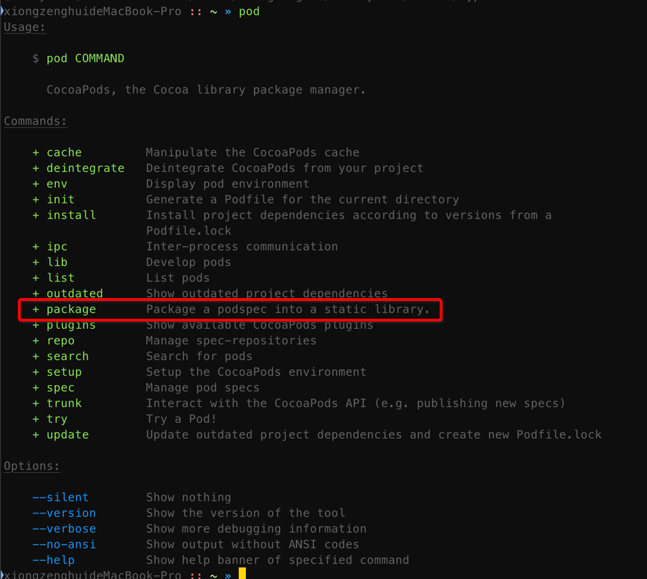

[TOC]

## 1. CocoaPods 与 Plugins

https://guides.cocoapods.org/plugins/setting-up-plugins.html

- 1) Cocoapods 是一个社区项目, 由很少的维护人员管理, 需要维护的表面积很大
- 2) 可以肯定地说, Cocoapods 永远不可能支持 xcode 支持的 所有功能, 团队也不得不对许多潜在的有用功能说 “不”
- 3) 早在2013年, cocoapods 就增加了对 **cocoapods plugin** 的支持, 而不是让这成为讨论的终点
- 4) 插件架构 允许其他人扩展 cocoapods, 来支持不符合依赖性管理和生态系统增长主要目标的特性


## 2. What can CocoaPods Plugins do?

A CocoaPods Plugin can:

- 1) **Hook** into the **install process**, both **before** and **after**
- 2) Add **new commands** to **pod**
- 3) Do whatever they want, because **Ruby is a very dynamic language**

这意味着插件的作用域通常与向构建过程中添加特性有关, 但实际上可以做任何您想要的事情。例如, cocoapods roulette 生成了一个新的ios应用程序，其中包含三个随机播客。


## 3. How do I install a plugin

- You will want to use a **Gemfile**, if you've never used a Gemfile before or want a refresher - check out our guide "Using a Gemfile".

- All **CocoaPods Plugins** are **Gems**,

- and they are installed by **first adding** them to the **Gemfile**,

- then you need to mention that they exist inside your **Podfile**.

### 1. first add cocoapods-repo-update to amend your ==Gemfile==

```ruby
source 'https://rubygems.org'

  gem 'cocoapods'
+ gem 'cocoapods-repo-update'
  gem 'fastlane'
```

### 2. Then add a reference to it in your ==Podfile==

```ruby
  platform :ios, '9.0'
+ plugin 'cocoapods-repo-update'

  use_frameworks!

  # OWS Pods
  pod 'SignalCoreKit', git: 'https://github.com/signalapp/SignalCoreKit.git', testspecs: ["Tests"]
```

### 3. 达到的效果

Running **bundle exec pod install** will then have the **cocoapods-repo-update** plugin executed also.


## 4. What Plugins Exist? (cocoapods 目前有哪些 plugins?)

```json
{
  "plugins": [
    {
      "gem": "cocoapods-appledoc",
      "name": "AppleDoc",
      "author": "Kyle Fuller",
      "social_media_url": "http://twitter.com/kylefuller",
      "url": "https://github.com/CocoaPods/cocoapods-appledoc",
      "description": "Generates docset and documentation for a pod."
    },
    {
      "gem": "cocoapods-deploy",
      "name": "Deploy",
      "author": "James Campbell",
      "social_media_url": "https://twitter.com/jcampbell_05",
      "url": "https://github.com/jcampbell05/cocoapods-deploy",
      "description": "Deploys dependencies for a CocoaPods project without needing to clone the repo (Similar to Bundler's `--deployment`)."
    },
    {
      "gem": "cocoapods-rome",
      "name": "Rome",
      "author": "Boris Bügling",
      "social_media_url": "https://twitter.com/neonichu",
      "url": "https://github.com/neonichu/rome",
      "description": "Rome makes it easy to build a list of frameworks for consumption outside of Xcode, e.g. for a Swift script."
    },
    {
      "gem": "cocoapods-dependencies",
      "name": "Pod Dependencies",
      "author": "Samuel E. Giddins",
      "social_media_url": "http://twitter.com/segiddins",
      "url": "https://github.com/segiddins/cocoapods-dependencies",
      "description": "Shows a project's CocoaPod dependency graph."
    },
    {
      "gem": "cocoapods-browser",
      "name": "Pod browser",
      "author": "Toshihiro Morimoto",
      "social_media_url": "http://twitter.com/dealforest",
      "url": "https://github.com/dealforest/cocoapods-browser",
      "description": "Open a pod's homepage in the browser."
    },
    {
      "gem": "cocoapods-check_latest",
      "name": "Check Latest",
      "author": "Yuji Nakayama",
      "social_media_url": "http://twitter.com/nkym37",
      "url": "https://github.com/yujinakayama/cocoapods-check_latest",
      "description": "Checks if the latest version of a pod is up to date."
    },
    {
      "gem": "cocoapods-docs",
      "name": "Pod docs",
      "author": "CocoaPods Dev Team",
      "social_media_url": "http://twitter.com/CocoaPods",
      "url": "https://github.com/CocoaPods/cocoapods-docs",
      "description": "Convenient access to the documentation of a Pod via cocoadocs.org."
    },
    {
      "gem": "cocoapods-docstats",
      "name": "docstats",
      "author": "Boris Bügling",
      "social_media_url": "http://twitter.com/NeoNacho",
      "url": "https://github.com/neonichu/cocoapods-docstats",
      "description": "Showing documentation metrics of Pods."
    },
    {
      "gem": "cocoapods-open",
      "name": "open",
      "author": "Les Hill",
      "social_media_url": "http://twitter.com/leshill",
      "url": "https://github.com/leshill/open_pod_bay",
      "description": "Open a pod’s workspace."
    },
    {
      "gem": "cocoapods-podfile_info",
      "name": "Pod info",
      "author": "CocoaPods Dev Team",
      "social_media_url": "http://twitter.com/CocoaPods",
      "url": "https://github.com/cocoapods/cocoapods-podfile_info",
      "description": "Shows information on installed Pods."
    },
    {
      "gem": "cocoapods-repo-svn",
      "name": "repo-svn",
      "author": "Dusty Clarkda",
      "social_media_url": "http://twitter.com/_clarkda",
      "url": "https://github.com/clarkda/cocoapods-repo-svn",
      "description": "Adds subversion support to manage spec-repositories."
    },
    {
      "gem": "cocoapods-repo-hg",
      "name": "repo-hg",
      "author": "Dusty Clarkda",
      "social_media_url": "http://twitter.com/_clarkda",
      "url": "https://github.com/clarkda/cocoapods-repo-hg",
      "description": "Adds mercurial support to manage spec-repositories."
    },
    {
      "gem": "cocoapods-repo-update",
      "name": "CocoaPods Repo Update",
      "author": "James Treanor",
      "url": "https://github.com/wordpress-mobile/cocoapods-repo-update",
      "description": "cocoapods-repo-update is a CocoaPods plugin that checks your dependencies when you run `pod install` and updates the local specs repositories if needed."
    },
    {
      "gem": "cocoapods-watch",
      "name": "Pod watch",
      "author": "Marin Usalj",
      "url": "https://github.com/supermarin/cocoapods-watch",
      "description": "Watch for Podfile changes and run pod install."
    },
    {
      "gem": "cocoapods-roulette",
      "name": "Pods Roulette",
      "author": "Heiko Behrens, Marcel Jackwerth",
      "url": "https://github.com/sirlantis/cocoapods-roulette",
      "description": "Builds an empty project with three random pods."
    },
    {
      "gem": "cocoapods-sorted-search",
      "name": "Sorted Search",
      "author": "Denys Telezhkin",
      "url": "https://github.com/DenHeadless/cocoapods-sorted-search",
      "description": "Adds a sort subcommand for pod search to sort search results by amount of stars, forks, or github activity."
    },
    {
      "gem": "cocoapods-release",
      "name": "Release",
      "author": "Oliver Letterer",
      "social_media_url": "https://twitter.com/oletterer",
      "url": "https://github.com/Sparrow-Labs/cocoapods-release",
      "description": "Tags and releases pods for you."
    },
    {
      "gem": "cocoapods-keys",
      "name": "CocoaPods Keys",
      "author": "Orta Therox, Samuel E. Giddins",
      "url": "https://github.com/orta/cocoapods-keys",
      "description": "Store sensitive data in your Mac's keychain, that will be installed into your app's source code via the Pods library."
    },
    {
      "gem": "cocoapods-packager",
      "name": "CocoaPods Packager",
      "author": "Kyle Fuller, Boris Bügling",
      "url": "https://github.com/CocoaPods/cocoapods-packager",
      "description": "Generate a framework or static library from a podspec."
    },
    {
      "gem": "cocoapods-links",
      "name": "CocoaPods Links",
      "author": "Mike Owens",
      "social_media_url": "https://twitter.com/mikejowens",
      "url": "https://github.com/mowens/cocoapods-links",
      "description": "A CocoaPods plugin to manage local development pods"
    },
    {
      "gem": "cocoapods-prune-localizations",
      "name": "CocoaPods Prune Localizations",
      "author": "Diego Torres",
      "social_media_url": "https://twitter.com/dtorres",
      "url": "https://github.com/dtorres/cocoapods-prune-localizations",
      "description": "Upon running pod install, this plugin will remove unused localizations by your project"
    },
    {
      "gem": "cocoapods-thumbs",
      "name": "CocoaPods Thumbs",
      "author": "Pablo Bendersky",
      "url": "https://github.com/quadion/cocoapods-thumbs",
      "description": "Use cocoapods-thumbs to check upvotes or downvotes of Podspecs from your peers based on past experiences."
    },
    {
      "gem": "cocoapods-blacklist",
      "name": "CocoaPods Blacklist",
      "author": "David Grandinetti",
      "url": "https://github.com/yahoo/cocoapods-blacklist",
      "description": "Check if a project is using a banned version of a pod. Handy for security audits."
    },
    {
      "gem": "cocoapods-archive",
      "name": "CocoaPods Archive",
      "author": "Braintree Open Source",
      "url": "https://github.com/braintreeps/cocoapods-archive",
      "description": "A CocoaPods plugin that enables you to archive your Pod as a static library"
    },
    {
      "gem": "cocoapods-check",
      "name": "CocoaPods Check",
      "author": "Matt Di Iorio",
      "url": "https://github.com/square/cocoapods-check",
      "description": "Displays differences between locked and installed Pods"
    },
    {
      "gem": "cocoapods-acknowledgements",
      "name": "CocoaPods Acknowledgements",
      "author": "Fabio Pelosin, Orta Therox, Marcelo Fabri",
      "url": "https://github.com/CocoaPods/cocoapods-acknowledgements",
      "description": "CocoaPods plugin that generates an acknowledgements plist to make it easy to create tools to use in apps."
    },
    {
      "gem": "cocoapods-generator",
      "name": "CocoaPods Generator",
      "author": "从权",
      "url": "https://github.com/zhzhy/cocoapods-generator",
      "description": "Add files to empty target from *.podspec, such as souce files, libraries, frameworks, resources and so on."
    },
    {
      "gem": "cocoapods-debug",
      "name": "CocoaPods Debug",
      "author": "Samuel Giddins",
      "url": "https://github.com/segiddins/cocoapods-debug",
      "description": "A simple plugin to ease debugging CocoaPods."
    },
    {
      "gem": "cocoapods-art",
      "name": "CocoaPods Artifactory Plugin",
      "author": "Dan Feldman",
      "url": "https://github.com/JFrogDev/cocoapods-art",
      "description": "Enables usage of Artifactory as an index for CocoaPods repo and as a repository for pods."
    },
    {
      "gem": "cocoapods-update-if-you-dare",
      "name": "CocoaPods Update If You Dare",
      "author": "Ashton Williams",
      "url": "https://github.com/Ashton-W/cocoapods-update-if-you-dare",
      "description": "update ... if you dare (warns users before updating all pods at once)"
    },
    {
      "gem": "cocoapods-uploader",
      "name": "CocoaPods Uploader",
      "author": "supern_lee",
      "url": "https://github.com/alibaba/cocoapods-uploader",
      "description": "Upload file/dir to remote storage."
    },
    {
      "gem": "cocoapods-mix-frameworks",
      "name": "CocoaPods Mix Frameworks",
      "author": "Florent Vilmart",
      "url": "https://github.com/flovilmart/cocoapods-mix-frameworks",
      "description": "Mix use_framework! targets with static targets through a surrogate Framework target."
    },
    {
      "gem": "cocoapods-foundation-headers",
      "name": "CocoaPods Foundation Headers",
      "author": "Keith Smiley",
      "url": "https://github.com/keith/cocoapods-foundation-headers",
      "description": "A CocoaPods plugin for using Foundation instead of UIKit/Cocoa in generated headers"
    },
    {
      "gem": "cocoapods-githooks",
      "name": "CocoaPods Githooks",
      "author": "Vlad Korzun",
      "url": "https://github.com/VladKorzun/cocoapods-githooks",
      "description": "A CocoaPods plugin that syncs git hooks between team members"
    },
    {
      "gem": "cocoapods-integrate-flutter",
      "name": "CocoaPods Integrate Flutter",
      "author": "kerry",
      "url": "https://github.com/upgrad/cocoapods-integrate-flutter",
      "description": "A plugin to integrate flutter with existing iOS application."
    },
    {
      "gem": "cocoapods-templates",
      "name": "CocoaPods Templates",
      "author": "Oliver Letterer",
      "url": "https://github.com/layered-pieces/cocoapods-templates",
      "description": "CocoaPods plugin to install Xcode templates from a remote source"
    },
    {
      "gem": "cocoapods-mangle",
      "name": "CocoaPods Mangle",
      "author": "James Treanor",
      "url": "https://github.com/intercom/cocoapods-mangle",
      "description": "Mangling your dependencies symbols allows more than one copy of a dependency to exist without errors. This plugin mangles your dependencies to make this possible."
    }
  ]
}
```

可使用如下小代码查看总共多少个 plugin

```ruby
map = { ...如上 json... }
pp map[:plugins].count
pp '-' * 50
pp map[:plugins].map { |p|
  p[:gem]
}
```

输出可得到

```
37
"--------------------------------------------------"
["cocoapods-appledoc",
 "cocoapods-deploy",
 "cocoapods-rome",
 "cocoapods-dependencies",
 "cocoapods-browser",
 "cocoapods-check_latest",
 "cocoapods-docs",
 "cocoapods-docstats",
 "cocoapods-open",
 "cocoapods-podfile_info",
 "cocoapods-repo-svn",
 "cocoapods-repo-hg",
 "cocoapods-repo-update",
 "cocoapods-watch",
 "cocoapods-roulette",
 "cocoapods-sorted-search",
 "cocoapods-release",
 "cocoapods-keys",
 "cocoapods-packager",
 "cocoapods-links",
 "cocoapods-prune-localizations",
 "cocoapods-thumbs",
 "cocoapods-blacklist",
 "cocoapods-archive",
 "cocoapods-check",
 "cocoapods-acknowledgements",
 "cocoapods-generator",
 "cocoapods-debug",
 "cocoapods-art",
 "cocoapods-update-if-you-dare",
 "cocoapods-uploader",
 "cocoapods-mix-frameworks",
 "cocoapods-foundation-headers",
 "cocoapods-githooks",
 "cocoapods-integrate-flutter",
 "cocoapods-templates",
 "cocoapods-mangle"]
```

一共 37 个 plugin, 具体有哪些也打印出来了.

cocoapods 原话是这样的:

> There's quite a **few** (很少 ~) ! If you have some more to add, send us a PR to this [JSON file](https://github.com/CocoaPods/cocoapods-plugins/blob/master/plugins.json)


## 5. 最后把 cocoapods-packager 用起来

### 1. 安装 cocoapods-packager

- 因为一个 cocoapods plugin 就是一个 ruby gem 应用
- 所以 ruby gem 应用, 怎么安装, 那么 cocoapods plugin 就怎么安装

#### 1. 直接 gem install

```
gem install cocoapods-packager
```

#### 2. clone 源码后安装

因为我们需要学习下，一个 cocoapods plugin 如何开发，那么最先就需要搞清楚他的目录结构是怎么用的，所以需要 clone 他的源码进行调试，才能学会如何开发一个 cocoapods plugin ~

> https://github.com/CocoaPods/cocoapods-packager

```
git clone https://github.com/CocoaPods/cocoapods-packager.git
cd cocoapods-packager
bundle install
rake install
```

不出意外，可以得到输出如下

```
10025 collect_rubygems/cocoapods-packager git:(master) » rake install
cocoapods-packager 1.5.0 built to pkg/cocoapods-packager-1.5.0.gem.
cocoapods-packager (1.5.0) installed.
```

已经安装成功。

### 2. 终端输入 pod 会多处一个 `package` sub command



这个就是 cocoapods plugin 最突出的作用。

### 3. 当然 cocoapods plugin 也可以作为 ruby gem 使用

```ruby
require 'cocoapods-packager'

# 调用 cocoapods-packager/lib/*.rb 中向外暴露的 api
```

### 4. 之后使用下 cocoapods-packager 这个插件

比如我随便 github clone 一个开源库

```
git clone https://github.com/ibireme/YYCache.git
cd YYCache/
```

使用 cocoapods-packager 插件开始编译 二进制静态库

```
 % pod package YYCache.podspec                                                                                    Desktop/YYCache (master) xiongzenghuideMacBook-Pro
Analyzing dependencies
Fetching podspec for `YYCache` from `/Users/xiongzenghui/Desktop/YYCache/YYCache.podspec`
Downloading dependencies
Installing YYCache (1.0.4)
Generating Pods project
Skipping User Project Integration
Sending stats
Pod installation complete! There is 1 dependency from the Podfile and 1 total pod installed.
Building static framework YYCache (1.0.4) with configuration Release
Mangling symbols
Building mangled framework
No such file or directory - /private/var/folders/kt/z8c9rz0s5nj68j_d_1bj0y7h0000gn/T/cocoapods-ctrtnl3y/ios/YYCache.framework/Versions/A/Headers/YYKVStorage.h
No such file or directory - /private/var/folders/kt/z8c9rz0s5nj68j_d_1bj0y7h0000gn/T/cocoapods-ctrtnl3y/ios/YYCache.framework/Versions/A/Headers/YYMemoryCache.h
No such file or directory - /private/var/folders/kt/z8c9rz0s5nj68j_d_1bj0y7h0000gn/T/cocoapods-ctrtnl3y/ios/YYCache.framework/Versions/A/Headers/YYDiskCache.h
No such file or directory - /private/var/folders/kt/z8c9rz0s5nj68j_d_1bj0y7h0000gn/T/cocoapods-ctrtnl3y/ios/YYCache.framework/Versions/A/Headers/YYCache.h
 %
```

结果貌似不太正常，有一些报错信息，但是不是本节的重点。

重点是你应该知道 cocoapods plugin 的好处了吧，就是能够把你自己的 **pod xxx** 注册到在整个 pod 流程中。

