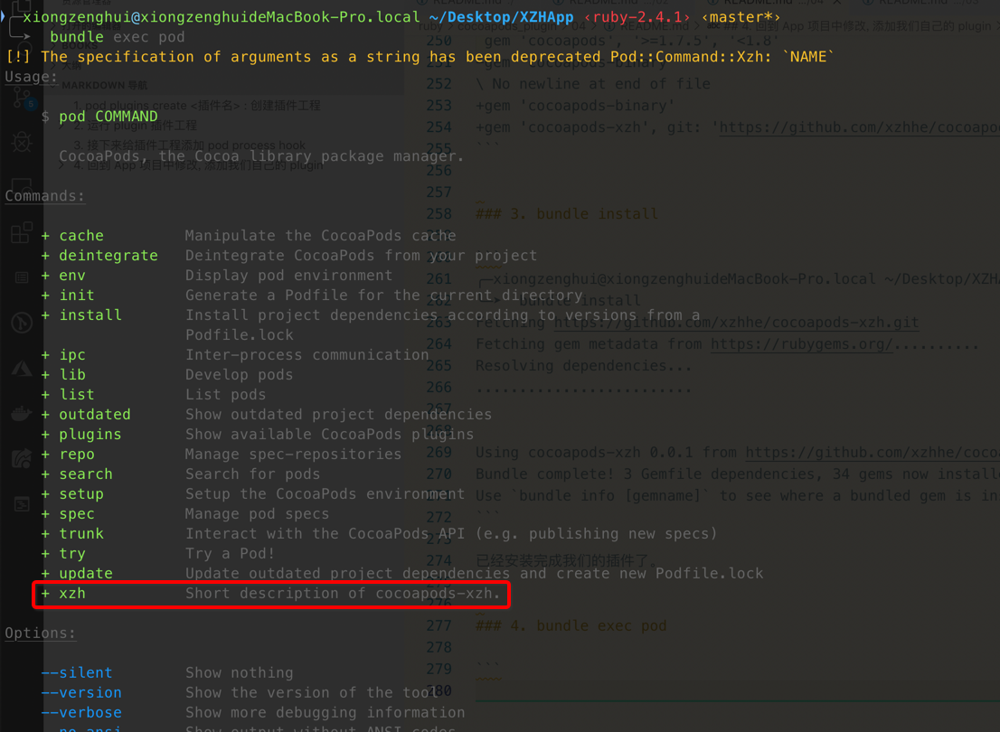
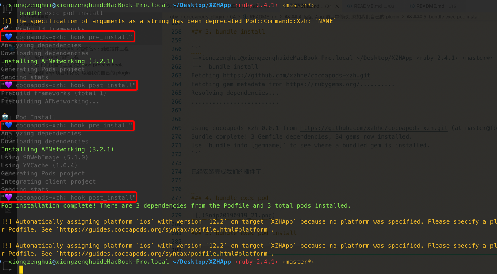

[TOC]


## 1. 可用 `def.*_hooks$` 正则式, 来匹配 cocoapods 所有源文件


- run_plugins_pre_install_hooks
- run_plugins_post_install_hooks
- run_source_provider_hooks
- run_podfile_pre_install_hooks
- run_podfile_post_install_hooks


## 2. plugin 添加 pod process hook

### 1. 创建 plugin 工程

[点击我](../03/README.md)

### 2. lib/cocoapods_plugin.rb 注册 ==pod install hook==

> cocoapods/lib/cocoapods/**installer.rb** 中的有哪一些状态可以被 hook

```ruby
require 'cocoapods-xzh/command'

require 'cocoapods'
require 'pp'

Pod::HooksManager.register('cocoapods-xzh', :pre_install) { |installer_context|
  pp "💙 cocoapods-xzh: hook pre_install"
}

Pod::HooksManager.register('cocoapods-xzh', :post_install) { |installer_context|
  pp "💜 cocoapods-xzh: hook post_install"
}
```

### 3. 然后 bundle install 之后, 提交修改到 plugin git 仓库

```
commit fb3693133dd1f97a5940ae347ea861eebc65d0b4 (HEAD -> master, origin/master)
Author: xiongzenghui <zxcvb1234001@163.com>
Date:   Thu Sep 19 00:05:14 2019 +0800

    add pod install hook

diff --git a/lib/cocoapods_plugin.rb b/lib/cocoapods_plugin.rb
index bbe2952..31059ab 100644
--- a/lib/cocoapods_plugin.rb
+++ b/lib/cocoapods_plugin.rb
@@ -1 +1,12 @@
 require 'cocoapods-xzh/command'
+
+require 'cocoapods'
+require 'pp'
+
+Pod::HooksManager.register('cocoapods-xzh', :pre_install) { |installer_context|
+  pp "💙 cocoapods-xzh: hook pre_install"
+}
+
+Pod::HooksManager.register('cocoapods-xzh', :post_install) { |installer_context|
+  pp "💜 cocoapods-xzh: hook post_install"
+}
```

### 4. 回到 App 项目中, 添加 plugin

#### 1. Gemfile

```
diff --git a/Gemfile b/Gemfile
index a3de599..e70b840 100644
--- a/Gemfile
+++ b/Gemfile
@@ -1,4 +1,5 @@
 source 'https://rubygems.org'

 gem 'cocoapods', '>=1.7.5', '<1.8'
-gem 'cocoapods-binary'
\ No newline at end of file
+gem 'cocoapods-binary'
+gem 'cocoapods-xzh', git: 'https://github.com/xzhhe/cocoapods-xzh.git', branch: 'master'
```

#### 2. Podfile

```
diff --git a/Podfile b/Podfile
index f5a6aae..4f7937d 100644
--- a/Podfile
+++ b/Podfile
@@ -2,6 +2,7 @@
 # platform :ios, '9.0'

 plugin 'cocoapods-binary'
+plugin 'cocoapods-xzh'

 target 'XZHApp' do
   use_frameworks!
```

#### 3. bundle install

```
╭─xiongzenghui@xiongzenghuideMacBook-Pro.local ~/Desktop/XZHApp ‹ruby-2.4.1› ‹master*›
╰─➤  bundle install
Fetching https://github.com/xzhhe/cocoapods-xzh.git
Fetching gem metadata from https://rubygems.org/..........
Resolving dependencies...
.........................


Using cocoapods-xzh 0.0.1 from https://github.com/xzhhe/cocoapods-xzh.git (at master@fb36931)
Bundle complete! 3 Gemfile dependencies, 34 gems now installed.
Use `bundle info [gemname]` to see where a bundled gem is installed.
```

已经安装完成我们的插件了。

#### 4. bundle exec pod



#### 5. bundle exec pod install



```
╭─xiongzenghui@xiongzenghuideMacBook-Pro.local ~/Desktop/XZHApp ‹ruby-2.4.1› ‹master*›
╰─➤  bundle exec pod install
[!] The specification of arguments as a string has been deprecated Pod::Command::Xzh: `NAME`
🚀  Prebuild frameworks
"💙 cocoapods-xzh: hook pre_install"
Analyzing dependencies
Downloading dependencies
Installing AFNetworking (3.2.1)
Generating Pods project
Sending stats
"💜 cocoapods-xzh: hook post_install"
Prebuild frameworks (total 1)
Prebuilding AFNetworking...

🤖  Pod Install
"💙 cocoapods-xzh: hook pre_install"
Analyzing dependencies
Downloading dependencies
Installing AFNetworking (3.2.1)
Using SDWebImage (5.1.0)
Using YYCache (1.0.4)
Generating Pods project
Integrating client project
Sending stats
"💜 cocoapods-xzh: hook post_install"
Pod installation complete! There are 3 dependencies from the Podfile and 3 total pods installed.

[!] Automatically assigning platform `ios` with version `12.2` on target `XZHApp` because no platform was specified. Please specify a platform for this target in your Podfile. See `https://guides.cocoapods.org/syntax/podfile.html#platform`.

[!] Automatically assigning platform `ios` with version `12.2` on target `XZHApp` because no platform was specified. Please specify a platform for this target in your Podfile. See `https://guides.cocoapods.org/syntax/podfile.html#platform`.
```

已经加载了我们的插件了。