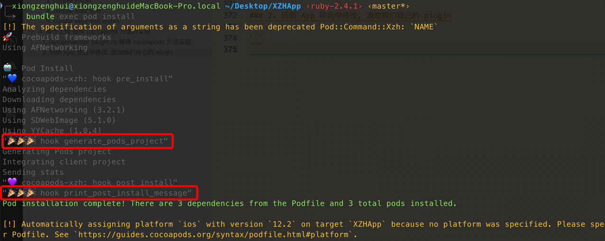

[TOC]


## 1. 创建 plugin 工程

[点击我](../03/README.md)


## 2. lib/cocoapods_plugin.rb 替换 cocoapods 方法实现

> 需要按照 cocoapods/lib/cocoapods/**installer.rb** 要替换的方法实现的【参数】匹配

```ruby
require 'cocoapods-xzh/command'
require 'cocoapods'
require 'pp'

module Pod
  #
  # patch Installer#print_post_install_message
  #
  class Installer
    def self.force_disable_integration(value)
      @@force_disable_integration = value
    end

    old_method = instance_method(:print_post_install_message)
    # pp "⚠️ old_method=#{old_method}"

    define_method(:print_post_install_message) do
      pp "🎉🎉🎉 hook print_post_install_message"
      return if @@disable_install_complete_message
      old_method.bind(self).()
    end
  end

  #
  # patch Installer#generate_pods_project
  #
  class Installer
    old_method = instance_method(:generate_pods_project)

    define_method(:generate_pods_project) do
      pp "🎉🎉🎉 hook generate_pods_project"
      if @@force_disable_integration
        return
      end
      old_method.bind(self).()
    end
  end
end

# major.minor.patch.pre
class Bump
  def bump_next
  end
  def bump_major
  end
  def bump_minor
  end
  def bump_patch
  end
end
```


## 3. 回到 App 项目, 添加使用 plugin



全部正常 ~