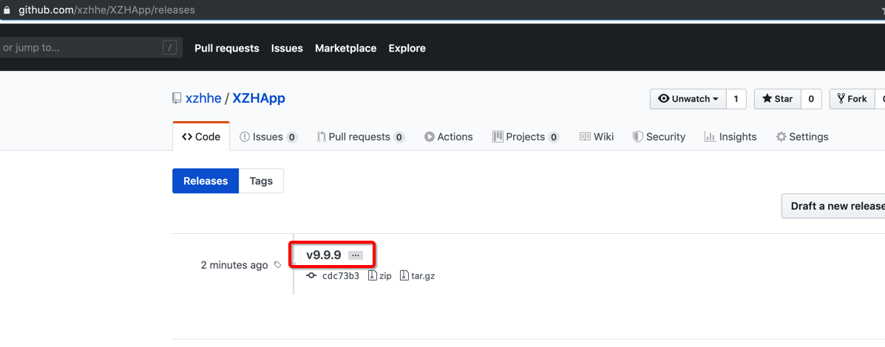
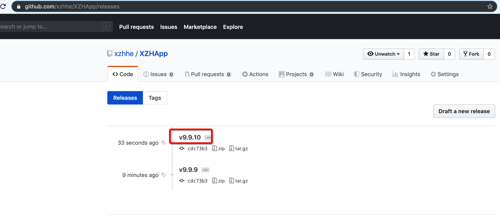

[TOC]


## 1、在一个没有 xx.xcodeproj 目录下 fastlane init

```
╰─○ fastlane init
[✔] 🚀
[✔] Looking for iOS and Android projects in current directory...
[22:58:53]: Created new folder './fastlane'.
[22:58:53]: No iOS or Android projects were found in directory '/Users/xiongzenghui/Desktop/workspace'
[22:58:53]: Make sure to `cd` into the directory containing your iOS or Android app
[22:58:53]: Alternatively, would you like to manually setup a fastlane config in the current directory instead? (y/n)
........................................
```

- No **iOS** or **Android projects** were found in directory 提示无法找到 iOS 或 Android 工程文件
- Alternatively, would you like to **manually setup** a fastlane config in the current directory instead? (y/n) 提示是否让你自己手动来配置一个 fastlane 项目, 选择 **y**
- 一路回车即可

得到的 fastlane 项目结构如下:

```
╰─○ tree
.
├── Gemfile
├── Gemfile.lock
└── fastlane
    ├── Appfile
    └── Fastfile

1 directory, 4 files
```

接下来你要做的事情, 与之前开发一个与 iOS project 绑定在一起的 fastlane 脚本时, 没有任何的区别。

下面来实现一个比较简单的例子。


## 2、实战

### 1. 要完成的效果

- 输入1: 一个 git 仓库地址 (注意必须是 ssh 地址)
- 输入2: branch
- 输入3: git clone 拷贝到的路径
- 输入4: 要打的 tag 名
- 输入5: commit message 信息

### 2. fastlane/Fastfile

```ruby
default_platform(:ios)

import 'Fastfiles/GitFastfile.rb'
```

### 3. fastlane/Fastfiles/GitFastfile.rb

```ruby
Dir[File.expand_path('git/*.rb', __dir__)].each { |f| import f }
```

### 4. fastlane/Fastfiles/git/GitAddTagFastfile.rb

```ruby
lane :add_tag do |options|
  git    	= options[:git]
  branch 	= options[:branch]
  path   	= options[:path]
  tag    	= options[:tag]
  message = options[:message]

  git_clone(
    git: git,
    path: path,
    branch: branch,
    depth: 1,
    single_branch: true
  )

  cmds = [
    "cd #{path}",
    "git tag -a #{tag} -m \"#{message}\""
  ]
  sh(cmds.join(';'), error_callback: lambda { |result|
    UI.user_error!("❌ git add tag 失败")
  })

  cmds = [
    "cd #{path}",
    "git push origin #{tag}"
  ]
  sh(cmds.join(';'), error_callback: lambda { |result|
    UI.user_error!("❌ push #{tag} 失败")
  })
end

```

### 5. fastlane/Fastfile 测试调用

```ruby
default_platform(:ios)

import 'Fastfiles/GitFastfile.rb'

lane :hello do
  add_tag(
    git: 'git@github.com:xzhhe/XZHApp.git',
    branch: 'master',
    path: '/Users/xiongzenghui/Desktop/tmp',
    tag: 'v9.9.9',
    message: 'this is a tag.'
  )
end
```

```
╰─○ bundle exec fastlane hello
[✔] 🚀
+---------------------------+---------+-----------+
|                  Used plugins                   |
+---------------------------+---------+-----------+
| Plugin                    | Version | Action    |
+---------------------------+---------+-----------+
| fastlane-plugin-git_clone | 0.1.2   | git_clone |
+---------------------------+---------+-----------+

[23:23:41]: ------------------------------
[23:23:41]: --- Step: default_platform ---
[23:23:41]: ------------------------------
[23:23:41]: Driving the lane 'hello' 🚀
[23:23:41]: ------------------------------------
[23:23:41]: --- Step: Switch to add_tag lane ---
[23:23:41]: ------------------------------------
[23:23:41]: Cruising over to lane 'add_tag' 🚖
[23:23:41]: -----------------------
[23:23:41]: --- Step: git_clone ---
[23:23:41]: -----------------------
Cloning into '/Users/xiongzenghui/Desktop/tmp'...
remote: Enumerating objects: 502, done.
remote: Counting objects: 100% (502/502), done.
remote: Compressing objects: 100% (415/415), done.
remote: Total 502 (delta 93), reused 444 (delta 76), pack-reused 0
Receiving objects: 100% (502/502), 621.69 KiB | 291.00 KiB/s, done.
Resolving deltas: 100% (93/93), done.
[23:23:47]: Successfully finished git clone
[23:23:47]: --------------------------------------------------------------------------------------
[23:23:47]: --- Step: cd /Users/xiongzenghui/Desktop/tmp;git tag -a v9.9.9 -m "this is a tag." ---
[23:23:47]: --------------------------------------------------------------------------------------
[23:23:47]: $ cd /Users/xiongzenghui/Desktop/tmp;git tag -a v9.9.9 -m "this is a tag."
[23:23:47]: -----------------------------------------------------------------------
[23:23:47]: --- Step: cd /Users/xiongzenghui/Desktop/tmp;git push origin v9.9.9 ---
[23:23:47]: -----------------------------------------------------------------------
[23:23:47]: $ cd /Users/xiongzenghui/Desktop/tmp;git push origin v9.9.9
[23:23:53]: ▸ To github.com:xzhhe/XZHApp.git
[23:23:53]: ▸ * [new tag]         v9.9.9 -> v9.9.9
[23:23:53]: Cruising back to lane 'hello' 🚘

+------+-----------------------------------------------------+-------------+
|                             fastlane summary                             |
+------+-----------------------------------------------------+-------------+
| Step | Action                                              | Time (in s) |
+------+-----------------------------------------------------+-------------+
| 1    | default_platform                                    | 0           |
| 2    | Switch to add_tag lane                              | 0           |
| 3    | git_clone                                           | 6           |
| 4    | cd /Users/xiongzenghui/Desktop/tmp;git tag -a       | 0           |
|      | v9.9.9 -m "this                                     |             |
| 5    | cd /Users/xiongzenghui/Desktop/tmp;git push origin  | 5           |
|      | v9.9.9                                              |             |
+------+-----------------------------------------------------+-------------+

[23:23:53]: fastlane.tools finished successfully 🎉
```



ok tag 添加成功!

### 6. 直接命令行 测试调用

```
bundle exec fastlane add_tag \
	git:'git@github.com:xzhhe/XZHApp.git' \
	branch:'master' \
	path:'/Users/xiongzenghui/Desktop/tmp' \
	tag:'v9.9.10' \
	message:'this is second tag.'
```

```
╰─○ bundle exec fastlane add_tag git:'git@github.com:xzhhe/XZHApp.git' branch:'master' path:'/Users/xiongzenghui/Desktop/tmp' tag:'v9.9.10' message:'this is second tag.'
[✔] 🚀
+---------------------------+---------+-----------+
|                  Used plugins                   |
+---------------------------+---------+-----------+
| Plugin                    | Version | Action    |
+---------------------------+---------+-----------+
| fastlane-plugin-git_clone | 0.1.2   | git_clone |
+---------------------------+---------+-----------+

[23:32:15]: Driving the lane 'add_tag' 🚀
[23:32:15]: -----------------------
[23:32:15]: --- Step: git_clone ---
[23:32:15]: -----------------------
Cloning into '/Users/xiongzenghui/Desktop/tmp'...
remote: Enumerating objects: 503, done.
remote: Counting objects: 100% (503/503), done.
remote: Compressing objects: 100% (416/416), done.
remote: Total 503 (delta 93), reused 445 (delta 76), pack-reused 0
Receiving objects: 100% (503/503), 621.80 KiB | 182.00 KiB/s, done.
Resolving deltas: 100% (93/93), done.
[23:32:23]: Successfully finished git clone
[23:32:23]: --------------------------------------------------------------------------------------------
[23:32:23]: --- Step: cd /Users/xiongzenghui/Desktop/tmp;git tag -a v9.9.10 -m "this is second tag." ---
[23:32:23]: --------------------------------------------------------------------------------------------
[23:32:23]: $ cd /Users/xiongzenghui/Desktop/tmp;git tag -a v9.9.10 -m "this is second tag."
[23:32:23]: ------------------------------------------------------------------------
[23:32:23]: --- Step: cd /Users/xiongzenghui/Desktop/tmp;git push origin v9.9.10 ---
[23:32:23]: ------------------------------------------------------------------------
[23:32:23]: $ cd /Users/xiongzenghui/Desktop/tmp;git push origin v9.9.10
[23:32:28]: ▸ To github.com:xzhhe/XZHApp.git
[23:32:28]: ▸ * [new tag]         v9.9.10 -> v9.9.10

+------+-----------------------------------------------------+-------------+
|                             fastlane summary                             |
+------+-----------------------------------------------------+-------------+
| Step | Action                                              | Time (in s) |
+------+-----------------------------------------------------+-------------+
| 1    | git_clone                                           | 7           |
| 2    | cd /Users/xiongzenghui/Desktop/tmp;git tag -a       | 0           |
|      | v9.9.10 -m "thi                                     |             |
| 3    | cd /Users/xiongzenghui/Desktop/tmp;git push origin  | 5           |
|      | v9.9.10                                             |             |
+------+-----------------------------------------------------+-------------+

[23:32:28]: fastlane.tools finished successfully 🎉
```



ok 同样添加成功!

### 7. fastlane 全部的源码结构

```
╰─○ tree
.
├── Gemfile
├── Gemfile.lock
└── fastlane
    ├── Appfile
    ├── Fastfile
    ├── Fastfiles
    │   ├── GitFastfile.rb
    │   └── git
    │       └── GitAddTagFastfile.rb
    ├── Pluginfile
    ├── README.md
    └── report.xml

3 directories, 9 files
```

[如果你需要 fastlane 项目地址 😎 点这里](fastlaneApp)

所以，赶紧开始你的 fastlane 之旅吧!

