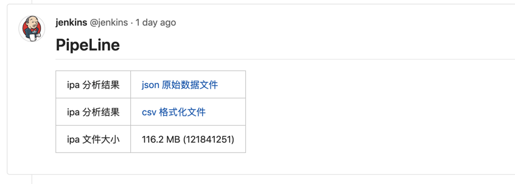
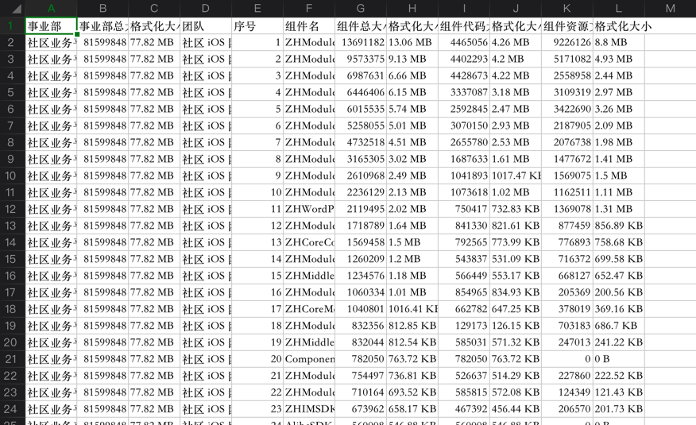

[TOC]


## 1. ipa 文件

### 1. 一个 ipa 文件, 实际上就是一个 zip 别名文件

- 你可以直接把一个 xx.ipa **重命名 mv** 成为一个 **xx.zip** 压缩包文件
- 然后直接对 **xx.zip** 这个压缩文件, 进行 **解压缩** 即可
- xx.zip 解压缩之后, 里面就是一个 **Payload/** 目录, 这个目录下面就是我们的 **xx.app**

### 2. developer/enterprise 导出的 ipa

```
├── Payload
   	└── osee2unifiedRelease.app
```

### 3. app_store 导出的 ipa

```
├── Payload
│   └── osee2unifiedRelease.app
├── SwiftSupport
└── Symbols
```

- 比上面模式导出的 ipa 文件要 **大出 几十M**
- 除了 **Payload/** 目录, 多出2个目录
- **SwiftSupport/** 目录
- **Symbols/** 目录


## 2. app 文件

- 主要的分析工作, 都是围绕 app 文件进行

- **xx.app** 就是一个 **包 (目录)** , 里面存放的就是一个 iOS 应用, 所需要的所有的 **代码、资源文件、签名校验等**

  ```
  ╭─xiongzenghui at xiongzenghui的MacBook Pro in ~/Downloads/app/Payload/osee2unifiedRelease.app using ‹ruby-2.6.0›
  ╰─○ ll
  total 207680
  -rw-r--r--@  1 xiongzenghui  staff   2.1K 12 17 16:20 AVOSCloud_Art.inc
  drwxr-xr-x@  4 xiongzenghui  staff   128B 12 17 16:16 AlibabaAuthSDK.bundle
  -rw-r--r--@  1 xiongzenghui  staff   7.8K 12 17 16:43 AppIcon29x29@2x.png
  -rw-r--r--@  1 xiongzenghui  staff   7.8K 12 17 16:43 AppIcon29x29@2x~ipad.png
  -rw-r--r--@  1 xiongzenghui  staff    12K 12 17 16:43 AppIcon29x29@3x.png
  -rw-r--r--@  1 xiongzenghui  staff   4.1K 12 17 16:43 AppIcon29x29~ipad.png
  -rw-r--r--@  1 xiongzenghui  staff    11K 12 17 16:43 AppIcon40x40@2x.png
  -rw-r--r--@  1 xiongzenghui  staff    11K 12 17 16:43 AppIcon40x40@2x~ipad.png
  -rw-r--r--@  1 xiongzenghui  staff    18K 12 17 16:43 AppIcon40x40@3x.png
  -rw-r--r--@  1 xiongzenghui  staff   5.4K 12 17 16:43 AppIcon40x40~ipad.png
  -rw-r--r--@  1 xiongzenghui  staff    18K 12 17 16:43 AppIcon60x60@2x.png
  -rw-r--r--@  1 xiongzenghui  staff    31K 12 17 16:43 AppIcon60x60@3x.png
  -rw-r--r--@  1 xiongzenghui  staff    25K 12 17 16:43 AppIcon76x76@2x~ipad.png
  -rw-r--r--@  1 xiongzenghui  staff    11K 12 17 16:43 AppIcon76x76~ipad.png
  -rw-r--r--@  1 xiongzenghui  staff    28K 12 17 16:43 AppIcon83.5x83.5@2x~ipad.png
  .....................................
  ```

  

## 3. 如何分析 app ?

### 1. app 组成

- 1) 各种 **资源文件**
  - 零散文件 (png/plist/jpeg/strings…..)
  - **xx.bundle**
- 2) **Frameworks/** 存放所有的 dylib
- 3) **Plugins/** 存放所有的 app extensions
- 4) **executable** 你的 iOS 应用, 最终要执行的可执行文件 

### 2. app 分析公式

#### 1. 总体而言

```
app = 资源文件 + 程序(代码)
```

#### 2. 细粒度: 资源文件

```
app 资源文件 = 组件1.资源文件 + 组件2.资源文件 + ... + 组件N.资源文件
```

#### 3. 细粒度: 程序(代码)

```
app 程序(代码) = 组件1.代码 + 组件2.代码 + ... + 组件N.代码
```

### 3. 问题

- 如何得到 **一个组件** 所包含的 **资源文件** 有哪一些, 大小多少 => xx.podspec
- 如何得到 **一个组件** 所包含的 **代码** 有哪一些, 大小多少 => linkmap


## 4. 找出 ==一个组件==, 包含的 ==代码==

- 需要区分 **静态库** 与 **动态库**
- 静态库, 需要解析 linkmap
- 动态库, 直接取出 xx.app/Frameworks/xx.framework 大小, 即可


## 5. 找出 ==一个组件==, 包含的 ==资源文件==

我把我尝试过的方法，列举下:

| 方法                                  | 核心思路                           | 收效、准确度                                                 |
| ------------------------------------- | ---------------------------------- | ------------------------------------------------------------ |
| 我自己发明的名称 fixed framework size | xx.framework - xx.framework/binary | 非常不准确, 与 xcode 编译环境密切先关, 因为都是 **编译** 阶段的产物 |
| 解析每一个组件的 xx.podspec.json      | 解析 Pods/Podspecs/xx.podspec.json | 比上面得到的数据精确很多了, 但问题是解析资源文件的过程, 相对复杂多了 |
| Pods resources.sh                     | 解析 Pods resources.sh             | 这个文件是 pod install 之后, 自动生成的脚本文件, 挂载在 app 工程的 script 区域, 在 build 完成时, 自动执行, 将所有的资源文件件, 拷贝到 app 内, 所以这种方式得到的资源文件是最准确的 |

- 目前已经基于第二种方式勉强实现, 但是代码逻辑异常复杂
- 所以打算使用第三种方式进行重构


## 6. 目前完成的包体积分析效果

### 1. 对于每一个 MR 都会跑 pipeline 包体积分析 stage



### 2. 点击链接查看 按照事业部、团队, 划分的组件体积



大致的形式就是这样的.

