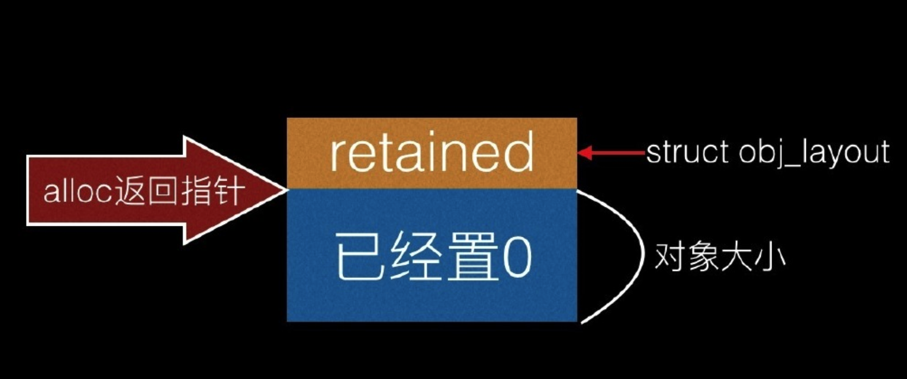

[TOC]


> 如下都是在【MRC】环境工程下测试，需要【关闭】Xcode工程的【ARC】。

## 1. ==alloc|new|create|copy== 创建对象, ==retainCount=1==

### 1. Foundation

```c
NSObject* obj1 = [NSObject new];
NSObject* obj2 = [NSObject alloc];
```

### 2. Core Foundation

```c
CFStringRef keys[2];
keys[0] = CFSTR("key1");
keys[1] = CFSTR("key2");

CFStringRef values[2];
values[0] = CFSTR("this is the first string");
values[1] = CFSTR("this is the second string");

// 创建dic对象
CFDictionaryRef myDictionaryRef = CFDictionaryCreate(
  kCFAllocatorDefault,
  (void*)keys,
  (void*)values,
  2,
  &kCFTypeDictionaryKeyCallBacks,
  &kCFTypeDictionaryValueCallBacks
);
```


## 2. retain() 引用计数器值 + 1

```c
NSObject* obj = [NSObject new]; // retainCount=1
retain(obj); // retainCount=2
```


## 3. release() 引用计数器值 - 1

```c
NSObject* obj = [NSObject new]; // retainCount=1
release(obj); // retainCount=0
```


## 4. autorelease

[点击我](../03/02/README.md)


## 5. [对象 copy] 引用计数器 + 1

```c
void test2()
{
  NSString *str1 = [[NSString alloc] initWithFormat:@"test111111111"]; // 1
  NSString *str2 = [str1 copy];  // 2
  NSMutableString *str3 = [str1 mutableCopy]; // 3
  
  NSLog(@"%@ %@ %@", str1, str2, str3);
  NSLog(@"%p %p %p", str1, str2, str3);
  
  [str3 release]; // 2
  [str2 release]; // 1
  [str1 release]; // 0
}
```


## 6. 对象关联

### 1. 被持有者

```c
@interface MJDog : NSObject
- (void)run;
@end

@implementation MJDog
- (void)run
{
  NSLog(@"%s", __func__);
}

- (void)dealloc
{
  [super dealloc];
  NSLog(@"%s", __func__);
}
@end
```

### 2. 主动持有者

- 1、setter 持有外界传入的 objc 对象
- 2、dealloc 释放持有的 objc 对象

```c
@interface MJPerson : NSObject
{
  int _age;     // 基本数据类型
  MJDog *_dog;  // objc对象指针
}

- (void)setDog:(MJDog *)dog;
- (MJDog *)dog;

@end
```

```c
@implementation MJPerson

- (void)setAge:(int)age
{
  _age = age;
}

- (int)age
{
  return _age;
}

/**
 * 【持有外界传入的objc对象】
 */
- (void)setDog:(MJDog *)dog
{
  if (_dog != dog) 
  {
    [_dog release];       // 1、release 旧值
    _dog = [dog retain];  // 2、retain 新值
  }
}

- (MJDog *)dog
{
  return _dog;
}

/**
 * 【释放持有的objc对象】
 */
- (void)dealloc
{
  // 1、释放持有的对象
  [_dog release];
  _dog = nil;
    
  // 2、再调用父类dealloc
  [super dealloc];
}

@end
```

### 3. main()

```c
int main()
{
  // 1、
  MJDog *dog1 = [[MJDog alloc] init]; // dog1 : 1
  MJDog *dog2 = [[MJDog alloc] init]; // dog2 : 1
  
  // 2、
  MJPerson *person = [[MJPerson alloc] init]; // person : 1

  // 3、
  [person setDog:dog1]; // dog1 : 2

  // 4、
  [person setDog:dog2]; // dog2 : 2, dog1 : 1
  
  // 5、
  [dog1 release]; // dog1 : 0
  [dog2 release]; // dog2 : 1
  
  // 6、
  [person release]; // person : 0, dog2 : 0
}
```

最终三个指针指向 person、dog1、dog2 三块堆区内存，retainCount都等于0，所以内存最终都正常废弃。


## 7. setter、getter 内存管理

### 1. MRC 写法

```c
@interface MJPerson : NSObject
@property(nonatomic, retain) Dog* dog; // 使用retain内存管理修饰符即可
@end

@implementation MJPerson

// 修改ivar变量名
@synthesize dog = _dog; 

- (void)dealloc
{
  // 1、释放持有的对象
  [_dog release];
  _dog = nil;
    
  // 2、再调用父类dealloc
  [super dealloc];
}

@end
```

### 2. ARC 写法

```c
@interface MJPerson : NSObject
@property(nonatomic, strong) Dog* dog; // 使用 strong 内存管理修饰符即可
@end

@implementation MJPerson

- (void)dealloc
{
  // 1、释放持有的对象
  [_dog release];
  _dog = nil;
    
  // 2、再调用父类dealloc
  [super dealloc];
}

@end
```


## 8. 存储 引用技术器值

### 1. GNUStep 实现

#### 1. alloc() 返回的内存结构



#### 2. 源码实现

```c
struct obj_layout
{
  NSUInteger retainded;
};

+(id)alloc
{
  // 分配内存总大小 = 存储retainCount所需字节数 + 对象占用字节数
  int size = sizeof(struct obj_layout) +【对象所占内存大小】;

  /**
   * 1、p 指向【retainCount】内存空间
   * 2、p+1 指向【objc对象】内存空间
   */
  struct obj_layout *p = (struct obj_layout *)calloc(1, size);

  return (id)(p+1);
}
```

### 2. Apple 实现

#### 1. retainCount <= 19位, 直接由 ==isa 存储== 计数器值

```c
union isa_t 
{
  .........

  #if __arm64__
#define ISA_MASK        0x0000000ffffffff8ULL
#define ISA_MAGIC_MASK  0x000003f000000001ULL
#define ISA_MAGIC_VALUE 0x000001a000000001ULL
  struct 
  {
    uintptr_t nonpointer        : 1;
    uintptr_t has_assoc         : 1;
    uintptr_t has_cxx_dtor      : 1;
    uintptr_t shiftcls          : 33; // MACH_VM_MAX_ADDRESS 0x1000000000
    uintptr_t magic             : 6;
    uintptr_t weakly_referenced : 1;
    uintptr_t deallocating      : 1;
    uintptr_t has_sidetable_rc  : 1;
    uintptr_t extra_rc          : 19; // 19个二进制位存储【引用计数器值】
#define RC_ONE   (1ULL<<45)
#define RC_HALF  (1ULL<<18)
  };

  .........
}
```

#### 2. retainCount > 19位

##### 1. has_sidetable_rc=1, 表示使用 ==SideTable 存储== 计数器值

```c
union isa_t 
{
  .........

  #if __arm64__
#define ISA_MASK        0x0000000ffffffff8ULL
#define ISA_MAGIC_MASK  0x000003f000000001ULL
#define ISA_MAGIC_VALUE 0x000001a000000001ULL
  struct 
  {
    uintptr_t nonpointer        : 1;
    uintptr_t has_assoc         : 1;
    uintptr_t has_cxx_dtor      : 1;
    uintptr_t shiftcls          : 33; // MACH_VM_MAX_ADDRESS 0x1000000000
    uintptr_t magic             : 6;
    uintptr_t weakly_referenced : 1;
    uintptr_t deallocating      : 1;
    uintptr_t has_sidetable_rc  : 1;  // 如果19个二进制位存储不下计数器值，则被【置1】
    uintptr_t extra_rc          : 19; //【不再用来】存储【引用计数器值】
#define RC_ONE   (1ULL<<45)
#define RC_HALF  (1ULL<<18)
  };

  .........
}
```

##### 2. 最终使用 ==SideTable 存储== 计时器值

```c
struct SideTable
{
  spinlock_t slock;
  RefcountMap refcnts; // 存储引用计数器的map
  weak_table_t weak_table;
};
```

通过 `SideTable.RefcountMap[this]` 获取某个对象的引用计数器值。


