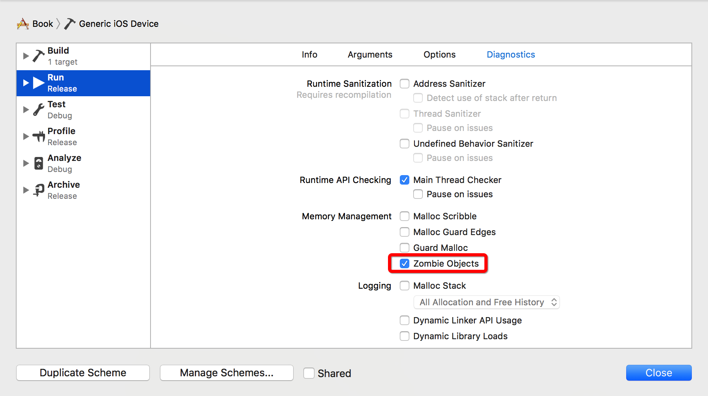

[TOC]


## 1. 开启 zombie, 检测 ==EXC_BAD_ACCESS== 崩溃



注意：在问题被修复后，关闭该功能。


## 2. zombie 原理

- 1) 在 **对象.retainCount == 0** 即将被废弃时
- 2) 运行时, **生成一个 Zombie 类**，继承 **即将被废弃的对象** 所属的类
- 3) 将 **被废弃的对象** 所属类型, 设置为 Zombie 类
- 4) 而 **Zombie 类** 所有的方法实现, 都是 **异常崩溃** , 打印调用栈

```c
@interface ZombieProxy : NSProxy
@property (nonatomic, assign) Class originClass;
@end

@implementation ZombieProxy

- (void)_throwMessageSentExceptionWithSelector: (SEL)selector
{
  @throw [NSException exceptionWithName:NSInternalInconsistencyException 
                                  reason:[NSString stringWithFormat:@"(-[%@ %@]) was sent to a zombie object at address: %p", NSStringFromClass(self.originClass), NSStringFromSelector(selector), self] 
                                userInfo:nil];
}

#define ZombieThrowMesssageSentException() [self _throwMessageSentExceptionWithSelector: _cmd]

- (id)retain
{
  ZombieThrowMesssageSentException();
  return nil;
}

- (oneway void)release
{
  ZombieThrowMesssageSentException();
}

- (id)autorelease
{
  ZombieThrowMesssageSentException();
  return nil;
}

- (void)dealloc
{
  ZombieThrowMesssageSentException();
  [super dealloc];
}

- (NSUInteger)retainCount
{
  ZombieThrowMesssageSentException();
  return 0;
}

@end
```


## 3. 扩展

- 可以交换 retain、release、dealloc 等方法实现
- 来监控对象的生命周期
- 并提供白名单控制，只对哪一些类型进行监控

