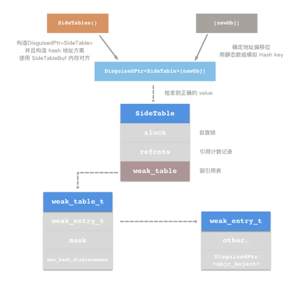
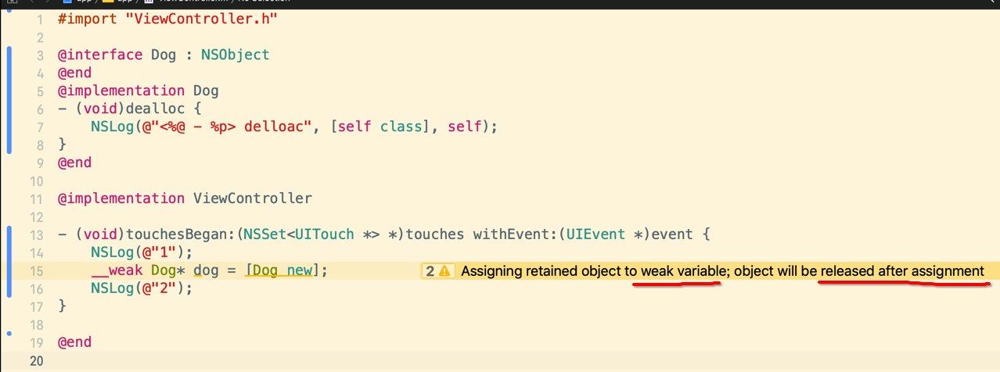

[TOC]


## 1. `__weak` 修饰的 指针变量, ==无法持有== 对象 

### eg1

```c
@interface MyDog : NSObject
@property (nonatomic, strong) NSString *name;
@end
@implementation MyDog
- (void)dealloc {
  NSLog(@"%@ - %@ dealloc", self, _name);
}
@end

int main(int argc, char * argv[])
{
  @autoreleasepool
  {
    NSLog(@"-------- 1 --------");
    __weak MyDog *dog = [MyDog new]; // retainCount = 1
    NSLog(@"-------- 2 --------");   // retainCount = 0
  }
  
  return 0;
}
```

```
2018-05-27 16:10:20.079 Book[17823:311458] -------- 1 --------
2018-05-27 16:10:20.088 Book[17823:311458] <MyDog: 0x7fb673f000a0> - (null) dealloc
2018-05-27 16:10:20.089 Book[17823:311458] -------- 2 --------
```

在执行第二句打印时，alloc 创建的对象已经释放掉了。

### eg2

```c
@interface MyDog : NSObject
@property (nonatomic, strong) NSString *name;
@end
@implementation MyDog
- (void)dealloc {
  NSLog(@"%@ - %@ dealloc", self, _name);
}
@end

int main(int argc, char * argv[])
{
  @autoreleasepool
  {
    __weak MyDog *weakDog = [MyDog new]; //指针本身就无法持有对象，创建完就被释放
    
    NSLog(@"-start-");
    dispatch_after(dispatch_time(DISPATCH_TIME_NOW, (int64_t)(3 * NSEC_PER_SEC)), dispatch_get_global_queue(0, 0), ^{
      [weakDog class]; // 捕获的是弱引用
      NSLog(@"-end-");
    });
  }
  
  
  return UIApplicationMain(argc, argv, nil, NSStringFromClass([AppDelegate class]));

}
```

```
2018-05-27 16:26:41.343 Book[18689:327338] <MyDog: 0x7fa600701840> - (null) dealloc
2018-05-27 16:26:41.344 Book[18689:327338] -start-
2018-05-27 16:26:44.345 Book[18689:327402] -end-
```

启动后 MyDog 对象, **立即被释放**，并不会等待3秒。

### eg3

```c
@interface MyDog : NSObject
@property (nonatomic, strong) NSString *name;
@end
@implementation MyDog
- (void)dealloc {
  NSLog(@"%@ - %@ dealloc", self, _name);
}
@end

int main(int argc, char * argv[])
{
  @autoreleasepool
  {
    
    MyDog *dog = [MyDog new];     // 强引用1
    __weak MyDog *weakDog = dog;  // 弱引用1
    
    NSLog(@"-start-");
    dispatch_after(
      dispatch_time(DISPATCH_TIME_NOW, (int64_t)(2 * NSEC_PER_SEC)), dispatch_get_global_queue(0, 0), ^{
      [weakDog class]; // 捕获的【弱引用2】

      dispatch_after(
        dispatch_time(DISPATCH_TIME_NOW, (int64_t)(1 * NSEC_PER_SEC)), dispatch_get_global_queue(0, 0), ^{
          /**
           * 捕获的是【强引用2】
           * - 只有等待 block 执行完毕、被释放时
           * - 才会释放掉强引用指向
           */
          [dog class];
          NSLog(@"-end-");
      });
    });
  } // 此时还剩下gcd block内部一个strong引用，3秒后才会释放
  
  return UIApplicationMain(argc, argv, nil, NSStringFromClass([AppDelegate class]));
}
```

```
2018-05-27 16:24:49.787 Book[18572:325253] -start-
2018-05-27 16:24:52.851 Book[18572:325415] -end-
2018-05-27 16:24:52.852 Book[18572:325415] <MyDog: 0x7f8503f01c20> - (null) dealloc
```

启动 **三秒之后** 才会释放局部对象。


## 2. `__weak` 变量, 指向的对象 ==被释放时== , 变量会自动被赋值 ==nil==

```c
@interface MyDog : NSObject
@property (nonatomic, strong) NSString *name;
@end
@implementation MyDog
- (void)dealloc {
  NSLog(@"%@ - %@ dealloc", self, _name);
}
@end

@implementation ViewController

- (void)touchesBegan:(NSSet<UITouch *> *)touches withEvent:(UIEvent *)event
{
  //1.
  MyDog* dog = [MyDog new];
  
  // 2.
  __weak MyDog* weakDog = dog;
  void (^block)() = ^(){
    NSLog(@"weakDog = %@", weakDog);
    
    if (nil == weakDog)
      NSLog(@"dog nil");
    else
      NSLog(@"dog not nil");
  };
  
  //3.
  dog = nil;
  
  //4.
  block();
}

@end
```

```
2018-06-11 22:19:15.317 Test[28624:1037388] <MyDog: 0x7fd599421e00> - (null) dealloc
2018-06-11 22:19:15.318 Test[28624:1037388] weakDog = (null)
2018-06-11 22:19:15.318 Test[28624:1037388] dog nil
```

最终 block 内部的weak变量被自动赋值为 nil。


## 3. weak 变量 工作原理

### 1. main.mm

```objective-c
#import <UIKit/UIKit.h>
#import "AppDelegate.h"

int main(int argc, char * argv[])
{
  @autoreleasepool
  {
    NSObject* obj = [NSObject new];//1.
    {//2.
      __weak NSObject* weakObj = obj;//3.
    }//4.
  }
}
```

### 2. clang 反编译 main.mm 为 c++ 源文件

```
xcrun -sdk iphoneos clang -arch arm64 -rewrite-objc -fobjc-arc -fobjc-runtime=ios-8.0.0 main.mm
```

### 3. 反编译生成的 main.cpp 

```c++
int main(int argc, char * argv[])
{
  /* @autoreleasepool */
  { __AtAutoreleasePool __autoreleasepool; 
   //1.
    NSObject* obj = ((NSObject *(*)(id, SEL))(void *)objc_msgSend)((id)objc_getClass("NSObject"), sel_registerName("new"));
    {//2.
      /**
       * 3. weak 引用
       */
      __attribute__((objc_ownership(weak))) NSObject* weakObj = obj;
    }//4.
  }
}
```

可以看到 `__weak` 被替换为 `__attribute__((objc_ownership(weak)))` 编译器属性修饰符。

### 4. weak 修饰变量, 最终转换为 ==函数调用==

#### 1. 申请【堆区】内存

```c
NSObject* obj = ((NSObject *(*)(id, SEL))(void *)objc_msgSend)
```

#### 2. 定义一个【临时】的【指针变量】

```c
id weakObj;
```

#### 3. 让【临时】【指针变量】指向【堆区地址】, 然后【注册】到【weak 表】

```c
objc_initWeak(&weakObj, obj);
```

#### 4. 【释放】【临时】【指针变量】指向【堆区地址】, 然后从到【weak 表】【删除】


```c
objc_destoryWeak(&weakObj);
```

- 1、【局部栈帧】上定义一个【新】指针变量
- 2、调用 objc_initWeak() 将 weakobj 与 obj 关联起来
- 3、当超出作用域时，调用 objc_destoryWeak() 删除 weakobj 与 obj 关联

### 5. objc_initWeak()  

```c++
id
objc_initWeak(id *location, id newObj)
{
  if (!newObj) {
    *location = nil;
    return nil;
  }
	
  /**
   * storeWeak() 向weak表添加一条记录 
   * - first: &weakObj
   * - second: obj
   */
  return storeWeak<DontHaveOld, DoHaveNew, DoCrashIfDeallocating>
    (location, (objc_object*)newObj);
}
```

- 向 weak 表, 添加一条记录 
- 格式：<weak变量的内存地址值 : 原始对象的内存地址值>
- <&weakObj : 0x9da8d129923>

### 6. objc_destoryWeak() 

```c++
void
objc_destroyWeak(id *location)
{
  /**
   * 同样也是调用 storeWeak() 清空weak变量的值为nil
	 * - first: &weakObj
   * - second: nil
   */
  (void)storeWeak<DoHaveOld, DontHaveNew, DontCrashIfDeallocating>
      (location, nil); // 将weak局部变量的值，赋值为nil
}
```

- 在超出作用域之后，通过key（原始对象的内存地址）找到weak记录项
- 将weak记录项中weak变量的值为修改为nil
- 删除weak记录项

```c
Person** ptr = weak表[原始对象内存地址]; // 1、取出【局部栈帧】weak变量的内存地址
*ptr = nil; // 2、将【局部栈帧】weak变量的内存数据赋值nil
weak表.remove(原始对象内存地址); // 3、从weak表中删除对应的weak记录项
```
### 7. storeWeak() 

```c++
/**
 * @param location【weak变量】的【内存地址】
 * @param newObj 被 weak 变量指向的【原始对象的内存地址】
 */
static id 
storeWeak(id *location, objc_object *newObj)
{
  assert(haveOld  ||  haveNew);
  if (!haveNew) assert(newObj == nil);

  Class previouslyInitializedClass = nil;
  id oldObj;
  SideTable *oldTable;
  SideTable *newTable;
	
  // 1、
  // Acquire locks for old and new values.
  // Order by lock address to prevent lock ordering problems. 
  // Retry if the old value changes underneath us.
retry:
  if (haveOld) {
    oldObj = *location;
    oldTable = &SideTables()[oldObj];
  } else {
    oldTable = nil;
  }
  if (haveNew) {
    newTable = &SideTables()[newObj];
  } else {
    newTable = nil;
  }
	
  // 2、SideTable::lockTwo() 调用类方法，进行加锁
  SideTable::lockTwo<haveOld, haveNew>(oldTable, newTable);
	
  // 3、
  if (haveOld  &&  *location != oldObj) {
    SideTable::unlockTwo<haveOld, haveNew>(oldTable, newTable);
    goto retry;
  }

  // 4、保证【对象->class】已经被初始化
  // Prevent a deadlock between the weak reference machinery
  // and the +initialize machinery by ensuring that no 
  // weakly-referenced object has an un-+initialized isa.
  if (haveNew  &&  newObj) 
  {
    // 4.1 获取【原始对象】的class
    Class cls = newObj->getIsa();
    
    // 4.2 
    if (
      cls != previouslyInitializedClass  &&
      !((objc_class *)cls)->isInitialized()
    ) 
    {
      SideTable::unlockTwo<haveOld, haveNew>(oldTable, newTable);
      _class_initialize(_class_getNonMetaClass(cls, (id)newObj));

      // If this class is finished with +initialize then we're good.
      // If this class is still running +initialize on this thread 
      // (i.e. +initialize called storeWeak on an instance of itself)
      // then we may proceed but it will appear initializing and 
      // not yet initialized to the check above.
      // Instead set previouslyInitializedClass to recognize it on retry.
      previouslyInitializedClass = cls;

      goto retry;
    }
  }

  // 5、Clean up old value, if any.
  if (haveOld) 
  {
    weak_unregister_no_lock(
      &oldTable->weak_table, 
      oldObj, 
      location
    );
  }

  // 6、Assign new value, if any.
  if (haveNew) 
  {
    // 向【原始对象】->【sidetable】->【weak_table】插入记录
    newObj = (objc_object *) weak_register_no_lock(
      &newTable->weak_table, 
      (id)newObj, 
      location, 
      crashIfDeallocating
    );
    // weak_register_no_lock returns nil if weak store should be rejected

    // Set is-weakly-referenced bit in refcount table.
    if (newObj  &&  !newObj->isTaggedPointer()) {
        newObj->setWeaklyReferenced_nolock();
    }
    
    // 让weak变量内存的值 = 原始对象的内存地址
    // Do not set *location anywhere else. That would introduce a race.
    *location = (id)newObj;
  }
  else {
    // No new value. The storage is not changed.
  }

	// 7、
  SideTable::unlockTwo<haveOld, haveNew>(oldTable, newTable);
  return (id)newObj;
}
```

### 8. SideTables() 

```c++
//【全局数组变量】，数组元素为 StripedMap<SideTable> 类模板实例
alignas(StripedMap<SideTable>) static uint8_t 
  SideTableBuf[sizeof(StripedMap<SideTable>)];

// 初始化
static void SideTableInit() {
  new (SideTableBuf) StripedMap<SideTable>();
}

// 获取【全局数组变量】的起始内存地址
static StripedMap<SideTable>& SideTables() {
  return *reinterpret_cast<StripedMap<SideTable>*>(SideTableBuf);
}
```

### 9. SideTable 

```c++
struct SideTable 
{
  spinlock_t slock;
  RefcountMap refcnts;
  weak_table_t weak_table;

  SideTable() {
    memset(&weak_table, 0, sizeof(weak_table));
  }

  ~SideTable() {
    _objc_fatal("Do not delete SideTable.");
  }

  void lock() { slock.lock(); }
  void unlock() { slock.unlock(); }
  void forceReset() { slock.forceReset(); }

  // Address-ordered lock discipline for a pair of side tables.

  template<HaveOld, HaveNew>
  static void lockTwo(SideTable *lock1, SideTable *lock2);
  template<HaveOld, HaveNew>
  static void unlockTwo(SideTable *lock1, SideTable *lock2);
};
```

### 10. weak_table_t 

```c++
struct weak_table_t 
{
  // 1. weak_entry_t 节点类型的【单链表】
  weak_entry_t *weak_entries;
  
  // 2. 存储空间
  size_t    num_entries;
  
  // 3. 参与判断引用计数辅助量
  uintptr_t mask;
  
  // 4. hash key 最大偏移值
  uintptr_t max_hash_displacement;
};
```

### 11. weak_entry_t

```c++
struct weak_entry_t 
{
  // 1、被指向的【原始对象】的内存地址
  DisguisedPtr<objc_object> referent;
  
  // 2、
  union 
  {
    // 2.1、weak_referrer_t[i] 可变数组
    // 里面保存着所有指向这个对象的弱引用的地址
    // 当这个对象被释放的时候，referrers[i]会被设置成nil
    struct {
      weak_referrer_t *referrers;
      uintptr_t        out_of_line_ness : 2;
      uintptr_t        num_refs : PTR_MINUS_2;
      uintptr_t        mask;
      uintptr_t        max_hash_displacement;
    };
    
    // 2.2、只有4个元素的数组
    // 默认情况下用它来存储弱引用的指针
    // 当大于4个的时候使用referrers来存储指针
    struct {
      // out_of_line_ness field is low bits of inline_referrers[1]
      weak_referrer_t  inline_referrers[WEAK_INLINE_COUNT];
    };
  };
	............
};
```

### 12. weak_referrer_t

```c++
typedef DisguisedPtr<objc_object *> weak_referrer_t;
```

### 13. 整个工作流程 



- 1、`&SideTables()[原始对象内存地址]` 找到与【原始对象】关联的【SideTable对象】
  - 1）数组下标 = hash(原始对象内存地址)
  - 2）SideTables() 返回一个全局数组
  - 3）获取 SideTables() [数组下标]
- 2、`SideTable对象->weak_table` 定位到【weak_table_t 弱引用表】
- 3、`weak_table_t对象->weak_entry_t` 定位到【weak_entry_t 弱引用**单链表**】
- 4、如果【增加】一个弱引用指向
  - 1）遍历【weak_entry_t 弱引用链表】到末尾节点
  - 2）末尾追加一个【weak_entry_t】节点，记录【弱引用变量的内存地址】
- 5、如果【删除】一个弱引用指向
  - 1）遍历【weak_entry_t 弱引用链表】
  - 2）对比查找传入的【弱引用变量的内存地址】相等的，【weak_entry_t】节点
  - 3）找到后，通过【弱引用变量】的【内存地址】将指向内存的数据 = nil 清空
  - 4）删除【weak_entry_t】节点


## 4. block 内对==weak 变量==使用 `__strong` 修饰的原因

### 1. block 内使用 `weak变量->成员`, ==编译器报错==

```c
@interface MyDog : NSObject
@property (nonatomic, strong) NSString *name;
@end
@implementation MyDog {
  @package
  int age;
}
- (void)dealloc {
  NSLog(@"%@ - %@ dealloc", self, _name);
}
- (void)run{}
@end

int main(int argc, char * argv[])
{
  @autoreleasepool
  {
    // 1.
    MyDog* dog = [MyDog new];
    
    // 2.
    __weak MyDog* weak = dog;
    
    // 3.
    void (^block)() = ^() {
      weak->age = 99; // error：不能通过【__weak 修饰的指针变量】访问被指向的内存
    };
    
    // 4.
    dog = nil;
    
    // 5.
    block();
  }
}
```

- 1）`__weak`修饰的指针变量，当被指向的堆区对象废弃时，会自动被赋值为`nil`
- 2）`[nil sel]` 发送objc消息不会产生崩溃，因为消息不会被发送
- 3）`nil->成员` 则会导致野指针崩溃

### 2. 通过 `nil->内存地址` 访问内存, 会导致 ==崩溃==

```c
MyDog* dog = nil;
dog->age = 99; // 直接导致崩溃
```

### 3. 通过 `__strong` 修饰后, 虽然可访问, 但仍然 ==崩溃==

```c
@interface MyDog : NSObject
@property (nonatomic, strong) NSString *name;
@end
@implementation MyDog {
  @package
  int age;
}
- (void)dealloc {
  NSLog(@"%@ - %@ dealloc", self, _name);
}
- (void)run{}
@end

int main(int argc, char * argv[])
{
  @autoreleasepool
  {
    // 1.
    MyDog* dog = [MyDog new];
    
    // 2.
    __weak MyDog* weak = dog;
    
    // 3.
    void (^block)() = ^() {
#if 0
    __strong typeof(weak) strong  = weak;
#else
    __strong MyDog* strong  = weak; // ARC 环境下，所有的【指针变量】默认使用 __storng 修饰
#endif
      
      strong->age = 99; // 此时编译器能够编译通过
    };
    
    // 4.
    dog = nil;
    
    // 5.
    block();
  }
}
```

- 1）虽然可通过 `__strong` 修饰后，使用 `->` 访问实例的成员
- 2）但仍然 **崩溃**

### 4. `__weak` 修饰的 ==指针变量==, 不会持有对象

```c
@interface Dog : NSObject
@end
@implementation Dog
- (void)dealloc {
    NSLog(@"<%@ - %p> delloac", [self class], self);
}
@end

@implementation ViewController

- (void)touchesBegan:(NSSet<UITouch *> *)touches withEvent:(UIEvent *)event {
    NSLog(@"1");
    __weak Dog* dog = [Dog new];
    NSLog(@"2");
}

@end
```

代码就会被 xcode 警告提示



运行输出

```
2019-03-01 18:28:39.707688+0800 app[13688:317123] 1
2019-03-01 18:28:39.707853+0800 app[13688:317123] <Dog - 0x600000a60100> delloac
2019-03-01 18:28:39.707938+0800 app[13688:317123] 2
```

被 `__weak` 指向的 Dog 对象，在执行 **第二句** 打印 **之前** 就被 **释放** 掉了。

### 5. block 捕获外部的 `__weak` 指针变量, 当执行时, ==外部对象可能已经被释放==

```objective-c
@interface Dog : NSObject
@end
@implementation Dog
- (void)dealloc {
    NSLog(@"<%@ - %p> delloac", [self class], self);
}
@end

@implementation ViewController {
  Dog *_dog; // 默认就是 __strong Dog *_dog;
}

- (void)touchesBegan:(NSSet<UITouch *> *)touches withEvent:(UIEvent *)event {
  // 1、初始时成员变量指向对象
  _dog = [Dog new]; // Dog对象.retainCount = 1
  
  // 2、使用局部变量，指向成员对象
  Dog* tmp = _dog; // Dog对象.retainCount = 2
  
  // 3、清空掉【__strong】类型【成员指针变量】的指向
  _dog = nil; // Dog对象.retainCount = 1
  
  // 4、 因为 weak 指针变量，不会持有对象，所以此时 Dog对象.retainCount = 1 不变
  __weak Dog *weakDog = tmp;
  
  NSLog(@"1");
  
  // 5、让 block 捕获外部的【weak 变量】，延迟 3秒 后执行block
  dispatch_after(dispatch_time(DISPATCH_TIME_NOW, (int64_t)(3 * NSEC_PER_SEC)), dispatch_get_global_queue(0,0), ^{
    while(1) {
      NSLog(@"weakDog = %@", weakDog);
    }
  });
  
  NSLog(@"2");
  
} // 当超出方法作用域时，只有一个被 block 持有的 __weak 指针变量指向

@end
```

```
2019-03-01 18:45:38.057542+0800 app[14063:332021] 1
2019-03-01 18:45:38.057736+0800 app[14063:332021] 2
2019-03-01 18:45:38.057840+0800 app[14063:332021] <Dog - 0x600002173810> delloac
2019-03-01 18:45:41.057699+0800 app[14063:332051] weakDog = (null)
2019-03-01 18:45:41.057866+0800 app[14063:332051] weakDog = (null)
2019-03-01 18:45:41.057995+0800 app[14063:332051] weakDog = (null)
2019-03-01 18:45:41.058128+0800 app[14063:332051] weakDog = (null)
.....................
```


在 block 被执行 **之前** ，Dog 对象就已经被释放掉。

### 6. block 捕获外部的 `__strong` 指针变量, 保证 block 执行期间, ==外部对象== 肯定 ==不被释放==

```objective-c
@interface Dog : NSObject
@end
@implementation Dog
- (void)dealloc {
    NSLog(@"<%@ - %p> delloac", [self class], self);
}
@end

@implementation ViewController {
  Dog *_dog; // 默认就是 __strong Dog *_dog;
}

- (void)touchesBegan:(NSSet<UITouch *> *)touches withEvent:(UIEvent *)event {
  // 1、初始时成员变量指向对象
  _dog = [Dog new]; // Dog对象.retainCount = 1
  
  // 2、使用局部变量，指向成员对象
  Dog* tmp = _dog; // Dog对象.retainCount = 2
  
  // 3、清空掉【__strong】类型【成员指针变量】的指向
  _dog = nil; // Dog对象.retainCount = 1
  
  NSLog(@"1");
  
  // 4、让 block 捕获外部的【strong 变量】，延迟 1秒 后执行block
  dispatch_after(dispatch_time(DISPATCH_TIME_NOW, (int64_t)(1 * NSEC_PER_SEC)), dispatch_get_global_queue(0,0), ^{
    while(1) {
      NSLog(@"tmp = %@", tmp);
    }
  });
  
  NSLog(@"2");
  
} // 当超出方法作用域时，只有一个被 block 持有的 __strong 指针变量指向

@end
```


- 当 block 捕获 `__strong` 修饰的 指针变量 时
- 只要 block 一直不释放，那么被 block 捕获的  `__strong` 修饰的 指针变量 也不会执行 release 释放

### 7. 面试题

```objective-c
@interface Dog : NSObject
@end
@implementation Dog
- (void)dealloc {
  NSLog(@"<%@ - %p> delloac", [self class], self);
}
@end

@implementation ViewController {
  Dog *_dog;
}

- (void)touchesBegan:(NSSet<UITouch *> *)touches withEvent:(UIEvent *)event {
  // 1.
  _dog = [Dog new];
  
  // 2.
  Dog* tmp = _dog;
  
  // 3.
  _dog = nil;
  
  // 4.
  __weak Dog *weakDog = tmp;
  
  // 5.
  NSLog(@"1");
  
  // 6.
  dispatch_after(dispatch_time(DISPATCH_TIME_NOW, (int64_t)(1 * NSEC_PER_SEC)), dispatch_get_global_queue(0,0), ^{
    while(1) {
      NSLog(@"weakDog = %@", weakDog);
    }
  });
  
  // 7.
  NSLog(@"2");
}

@end
```

选项 A:

```
1
2
weakDog = 0x6000011c4080
weakDog = 0x6000011c4080
weakDog = 0x6000011c4080
weakDog = 0x6000011c4080
........
```

选项 B:

```
1
2
<Dog - 0x6000011c4080> delloac
weakDog = (null)
weakDog = (null)
weakDog = (null)
........
```


