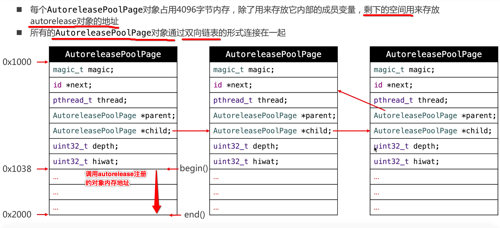
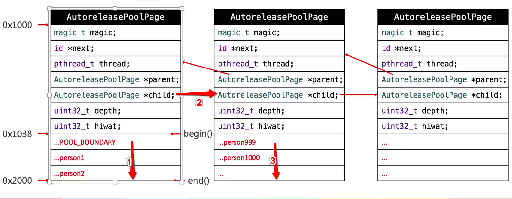
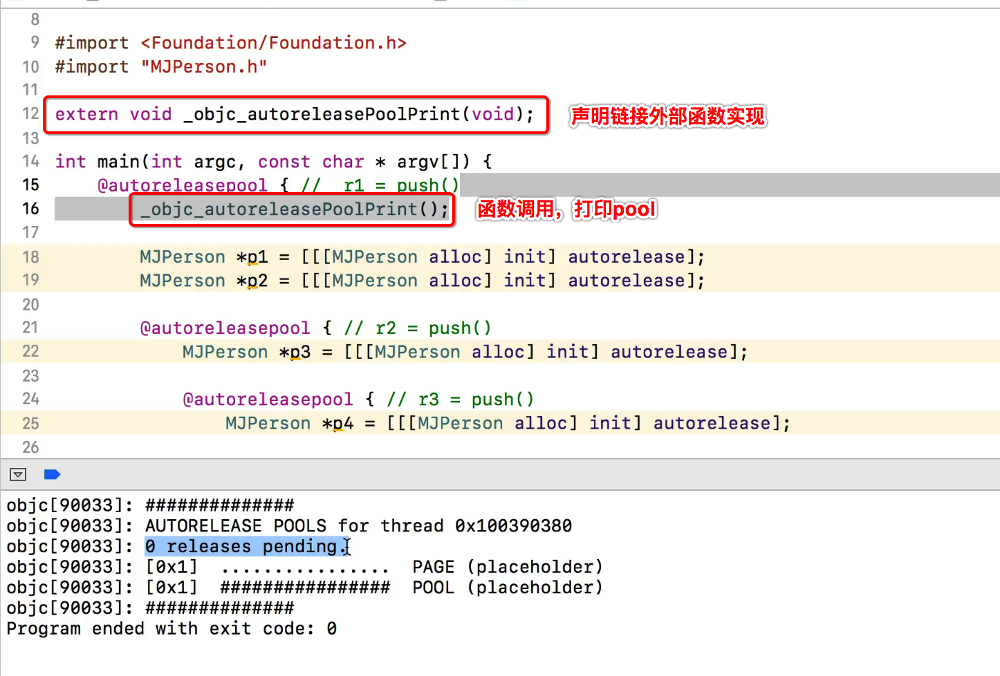
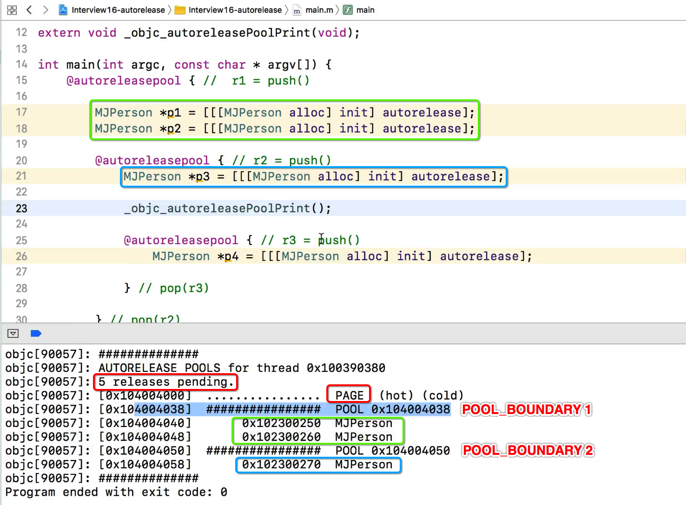
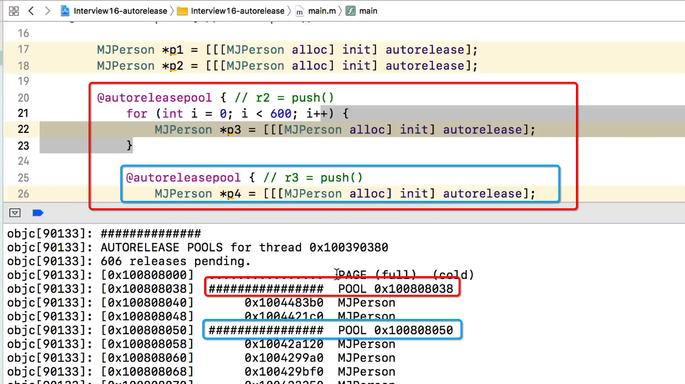

[TOC]


## 1. autorelease/`__autoreleasing`

### 1. [MRC] iOS5 以前 写法

```c
// 1、开始pool
NSAutoreleasePool *pool = [[NSAutoreleasePool alloc] init];
 
// 2、注册对象到pool
NSObject* obj1 = [[NSObject new] autorelease]; // retainCount=1
NSObject* obj2 = [[NSObject new] autorelease]; // retainCount=1
 
// 3、结束pool，对pool内所有对象release
[pool release];

// 4、retainCount=0
```


### 2. [MRC] iOS5 以后 写法

```c
@autoreleasepool
{  
  NSObject* obj1 = [[NSObject new] autorelease]; // retainCount=1
  NSObject* obj2 = [[NSObject new] autorelease]; // retainCount=1
}

// retainCount=0
```
### 3. [ARC] 写法

```c
@autoreleasepool
{  
  __autoreleasing NSObject* obj1 = [[NSObject new] autorelease]; // retainCount=1
  __autoreleasing NSObject* obj2 = [[NSObject new] autorelease]; // retainCount=1
}
```

### 4. autoreleasepool 注意事项

- 1) 在 **ARC** 下，必须应该用 **@autoreleasepool**
- 2) 不要把 **大量的循环** 操作放到 **一个自动释放池** 内, 否则会造成 **内存峰值**
- 3) 避免对 **大内存对象** 使用该方法，应尽量少用这种延迟释放机制
- 4) SDK 中一般利用 **静态方法** 创建、返回 **已经 autorelease 的对象**, 不需要再自动释放了


### 5. clang 反编译 生成 C++ 代码

```c++
struct __AtAutoreleasePool 
{
  // 构造函数
  __AtAutoreleasePool() 
  {
    atautoreleasepoolobj = objc_autoreleasePoolPush(); // push
  }

  // 析构函数
  ~__AtAutoreleasePool() 
  {
    objc_autoreleasePoolPop(atautoreleasepoolobj); // pop
  }

  void* atautoreleasepoolobj;
};

// C++ 代码
{
  // 1、创建【局部栈帧】结构体对象，构造函数中执行 objc_autoreleasePoolPush() 
  __AtAutoreleasePool __autoreleasepool;

  // 2、3、创建 MJPerson 堆区对象、然后再调用 autorelease
  MJPerson *person = ((MJPerson *(*)(id, SEL))(void *)objc_msgSend)((id)((MJPerson *(*)(id, SEL))(void *)objc_msgSend)((id)((MJPerson *(*)(id, SEL))(void *)objc_msgSend)((id)objc_getClass("MJPerson"), sel_registerName("alloc")), sel_registerName("init")), sel_registerName("autorelease"));

} // 4、超出作用域
  // 局部 pool对象释放
  // 调用 析构函数
  // 继而执行 objc_autoreleasePoolPop() 退栈顶 pool
```

- 1) 创建 autoreleasepool 并压入栈顶
- 2) 自定义对象调用 autorelease，加入到【栈顶 autoreleasepool】
- 3) pop  退【栈顶 autoreleasepool】给池子中所有对象, **发送 release 消息** 完成释放

### 6. 大致结构


```c
// 1、创建pool，并压入栈顶
id atautoreleasepoolobj = objc_autoreleasePoolPush(); // push

// 2、创建堆区对象，并注册到栈顶pool
MJPerson *person = [[[MJPerson alloc] init] autorelease];

// 3、退栈顶pool，对pool中所有对象发送release消息
objc_autoreleasePoolPop(atautoreleasepoolobj); // pop
```


## 2. autoreleasepool 结构解析

### 1. objc_autoreleasePoolPush()

- 1) 创建 pool **page**
- 2) **push** pool page 压入栈顶

```c
void* objc_autoreleasePoolPush(void)
{
  if (UseGC) 
    return NULL; // 如果使用垃圾回收机制

  return AutoreleasePoolPage::push(); // create && push page
}
```

### 2. objc_autoreleasePoolPop()

- 1) 退出【栈顶】pool page

```c
void objc_autoreleasePoolPop(void *ctxt)
{
  if (UseGC) return;

  // fixme rdar://9167170
  if (!ctxt) return;

  AutoreleasePoolPage::pop(ctxt); // pop page
}
```

### 3. AutoreleasePool==Page== 

```c
class AutoreleasePoolPage 
{
#define POOL_SENTINEL 0
  static size_t const SIZE = 
#if PROTECT_AUTORELEASEPOOL
    4096;  // must be multiple of vm page size
#else
    4096;  // size and alignment, power of 2
#endif
  magic_t const magic;    // 用于数据校验
  id *next;               // 指向下一个用于存储autorelease对象内存地址的位置（栈结构）
  pthread_t const thread; // 所属线程
  AutoreleasePoolPage * const parent; // 上一个page
  AutoreleasePoolPage *child; // 下一个page
  uint32_t const depth;   // 当前 page 深度
  uint32_t hiwat;
  ...

  // 获取当前 page 用于存储【autorelease 对象内存地址】的【起始】位置
  id * begin() {
    return (id *) ((uint8_t *)this+sizeof(*this));
  }

  // 获取当前page 用于存储【autorelease 对象内存地址】的【结束】位置
  id * end() {
    return (id *) ((uint8_t *)this+SIZE);
  }
}
```

- 1) AutoreleasePool **双向链表** 结构
- 2) 1个 Page 占用 **4096 字节**
- 3) begin() 获取 page 用于存储【autorelease 对象内存地址】的【起始】位置
- 4) 当前 page 存储不下时，则创建一个新 page 来存储，并组织为 **链表** 连起来



### 4. [对象 autorelease]



- 1) objc_autoreleasePoolPush() 
  - 1）从最开始的位置压入 `#define POOL_BOUNDARY nil` 标记值
  - 2）记录初始位置

- 2) 后续 依次往下 存储, 调用 autorelease 方法的【对象的内存地址】
- 3、当前 page 存储不下时
  - 1）则创建一个新 page 来存储，
  - 2）并组织为链表连起来

- 4、当 pool 销毁时，【相反顺序】释放对象
  - 1）【从后往前】销毁 page
  - 2）【从下往上】通知存储的 autorelease 对象释放

- 5、`#define POOL_BOUNDARY nil` 标记值作为一个【pool 开始】
- 6、如果是【嵌套 pool】
  - 1）则写入 page 中的, 不是【对象内存地址】
  - 2）而是【POOL_BOUNDARY 标记值】


## 3. 打印 autoreleasepool 信息

### 1. 没有 autorelease 对象

- 1) cold：前面被分配的 page，但并不是当前操作的 page
- 2) hot：当前正在使用的 page



### 2. 有 autorelease 对象



### 3. autorelease 嵌套




## 4. 测试函数

```c
// 在文件中 extern 声明链接外部符号后，即可使用这两个函数
extern void _objc_autoreleasePoolPrint();//打印注册到自动释放池中的对象
extern uintptr_t _objc_rootRetainCount(id obj);//获取对象的引用计数
```


## 5. autoreleasepool 与 runloop

runloop_AutoreleasePool.md

