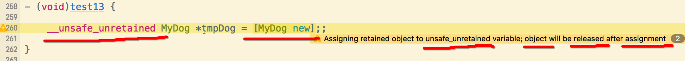
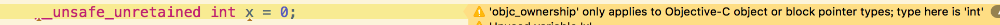

[TOC]


## 1. `__weak` 修饰符

[点击我](01/README.md)


## 2. `__unsafe_unretained`

### 1. ==无法持有== 对象

#### 1. 编译器会报警告



#### 2. 崩溃代码

```objecive-c
// 1、
id __unsafe_unretained obj1 = nil;

// 2、
{
  id  obj0 = [NSMutableArray array]; // 局部释放池内的对象
//id  obj0 = [[NSMutableArray alloc] init]; // 同上
  [obj0 addObject:@"obj"];
  obj1 = obj0;
  NSLog(@"obj0 = %@", obj0);
} // 超出作用域，释放释放池内的对象

// 3、此时 __unsafe_unretained 修饰的 obj1 已经成为【野指针】
NSLog(@"obj1 = %@", obj1);
```

#### 3. 正常代码

```objective-c
// 1、
id __unsafe_unretained obj1 = nil;

// 2、
{
  id obj0 = [NSMutableArray arrayWithObjects:@"obj",nil]; // 注意：数组元素>0
  obj1 = obj0;
  NSLog(@"obj0 = %@", obj0);
}

// 3、
NSLog(@"obj1 = %@", obj1);
```

- 1、运行正常，没有产生崩溃
- 2、因为此时并没有使用 **自动释放池** 来延迟对象内存释放
- 3、而是使用 **一对缓存相关** 函数来管理对象的内存
  - 1）**objc_autoreleaseReturnValue**() => 调用方
  - 2）**objc_retainAutoreleasedReturnValue**() => 被调用方

### 2. 与 `__weak` 不同点

- 只能修饰【指针变量】
- 不能修饰【基本类型变量】，否则编译器报警告
- 编译器【不会附加】`retain/release/autorelease` 等代码，即不会修改内存的retainCount
- **unsafe_unretained**变量，**不会**在objc对象被释放的时候，**自动赋值为nil**
- 所以当 unsafe unretain 修饰的指针变量，所指向的对象被废弃时，该指针变量会成为 **野指针**



### 3. 解决 block reain 外部对象, 效率最高的方式

- 是解决 objc 对象之间 **retian cycle** 速度最快, 的一种解决办法
- 因为 block 捕获 unsafe unretain 修饰对象时, 直接 **传递对象的【内存地址】**
- 所以 **不会** 执行任何的 **retain/release/autorelease** 等内存代码
- 但是需要考虑指向的对象是否 **可能会被释放** , 导致出现 **BAD_ACCESS** 崩溃

```objc
@interface Dog : NSObject
@property (nonatomic, copy) NSString* name;
@end
@implementation Dog
- (void)dealloc {
  NSLog(@"%@", self);
}
- (NSString *)description {
  return [NSString stringWithFormat:@"<%@ - %p: %@>", self.class, self, _name];
}
@end

@implementation ViewController
{
  void (^_ivar_block)(void);
}

- (void)touchesBegan:(NSSet<UITouch *> *)touches withEvent:(UIEvent *)event
{
  //1. 局部对象内存
  Dog *dog = [Dog new];
  dog.name = @"ahahha";

  //2. 使用__unsafe_unretained修饰的指针变量指向内存
  __unsafe_unretained Dog *tmpDog = dog;

  //3. 使用成员变量block来捕获外部对象
  _ivar_block = ^() {
    NSLog(@"name = %@", tmpDog.name);
  };
}

@end
```

运行后结果

```
2017-11-17 10:10:00.793 Demo[1679:24930] <Dog - 0x7fd431e04600: ahahha>
```

可以正常释放局部的对象，也就是说并没retain外部的对象。

### 4. 修饰的指针变量，==不会== 自动 ==赋值 nil==

- 如果被访问的地址已经被**废弃**，再去使用该指针变量，就会造成崩溃
- 当对象被废弃时，指向对这个被废弃对象所在内存的指针变量，就成为了一个野指针，继续使用会造成崩溃。

```objc
@interface Dog : NSObject
@property (nonatomic, copy) NSString* name;
@end
@implementation Dog
- (void)dealloc {
  NSLog(@"%@", self);
}
- (NSString *)description {
  return [NSString stringWithFormat:@"<%@ - %p: %@>", self.class, self, _name];
}
@end

@implementation ViewController

- (void)touchesBegan:(NSSet<UITouch *> *)touches withEvent:(UIEvent *)event
{
  //1. 局部对象内存
  Dog *dog = [Dog new];
  
  //2. __unsafe_unretained 修饰的指针变量指向内存
  __unsafe_unretained Dog *tmpDog = dog;
  
  //3. 释放掉对象内存
  dog = nil;
  
  //4. 长时间不断使用unsafe指针
  NSLog(@"%@", tmpDog);
}

@end
```

```
0x1b21930129900
```

unsafe unrained 变量，在指向的对象废弃后，并不会自动赋值为nil。

### 5. 编译器, ==不会附加== retain/release/autorelease 等内存管理

#### 1. weak 处理方式

- 1、使用`__weak`修饰的指针变量指向的对象时
- 2、会将被指向的对象自动注册到自动释放池
- 3、防止使用的时候被废弃
- 4、但是影响了代码执行效率

```objc
@interface Dog : NSObject
@property (nonatomic, copy) NSString* name;
@end
@implementation Dog
- (void)dealloc {
  NSLog(@"%@", self);
}
- (NSString *)description {
  return [NSString stringWithFormat:@"<%@ - %p: %@>", self.class, self, _name];
}
@end

@implementation ViewController
{
  void (^_ivar_block)(void);
}

- (void)touchesBegan:(NSSet<UITouch *> *)touches withEvent:(UIEvent *)event
{
  //1.
  Dog* dog = [Dog new];
  dog.name = @"ahahha";

  //2. weak修饰指针，避免block强引用
  __weak Dog *weak_dog = dog;

  //3.
  double date_s = CFAbsoluteTimeGetCurrent();
  for (int i = 0; i < 100000; i++) {
    weak_dog.name;
  }

  double date_current = CFAbsoluteTimeGetCurrent() - date_s;
  NSLog(@"consumeTime: %f μs",date_current * 11000 * 1000);
}

@end
```

运行时间

```
consumeTime: 85161.864758 μs
```

#### 2. unsafe unretained 处理方式

- 直接将【内存地址】传入到 block
- 不进行任何的内存管理

所以 unsafe unretained 效率会比 weak 要高一些。

如果一个对象**确定不会被废弃**，或者**调用完成之前不会被废弃**，就使用`__unsafe_unretained`来修饰指针变量，解决内存强引用的问题：

```objc
@interface Dog : NSObject
@property (nonatomic, copy) NSString* name;
@end
@implementation Dog
- (void)dealloc {
  NSLog(@"%@", self);
}
- (NSString *)description {
  return [NSString stringWithFormat:@"<%@ - %p: %@>", self.class, self, _name];
}
@end

@implementation ViewController
{
  void (^_ivar_block)(void);
}

- (void)touchesBegan:(NSSet<UITouch *> *)touches withEvent:(UIEvent *)event
{
  //1.
  Dog* dog = [Dog new];
  dog.name = @"ahahha";
  
  //2. unsafe unretained 修饰指针，避免block强引用
  __unsafe_unretained Dog *unsafe_unretained_dog = dog;
  
  //3.
  double date_s = CFAbsoluteTimeGetCurrent();
  for (int i = 0; i < 100000; i++) {
    unsafe_unretained_dog.name;
  }
  
  double date_current = CFAbsoluteTimeGetCurrent() - date_s;
  NSLog(@"consumeTime: %f μs",date_current * 11000 * 1000);
}

@end
```

运行时间

```
consumeTime: 25024.890900 μs
```

unsafe unretained 消耗的时间远远小于 weak。


## 3. `__strong`

### 1. 持有与释放的原则

- 自己生成的对象，自己持有
- 非自己生成的对象，我也能持有
- 不再需要自己持有的对象时进行释放
- 非自己持有的对象无法释放

会自动由编译器，添加对指针变量进行**retain/release/autorelease**等内存管理代码。

### 2. 一对重要的函数，用于返回值对象的内存管理优化

`objc_autoreleaseReturnValue(id obj)`与`objc_retainAutoreleasedReturnValue(id obj)`这一对函数，在返回值为objc对象时, **禁止** **返回值 objc 对象** 被注册到 **autorelease pool** 的多余过程。

#### 1. objc_autoreleaseReturnValue

```c
id  objc_autoreleaseReturnValue(id obj)
{
  // 1. 如果调用函数的一方，在获取到返回值后，使用了 objc_retainAutoreleasedReturnValue(obj)
  // 就走如下if语句，
  // 首先、对该返回值对象做一个标记
  // 最后、直接返回这个返回值对象
    if (callerAcceptsFastAutorelease(__builtin_return_address(0))) {//判断调用方法，是否使用了 objc_retainAutoreleasedReturnValue(obj)
        tls_set_direct(AUTORELEASE_POOL_RECLAIM_KEY, obj);//对该返回值对象做一个标记
        return obj;
    }

    //2. 相反如果在获取到返回值后，没有使用 objc_retainAutoreleasedReturnValue(obj)
    // 则将对象注册到一个释放池中，然后再返回
    return objc_autorelease(obj);
}
```

#### 2. objc_retainAutoreleasedReturnValue

```c
id objc_retainAutoreleasedReturnValue(id obj)
{
  //1. 判断传入的对象，是否是需要做内存优化。如果需要走如下if语句:
  // 首先、根据标记从缓存中取出返回值对象
  // 然后、取消这个对象的返回值内存优化标记
  // 最后、返回这个对象
    if (obj == tls_get_direct(AUTORELEASE_POOL_RECLAIM_KEY)) {
        tls_set_direct(AUTORELEASE_POOL_RECLAIM_KEY, 0);
        return obj;
    }

    //2. 而如果没有被标记做返回值优化的对象
    // 会被retain一次，增加其retainCount
    return objc_retain(obj);
}
```

### 3. `+[NSMutableArray array]` 返回值

```objc
@implementation NSMutableArray

+ (id)array {

  //1. 生成一个数组对象
  id obj = objc_msgSend(NSMutableArray, @selector(alloc));
  
  //2. 执行对象的初始化init方法
  obj = objc_msgSend(obj, @selector(init));
  
  //3. 【重点】
  return objc_autoreleaseReturnValue(obj);
}

@end
```

### 4. 接收 `+[NSMutableArray array]` 返回值

```objc
@implementation ViewController 
 
- (void) test  {
  id __strong obj = [NSMutableArray array];
}
 
@emd
```

### 5. 最终被编译成为的C代码

```c
void test(id target, SEL sel) 
{
  //1. 调用方法获取返回值对象
  id obj = objc_msgSend(NSMutableArray, @selector(array));

  //2. 【重点】紧跟在获取方法返回值的代码后面 
  objc_retainAutoreleasedReturnValue(obj);

  //3.
  objc_release(obj);
}
```


## 4. `__autoreleasing`

[点击我](02/README.md)


## 5. `__block`

- 1）ARC , `__block` 会产生 **对象持有**（ARC 默认使用 `__strong` 强持有）
- 2）MRC , `__block` 不会产生


