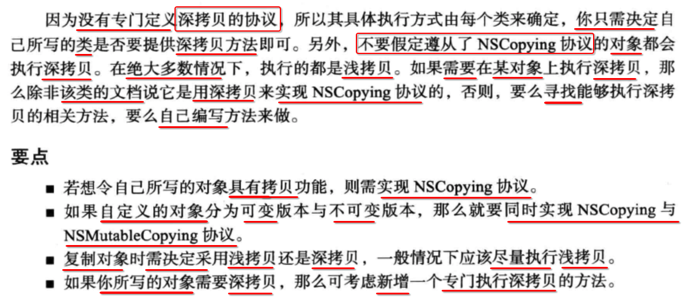
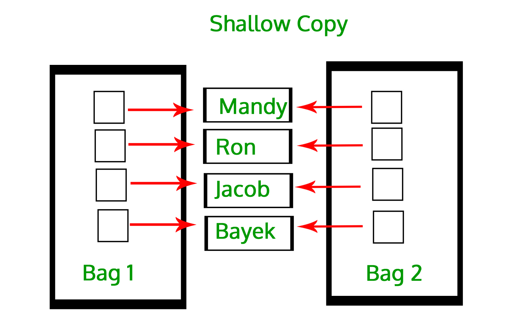
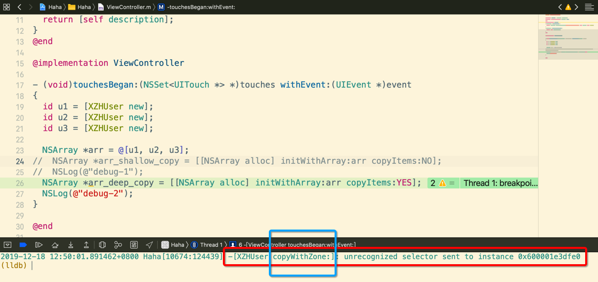
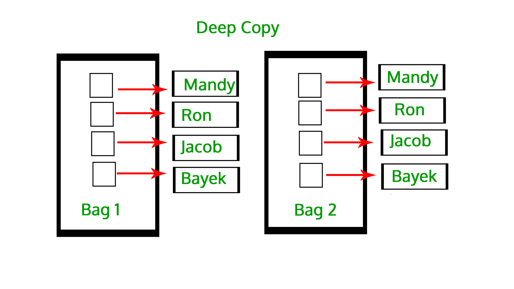
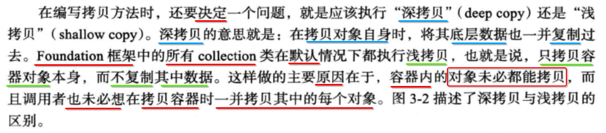
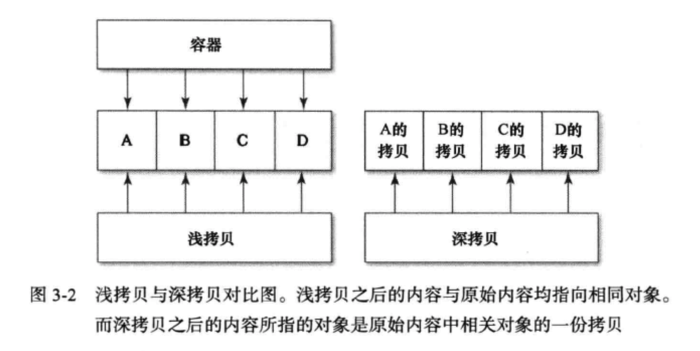
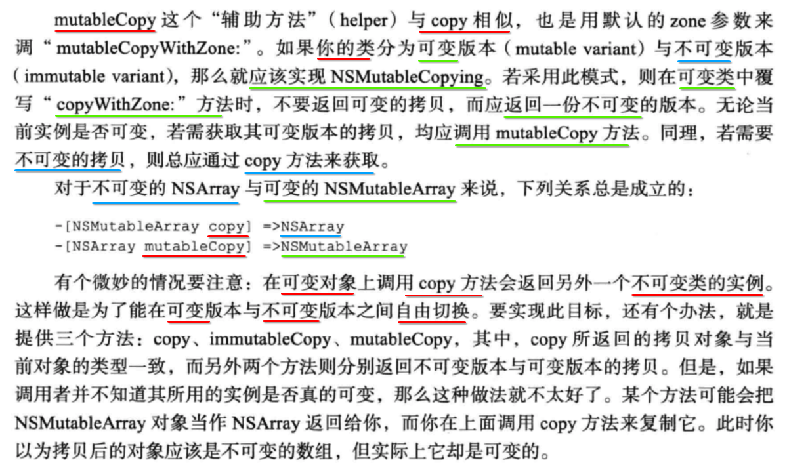
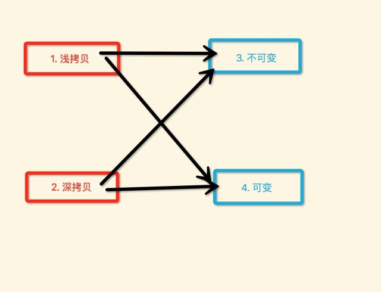

[TOC]


## 1. 关于对象拷贝, Effective objc 2.0 书的结论

> 下图, 取自于 Effective objc 2.0 一书



- shallow copy (浅拷贝)
- deep copy (深拷贝)


## 2. copy 协议

- 1) 协议
  - 只是 **约定** 了如果你要 **具备那个能力**, 你 **必须要做的事情**
  - 而具体你是 **如何做到那件事**, 调用者是不关心的
- 2) Foundation 提供的 2个 协议,  让一个类 **具备对象拷贝能力** 的协议
  - NSCopying 协议
  - NSMutableCopy 协议
- 3) 可能很多人认为
  - 实现 **NSCopying** 协议, 就是 **浅拷贝** 
  - 实现 **NSMutableCopy** 协议, 就是 **深拷贝** 
  - 显然是 **错误** 的
  - 因为苹果只是约定了一个协议, 而我在实现的时候, 到底怎么实现, 是我来决定的
- 4) **NSCopying/NSMutableCopy** 这 2个 copy 协议, 
  - 只是说你想要 **具备拷贝** 这个能力, 你需要做到的事情
  - 但是具体 **怎么拷贝(浅、深)** 是取决于 **你自己的实现** 方式
  - 你想让 copy/mutableCopy **浅拷贝**, 那就按 **浅拷贝** 方式实现
  - 你想让 copy/mutableCopy **深拷贝**, 那就按 **深拷贝** 方式实现 (但是不建议, 下面有原因)
- 5) Foundation 中的大多数 **集合** 类型
  - 都已经实现了 **NSCopying** 和 **NSMutableCopy** 这2个协议
  - 所以 Foundation 中的 **集合** 对象, 都可以直接发送 **copy、mutableCopy** 消息
- 6) **自定义类型** 
  - 首先, 你必须让这个自定义类 **具备** 能够被 **拷贝** 的能力
    - 那到底选择, 实现  **NSCopying** 协议, 还是或者实现 **NSMutableCopy** 协议 ???
    - 取决于 **可变** 与 **不可变**
  - 再次, 可以接着考虑, 支持 **浅拷贝** 还是 **深拷贝**, 还是同时都支持
      - 并不是, 实现了 **NSCopying** 协议, 就具备 **浅拷贝** 能力
      - 也不是, 实现了 **NSMutableCopy** 协议, 就具备 **深拷贝** 能力
      - 因为 **NSCopying/NSMutableCopy** 协议, 具体的实现, 是控制在开发者手中的
      - 你想让这个类 **浅拷贝**, 那么他就 **浅拷贝**
      - 你想让这个类 **深拷贝**, 那么他就 **深拷贝**
      - 所以 **怎么拷贝** 的 **决定权** 完全处于 **你自己**


## 3. 测试 Foundation ==容器对象== copy/mutableCopy

> 下面以 NSArray/NSMutableArray 举例, NSSet/NSDictionary 一样的.

### 1. NSArray - copy

#### 1. 测试代码

```objective-c
#import "ViewController.h"

// 实体类, 「不实现」任何的 copy 协议
@interface XZHUser : NSObject
@end
@implementation XZHUser
- (NSString *)description {
  return [NSString stringWithFormat:@"<%@ - %p>", [self class], self];
}
-(NSString *)debugDescription {
  return [self description];
}
@end

// VC
@implementation ViewController

- (void)touchesBegan:(NSSet<UITouch *> *)touches withEvent:(UIEvent *)event
{
  id u1 = [XZHUser new];
  id u2 = [XZHUser new];
  id u3 = [XZHUser new];
  NSLog(@"debug-1"); // 此行, 加上断点

  NSArray *arr       = @[u1, u2, u3];
  NSArray *arr_copy1 = [arr copy];
  NSArray *arr_copy2 = [arr copy];
  NSLog(@"debug-2"); // 此行, 加上断点
}
@end
```

#### 2. 断点 debug-1 处, po 打印 u1、u2、u3 三个对象的内存地址

```
(lldb) po u1
<XZHUser - 0x600002d50410>

(lldb) po u2
<XZHUser - 0x600002d50420>

(lldb) po u3
<XZHUser - 0x600002d50430>
```

#### 3. 断点 debug-2 处, po 打印 arr

```
(lldb) po arr
<__NSArrayI 0x6000021c11d0>(
<XZHUser - 0x600002d50410>,
<XZHUser - 0x600002d50420>,
<XZHUser - 0x600002d50430>
)
```

#### 4. 断点 debug-2 处, 打印 arr_copy1

```
(lldb) po arr_copy1
<__NSArrayI 0x6000021c11d0>(
<XZHUser - 0x600002d50410>,
<XZHUser - 0x600002d50420>,
<XZHUser - 0x600002d50430>
)
```

#### 5. 断点 debug-2 处, 打印 arr_copy2

```
(lldb) po arr_copy2
<__NSArrayI 0x6000021c11d0>(
<XZHUser - 0x600002d50410>,
<XZHUser - 0x600002d50420>,
<XZHUser - 0x600002d50430>
)
```

#### 6. 结论

- arr, arr_copy1, arr_copy2 这三个 容器对象, **类型** 和 **内存地址** 都是 **一样**

  | 容器对象 | 类型 | 内存地址 |
  | -------- | ---- | -------- |
  | arr       | `__NSArrayI` | 0x6000021c11d0 |
  | arr_copy1 | `__NSArrayI` | 0x6000021c11d0 |
  | arr_copy2 | `__NSArrayI` | 0x6000021c11d0 |

- 而且, **arr, arr_copy1, arr_copy2** 内部的 **3个 XZHUser 对象的** 内存地址, 也是 **一样**

  | XZHUser 对象 | 内存地址 |
  | ------------ | -------- |
  | u1 | 0x600002d50410 |
  | u2 | 0x600002d50420 |
  | u3 | 0x600002d50430 |

### 2. NSArray - mutableCopy

#### 1. 测试代码

```objective-c
#import "ViewController.h"

// 实体类, 「不实现」任何的 copy 协议
@interface XZHUser : NSObject
@end
@implementation XZHUser
- (NSString *)description {
  return [NSString stringWithFormat:@"<%@ - %p>", [self class], self];
}
-(NSString *)debugDescription {
  return [self description];
}
@end

// VC
@implementation ViewController

- (void)touchesBegan:(NSSet<UITouch *> *)touches withEvent:(UIEvent *)event
{
  id u1 = [XZHUser new];
  id u2 = [XZHUser new];
  id u3 = [XZHUser new];
  NSLog(@"debug-1"); // 此行, 加上断点

  NSArray *arr       = @[u1, u2, u3];
  NSArray *arr_copy1 = [arr mutableCopy];
  NSArray *arr_copy2 = [arr mutableCopy];
  NSLog(@"debug-2"); // 此行, 加上断点
}
@end
```

#### 2. 断点 debug-1 处, po 打印 u1、u2、u3 三个对象的内存地址

```
(lldb) po u1
<XZHUser - 0x600003563b50>

(lldb) po u2
<XZHUser - 0x600003563b60>

(lldb) po u3
<XZHUser - 0x600003563b70>
```

#### 3. 断点 debug-2 处, po 打印 arr

```
(lldb) po arr
<__NSArrayI 0x6000039244e0>(
<XZHUser - 0x600003563b50>,
<XZHUser - 0x600003563b60>,
<XZHUser - 0x600003563b70>
)
```

#### 4. 断点 debug-2 处, 打印 arr_copy1

```
(lldb) po arr_copy1
<__NSArrayM 0x600003924210>(
<XZHUser - 0x600003563b50>,
<XZHUser - 0x600003563b60>,
<XZHUser - 0x600003563b70>
)
```

#### 5. 断点 debug-2 处, 打印 arr_copy2

```
(lldb) po arr_copy2
<__NSArrayM 0x6000039243c0>(
<XZHUser - 0x600003563b50>,
<XZHUser - 0x600003563b60>,
<XZHUser - 0x600003563b70>
)
```

#### 6. 结论

- arr, arr_copy1, arr_copy2 这三个 容器对象
  - 自身的 内存地址 **不同**
    - arr: 0x6000039244e0
    - arr_copy1: 0x600003924210
    - arr_copy2: 0x6000039243c0
  - 而且 **mutableCopy** 拷贝出来的是 `__NSArrayM` 类型的 **可变** 数组, 类型都不一致, 肯定对象的内存地址也不同

  | 容器对象 | 类型 | 内存地址 |
  | -------- | ---- | -------- |
  | arr       | `__NSArrayI` | 0x6000039244e0 |
  | arr_copy1 | `__NSArrayM` | 0x600003924210 |
  | arr_copy2 | `__NSArrayM` | 0x6000039243c0 |

- 但是, **arr, arr_copy1, arr_copy2** 内部的 **3个 XZHUser 对象的** 内存地址, 是 **一样**

  | XZHUser 对象 | 内存地址 |
  | ------------ | -------- |
  | u1 | 0x600003563b50 |
  | u2 | 0x600003563b60 |
  | u3 | 0x600003563b70 |

### 3. NSMutableArray - copy

#### 1. 测试代码

```objective-c
#import "ViewController.h"

// 实体类, 「不实现」任何的 copy 协议
@interface XZHUser : NSObject
@end
@implementation XZHUser
- (NSString *)description {
  return [NSString stringWithFormat:@"<%@ - %p>", [self class], self];
}
-(NSString *)debugDescription {
  return [self description];
}
@end

// VC
@implementation ViewController

- (void)touchesBegan:(NSSet<UITouch *> *)touches withEvent:(UIEvent *)event
{
  id u1 = [XZHUser new];
  id u2 = [XZHUser new];
  id u3 = [XZHUser new];
  NSLog(@"debug-1"); // 此行, 加上断点

  NSMutableArray *arr = [@[u1, u2, u3] mutableCopy];
  NSArray *arr_copy1  = [arr copy];
  NSArray *arr_copy2  = [arr copy];
  NSLog(@"debug-2"); // 此行, 加上断点
}
@end
```

#### 2. 断点 debug-1 处, po 打印 u1、u2、u3 三个对象的内存地址

```
(lldb) po u1
<XZHUser - 0x60000301fc30>

(lldb) po u2
<XZHUser - 0x60000301fc40>

(lldb) po u3
<XZHUser - 0x60000301fc50>
```

#### 3. 断点 debug-2 处, po 打印 arr

```
(lldb) po arr
<__NSArrayM 0x600003c1ea90>(
<XZHUser - 0x60000301fc30>,
<XZHUser - 0x60000301fc40>,
<XZHUser - 0x60000301fc50>
)
```

#### 4. 断点 debug-2 处, 打印 arr_copy1

```
(lldb) po arr_copy1
<__NSArrayI 0x600003c1e970>(
<XZHUser - 0x60000301fc30>,
<XZHUser - 0x60000301fc40>,
<XZHUser - 0x60000301fc50>
)
```

#### 5. 断点 debug-2 处, 打印 arr_copy2

```
(lldb) po arr_copy2
<__NSArrayI 0x600003c1fde0>(
<XZHUser - 0x60000301fc30>,
<XZHUser - 0x60000301fc40>,
<XZHUser - 0x60000301fc50>
)
```

#### 6. 结论

- arr, arr_copy1, arr_copy2 这三个 容器对象, 类型 和 内存地址, 都是 **不同** 的

  | 容器对象 | 类型 | 内存地址 |
  | -------- | ---- | -------- |
  | arr       | `__NSArrayM` | 0x600003c1ea90 |
  | arr_copy1 | `__NSArrayI` | 0x600003c1e970 |
  | arr_copy2 | `__NSArrayI` | 0x600003c1fde0 |

- 但是, **arr, arr_copy1, arr_copy2** 内部的 **3个 XZHUser 对象的** 内存地址, 是 **一样**

  | XZHUser 对象 | 内存地址 |
  | ------------ | -------- |
  | u1 | 0x60000301fc30 |
  | u2 | 0x60000301fc40 |
  | u3 | 0x60000301fc50 |

### 4. NSMutableArray - mutableCopy

#### 1. 测试代码

```objective-c
#import "ViewController.h"

// 实体类, 「不实现」任何的 copy 协议
@interface XZHUser : NSObject
@end
@implementation XZHUser
- (NSString *)description {
  return [NSString stringWithFormat:@"<%@ - %p>", [self class], self];
}
-(NSString *)debugDescription {
  return [self description];
}
@end

// VC
@implementation ViewController

- (void)touchesBegan:(NSSet<UITouch *> *)touches withEvent:(UIEvent *)event
{
  id u1 = [XZHUser new];
  id u2 = [XZHUser new];
  id u3 = [XZHUser new];
  NSLog(@"debug-1"); // 此行, 加上断点

  NSMutableArray *arr = [@[u1, u2, u3] mutableCopy];
  NSArray *arr_copy1  = [arr mutableCopy];
  NSArray *arr_copy2  = [arr mutableCopy];
  NSLog(@"debug-2"); // 此行, 加上断点
}
@end
```

#### 2. 断点 debug-1 处, po 打印 u1、u2、u3 三个对象的内存地址

```
(lldb) po u1
<XZHUser - 0x600001270270>

(lldb) po u2
<XZHUser - 0x600001270280>

(lldb) po u3
<XZHUser - 0x600001270290>
```

#### 3. 断点 debug-2 处, po 打印 arr

```
(lldb) po arr
<__NSArrayM 0x600001e0c960>(
<XZHUser - 0x600001270270>,
<XZHUser - 0x600001270280>,
<XZHUser - 0x600001270290>
)
```

#### 4. 断点 debug-2 处, 打印 arr_copy1

```
(lldb) po arr_copy1
<__NSArrayM 0x600001e0c720>(
<XZHUser - 0x600001270270>,
<XZHUser - 0x600001270280>,
<XZHUser - 0x600001270290>
)
```

#### 5. 断点 debug-2 处, 打印 arr_copy2

```
(lldb) po arr_copy2
<__NSArrayM 0x600001e0cea0>(
<XZHUser - 0x600001270270>,
<XZHUser - 0x600001270280>,
<XZHUser - 0x600001270290>
)
```

#### 6. 结论

- arr, arr_copy1, arr_copy2 这三个 容器对象, 类型 相同,  内存地址 **不同**

  | 容器对象 | 类型 | 内存地址 |
  | -------- | ---- | -------- |
  | arr       | `__NSArrayM` | 0x600001e0c960 |
  | arr_copy1 | `__NSArrayM` | 0x600001e0c720 |
  | arr_copy2 | `__NSArrayM` | 0x600001e0cea0 |

- 但是, **arr, arr_copy1, arr_copy2** 内部的 **3个 XZHUser 对象的** 内存地址, 是 **一样**

  | XZHUser 对象 | 内存地址 |
  | ------------ | -------- |
  | u1 | 0x600001270270 |
  | u2 | 0x600001270280 |
  | u3 | 0x600001270290 |

### 5. 结论: NSArray/NSMutableArray 发送 copy/mutableCopy

- 改变 : 原始的 **NSArray/NSMutableArray** 对象的 **类型** 和 **内存地址**
- 不变 : NSArray/NSMutableArray 容器内部的 **元素, 内存地址**

### 6. 图示, 此种拷贝模式, 内存模型



- 1) 容器: 可能相同, 也可能不同
- 2) 元素: 一定相同

而这种 **拷贝模式**, 就叫做 **浅拷贝**。


## 4. 自定义类, 具备 ==拷贝== 能力

- 第一点: 实现 NSCopying 协议
- 第二点: 这里我并没有说, 具备 **浅拷贝** 能力, 而是描述 **拷贝** 能力, 是有原因的

### 1. 测试代码

```c
#import "ViewController.h"

@interface Person : NSObject <NSCopying>
@property (nonatomic, copy) NSString *pid;
@property (nonatomic, assign) NSInteger age;
@property (nonatomic, copy) NSString *name;

- (instancetype)initWithPid:(NSString *)pid Age:(NSInteger)age Name:(NSString *)name;

// 提供操作内部私有数组对象的方法
- (void)addCar:(id)car;
- (void)removeCar:(id)car;
- (NSArray *)cars;
@end

@implementation Person {
  @package
  NSMutableArray* _mutableCars;
}

- (instancetype)initWithPid:(NSString *)pid Age:(NSInteger)age Name:(NSString *)name {
  self = [super init];
  if (self) {
    _age         = age;
    _pid         = [pid copy];
    _name        = [name copy];
    _mutableCars = [NSMutableArray new];
  }
  return self;
}

- (void)addCar:(id)car {
  [_mutableCars addObject:car];
}

- (void)removeCar:(id)car {
  [_mutableCars removeObject:car];
}

- (NSArray*)cars {
  return [_mutableCars copy];
}

#pragma mark - 实现 NSCopying 协议, 按照【不可变版本】进行拷贝对象

- (id)copyWithZone:(NSZone *)zone
{
  // 1. 基本类型的属性, 递归【拷贝】
  Person *newCopy = [[Person alloc] initWithPid:_pid
                                            Age:_age
                                            Name:_name];

  // 2. 容器类型的属性, 直接赋值【指向】
  newCopy->_mutableCars = _mutableCars;

  // 3. 返回【新的】对象
  return newCopy;
}
@end

@implementation ViewController

- (void)touchesBegan:(NSSet<UITouch *> *)touches withEvent:(UIEvent *)event
{
  Person *p1 = [[Person alloc] initWithPid:@"person1" Age:19 Name:@"person1"];
  [p1 addCar:[NSObject new]];
  [p1 addCar:[NSObject new]];
  [p1 addCar:[NSObject new]];

  Person *p2 = [p1 copy];
  Person *p3 = [p2 copy];

  NSLog(@"%p - %p - %@", p1.name, p1->_mutableCars, p1->_mutableCars);
  NSLog(@"%p - %p - %@", p2.name, p2->_mutableCars, p2->_mutableCars);
  NSLog(@"%p - %p - %@", p3.name, p3->_mutableCars, p3->_mutableCars);
}

@end
```

### 2. 运行输出

```
2019-12-18 12:38:42.072945+0800 Haha[10105:115092] 0x10cfbe120 - 0x6000012700c0 - (
  "<NSObject: 0x600001ee8750>",
  "<NSObject: 0x600001ee8770>",
  "<NSObject: 0x600001ee8780>"
)
2019-12-18 12:38:42.073158+0800 Haha[10105:115092] 0x10cfbe120 - 0x6000012700c0 - (
  "<NSObject: 0x600001ee8750>",
  "<NSObject: 0x600001ee8770>",
  "<NSObject: 0x600001ee8780>"
)
2019-12-18 12:38:42.073362+0800 Haha[10105:115092] 0x10cfbe120 - 0x6000012700c0 - (
  "<NSObject: 0x600001ee8750>",
  "<NSObject: 0x600001ee8770>",
  "<NSObject: 0x600001ee8780>"
)
```

### 3. 结论

- 三个对象, 成员变量 name, 指向的内存地址, 都相同
- 三个对象, 成员变量 `_mutableCars`, **指向** 的内存地址, 都相同
- 三个对象, 成员变量 `_mutableCars`, **内部元素** 的内存地址, 都相同
- 三个对象, **自己** 的地址 肯定是 **不同** 的


## 5. Foundation 虽然没提供 ==深拷贝协议==, 但是 ==容器== 提供 深拷贝功能

### 1. 容器对象的 ==深拷贝== API

```objective-c
// NSArray 提供的
- (instancetype)initWithArray:(NSArray<ObjectType> *)array
                    copyItems:(BOOL)flag;
```

```objective-c
//  NSDictionary 提供的
- (instancetype)initWithDictionary:(NSDictionary<KeyType, ObjectType> *)otherDictionary
                         copyItems:(BOOL)
```

```objective-c
// NSSet 提供的
- (instancetype)initWithSet:(NSSet<ObjectType> *)set
                  copyItems:(BOOL)flag;
```

第二个 `copyItem:` 参数, 接收一个 BOOL 值:

- 传递 YES  => **深** 拷贝
- 传递 No   => **浅** 拷贝

### 2. ==容器内元素== 如果不实现 ==NSCopying/NSMutableCopying 协议==

#### 1. 测试代码

```c
#import "ViewController.h"

@interface XZHUser : NSObject <NSCopying>
@property (nonatomic, copy) NSString *name;
@end
@implementation XZHUser
- (NSString *)description {
  return [NSString stringWithFormat:@"<%@ - %p> name = %@", [self class], self, _name];
}
-(NSString *)debugDescription {
  return [self description];
}
@end

@implementation ViewController

- (void)touchesBegan:(NSSet<UITouch *> *)touches withEvent:(UIEvent *)event
{
  id u1 = [XZHUser new];
  id u2 = [XZHUser new];
  id u3 = [XZHUser new];

  NSArray *arr = @[u1, u2, u3];
//  NSArray *arr_shallow_copy = [[NSArray alloc] initWithArray:arr copyItems:NO];
//  NSLog(@"debug-1");
  NSArray *arr_deep_copy = [[NSArray alloc] initWithArray:arr copyItems:YES];
  NSLog(@"debug-2");
}

@end
```

#### 2. 运行崩溃



- 如果不实现 `NSCopying、NSMutableCopying` 协议，在执行 `-[NSArray initWithArray:copyItems:` 深拷贝, 时会造成崩溃
- 正是 Foundation 为什么, 默认都进行 `浅拷贝` 的原因了
- 因为系统并不知道, 我们开发者写的类型是否已经实现了NSCopying或NSMutableCopying协议，如果强制按照`深拷贝`，结果就是崩溃

### 4. 容器内元素, ==首先要具备拷贝的能力==, 才能执行 ==深拷贝== 操作

#### 1. 测试代码

```objective-c

```

#### 2. 断点处, po 打印 u1、u2、u3 三个对象的内存地址

```
(lldb) po u1
<XZHUser - 0x600000e469c0> name = (null)

(lldb) po u2
<XZHUser - 0x600000e469d0> name = (null)

(lldb) po u3
<XZHUser - 0x600000e46a70> name = (null)
```

#### 3. 断点处, po 打印 arr

```
(lldb) po arr
<__NSArrayI 0x6000002facd0>(
<XZHUser - 0x600000e469c0> name = (null),
<XZHUser - 0x600000e469d0> name = (null),
<XZHUser - 0x600000e46a70> name = (null)
)
```

#### 4. 断点处, 打印 arr_deep_copy

```
(lldb) po arr_deep_copy
<__NSArrayI 0x6000002fad00>(
<XZHUser - 0x600000e46ae0> name = (null),
<XZHUser - 0x600000e46af0> name = (null),
<XZHUser - 0x600000e46b00> name = (null)
)
```

#### 5. 结论

- 对于 容器

  | 容器对象 | 类型 | 内存地址 |
  | -------- | ---- | -------- |
  | arr       | `__NSArrayI` | 0x6000002facd0 |
  | arr_deep_copy | `__NSArrayI` | 0x6000002fad00 |

- 对于 arr 元素

  | XZHUser 对象 | 内存地址 |
  | ------------ | -------- |
  | u1 | 0x600000e469c0 |
  | u2 | 0x600000e469d0 |
  | u3 | 0x600000e46a70 |

- 对于 arr_deep_copy 元素

  | XZHUser 对象 | 内存地址 |
  | ------------ | -------- |
  | u1 | 0x600000e46ae0 |
  | u2 | 0x600000e46af0 |
  | u3 | 0x600000e46b00 |


可以看到, 此时, 2个 容器内的 **元素** 内存地址, 已经 **不同** 了。

### 5. 图示, 此种拷贝模式, 内存模型




## 6. 图示总结: 浅拷贝 vs 深拷贝

### 1. shallow copy 浅拷贝


### 2. deep copy 深拷贝


### 3. Foundation 默认, 采用 ==浅拷贝==



### 4. Effective Objc 书上总结: 浅拷贝 vs 深拷贝 



### 4. 遗留的问题

- 到此应该可以区分 **浅拷贝** 和 **深拷贝** 区别了, 但是还有一些问题
- **copy** 与 **mutableCopy** 有啥区别 ???
- 实现 **NSCopying** 协议, 就是 **浅拷贝** ???
- 实现 **NSMutableCopying** 协议, 就是 **深拷贝** ???


## 7. 遗留问题1: copy 与 mutableCopy

### 1. effective objc 书上的说明



### 2. NSObject 提供, 两种 对象拷贝 api

- 1) `-[NSObject copy]`
- 2) `-[NSObject mutableCopy]`

### 3. 如果你要发送 `-[NSObject copy]` 消息

那么你自己的类, 必须要实现 **NSCopying** 协议

```objective-c
@protocol NSCopying
- (id)copyWithZone:(nullable NSZone *)zone;
@end
```

### 4. 如果你要发送 `-[NSObject mutableCopy]` 消息

那么你自己的类, 必须要实现 **NSCopying** 协议

```objective-c
@protocol NSMutableCopying
- (id)mutableCopyWithZone:(nullable NSZone *)zone;
@end
```

### 5. 实现哪一种协议, 取决于你的类, 是否同时存在 ==可变== 和 ==不可变== 两个版本

- 1) 比如, 对于 iOS 中的 Array/Set/Dictionary/Request ..
  - 就同时存在 **可变** 与 **不可变** 两种版本
  - 这种情况下, 就必须 同时实现 NSCopying 和 NSMutableCopying 这 **2个协议**
  - 实现 NSCopying 协议, 让类支持拷贝得到一个 **不可变 (`__NSArrayI`)** 类型的对象
  - 而实现 NSMutableCopying 协议, 让类支持拷贝得到一个 **可变 (`__NSArrayM`)** 类型的对象

- 2) 但是对于我们自己一般的类
  - 就只存在 **一种情况**, 基本都是 **不可变**
  - 你选择实现 NSCopying 还是 NSMutableCopying 其中哪个, 都不重要
  - 区别只是, 你到底要发送 copy 还是 mutableCopy 消息
  - 所以默认情况下, 只需要实现 **NSCopying** 协议


## 8. 遗留问题2: 实现 **NSCopying** 协议, 就是 **浅拷贝** ???

### 1. 测试代码

```objective-c
#import "ViewController.h"

@interface Dog : NSObject <NSCopying>
@property (nonatomic, copy) NSString *name;
@end
@implementation Dog
#pragma mark - NSCopying
- (id)copyWithZone:(NSZone *)zone {
  Dog* obj = [Dog new];
  obj.name = [_name copy];
  return obj;
}
@end

@interface User : NSObject <NSCopying>
@property (nonatomic, copy) NSString *name;
@property (nonatomic, strong) Dog *dog;
@end
@implementation User
#pragma mark - NSCopying
- (id)copyWithZone:(NSZone *)zone {
  User *obj = [User new];
  obj.name  = [_name copy];
  obj.dog   = [_dog copy]; // 关键修改
  return obj;
}
@end

@implementation ViewController

- (void)touchesBegan:(NSSet<UITouch *> *)touches withEvent:(UIEvent *)event
{
  Dog *dog = [Dog new];

  User *u1 = [User new];
  u1.dog = dog;

  User *u2 = [u1 copy];
  NSLog(@"debug");
}

@end
```

### 2. po u1 和 u2

```
(lldb) po u1
<User: 0x600001765080>
```

```
(lldb) po u2
<User: 0x6000017650a0>
```

2个顶层的 User 对象, 内存地址 **不同**

### 3. po u1.dog 和 u2.dog

```
(lldb) po u1.dog
<Dog: 0x6000015703a0>
```

```
(lldb) po u2.dog
<Dog: 0x6000015703b0>
```

- 但是 2个顶层的 User 对象, **内部元素** 内存地址 **不同**
- 所以你还认为 **copy** 是 **浅拷贝** 吗?


## 9. 遗留问题3: 实现 **NSMutableCopying** 协议, 就是 **深拷贝** ???

### 1. 测试代码

```objective-c
#import "ViewController.h"

@interface Dog : NSObject <NSMutableCopying>
@property (nonatomic, copy) NSString *name;
@end
@implementation Dog
#pragma mark - NSMutableCopying
- (id)mutableCopyWithZone:(NSZone *)zone {
  Dog* obj = [Dog new];
  obj.name = [_name copy];
  return obj;
}
@end

@interface User : NSObject <NSMutableCopying>
@property (nonatomic, copy) NSString *name;
@property (nonatomic, strong) Dog *dog;
@end
@implementation User
#pragma mark - NSMutableCopying
- (id)mutableCopyWithZone:(NSZone *)zone {
  User *obj = [User new];
  obj.name  = [_name copy];
  obj.dog   = _dog;
  return obj;
}
@end

@implementation ViewController

- (void)touchesBegan:(NSSet<UITouch *> *)touches withEvent:(UIEvent *)event
{
  Dog *dog = [Dog new];

  User *u1 = [User new];
  u1.dog = dog;

  User *u2 = [u1 mutableCopy];
  NSLog(@"debug");
}

@end
```

### 2. po u1 和 u2

```
(lldb) po u1
<User: 0x600003453120>
```

```
(lldb) po u2
<User: 0x600003453140>
```

2个顶层的 User 对象, 内存地址 **不同**

### 3. po u1.dog 和 u2.dog

```
(lldb) po u1.dog
<Dog: 0x60000364c520>
```

```
(lldb) po u2.dog
<Dog: 0x60000364c520>
```

- 但是 2个顶层的 User 对象, **内部元素** 内存地址 **相同**
- 所以你还认为 **mutableCopy** 是 **深拷贝** 吗?


## 10. 该书上建议, 对自定义类型, 给 ==深拷贝== 增加新的 ==协议==

### 1. 基于 ==浅拷贝== 实现, 仍然使用系统的协议

#### 1. copy

```objective-c
@protocol NSCopying
- (id)copyWithZone:(nullable NSZone *)zone;
@end
```

#### 2. mutable copy

```objective-c
@protocol NSMutableCopying
- (id)mutableCopyWithZone:(nullable NSZone *)zone;
@end
```

### 2. 而基于 ==深拷贝== 实现, 则新增协议来规范, 不打扰 Foundation 规范

#### 1. copy

```objective-c
/**
 *  对应 NSCopying 协议
 */
@protocol NSDeepObjectCopying <NSObject>
- (id)deepCopy;
@end
```

#### 2. mutable copy

```objective-c
/**
 *  对应 NSMutableCopying 协议
 */
@protocol NSDeepObjectMuatbleCopying <NSObject>
- (id)deepMutableCopy;
@end
```

因为前面说了，Foundation基本上都是采用`浅拷贝`实现的所有的NSCopying、NSMutableCopying。

而我们突然使用`深拷贝`来改写NSCopying、NSMutableCopying，这会打破系统的平衡。

### 3. 需要实现 ==深拷贝== 的类型, 转而实现新增的协议

#### 1. XZHDeepCopying.h

```objective-c
#import <Foundation/Foundation.h>

@protocol NSDeepObjectCopying <NSObject>
- (id)deepCopy;
@end

@protocol NSDeepObjectMuatbleCopying <NSObject>
- (id)deepMutableCopy;
@end
```

#### 2. User.h

```objective-c
#import <Foundation/Foundation.h>
#import "Account.h"

// 深拷贝协议
#import "XZHDeepCopying.h"

/**
 *  添加对 深拷贝协议的实现，由于当前 User 就只有一个不可变版本，所以实现 XZHDeepCopying 协议
 */
@interface User : NSObject <NSCopying, XZHDeepCopying>

@property (nonatomic, assign) NSInteger uid;
@property (nonatomic, copy) NSString *uname;
@property (nonatomic, copy) NSString *upassword;

- (instancetype)initWithUid:(NSInteger)uid
                      uName:(NSString *)name
                  uPassword:(NSString *)password;

- (void)addAccount:(Account *)account;
- (void)removeAccount:(Account *)account;
- (NSArray *)accounts;

@end
```

#### 3. User.m

```objective-c
#import "User.h"

@implementation User {
  NSMutableArray *_mutaAccounts;
}

- (instancetype)initWithUid:(NSInteger)uid
                      uName:(NSString *)name
                  uPassword:(NSString *)password
{
  self = [super init];
  if (self) {
    _uid = uid;
    _uname =
    _upassword = [password copy];
    _mutaAccounts = [NSMutableArray new];
  }
  return self;
}

- (void)addAccount:(Account *)account {
  [_mutaAccounts addObject:account];
}

- (void)removeAccount:(Account *)account {
  [_mutaAccounts removeObject:account];
}

- (NSArray *)accounts {
  return [_mutaAccounts copy];
}

#pragma mark - 浅拷贝 + 不可变 = NSCopying 协议
- (id)copyWithZone:(NSZone *)zone
{
  // 1. 创建一个新的User，并直接传入当前对象的属性值
  User *newUser = [[User allocWithZone:zone] initWithUid:_uid
                                                    uName:_uname
                                                uPassword:_upassword];

  // 2. 内部【数组元素】直接【赋值指向】
  // newUser->_mutaAccounts = self->_mutaAccounts; // 这样会导致修改内部子对象，会影响原来的数组内部子对象
  newUser->_mutaAccounts = [self->_mutaAccounts mutableCopy]; // 建议对数组浅拷贝一下，这样就互相不会影响
  // newUser->_mutaAccounts = [[NSMutableArray alloc] initWithArray:newUser->_mutaAccounts copyItems:NO]; // 与上都是浅拷贝, 容器对象本身

  // 3. 如果是还有单个1:1的对象, 同样直接【赋值指向】
  //newUser.car = _car;

  // 4. 返回新User容器对象
  return newUser;
}

#pragma mark - 深拷贝 + 不可变 = XZHDeepCopying 协议
- (instancetype)xzh_copyWithDeep
{
  // 1. 创建一个新的 User，并传入 copy 后的属性值（Foundation类直接copy即可）
  User *newUser = [[User alloc] initWithUid:_uid
                                      uName:[_uname copy]
                                  uPassword:[_upassword copy]];

  // 2. 对内部【数组元素】分别进行【copy】，得到新的【元素】
  // 对数组执行深拷贝，得到一个新的数组对象，并且新数组内部子对象也同样是新的
  newUser->_mutaAccounts = [[NSMutableArray alloc] initWithArray:self->_mutaAccounts copyItems:YES];

  //3. 如果是还有单个1:1的对象，继续进行【copy】，得到新的【元素】
  // newUser.car = [_car xzh_copyWithDeep];

  //4.
  return newUser;
}

@end
```

如上代码，分别以`浅拷贝`和`深拷贝`两种形式，实现了对象的拷贝，而且都是拷贝的`不可变`版本，不过这个类型也只有`不可变`版本。


## 11. 浅拷贝/深拷贝/copy/mutableCopy

### 1. ==4种== 组合

#### 1. 测试代码

```objective-c
#import "ViewController.h"

@interface User : NSObject <NSCopying>
@property (nonatomic, copy) NSString *name;
@end
@implementation User
#pragma mark - NSCopying
- (id)copyWithZone:(NSZone *)zone {
  User *obj = [User new];
  obj.name  = [_name copy];
  return obj;
}
@end

@implementation ViewController

- (void)touchesBegan:(NSSet<UITouch *> *)touches withEvent:(UIEvent *)event
{
  User *u1 = [User new];
  User *u2 = [User new];
  User *u3 = [User new];

  // 被拷贝的数组
  id arr1 = @[u1, u2, u3];

  // 1. 不可变对象 + 浅拷贝
  id arr2 = [[NSArray alloc] initWithArray:arr1 copyItems:NO];

  // 2. 可变对象 + 浅拷贝
  id arr3 = [[NSMutableArray alloc] initWithArray:arr1 copyItems:NO];

  // 3. 不可变对象 + 深拷贝
  id arr4 = [[NSArray alloc] initWithArray:arr1 copyItems:YES];

  // 4. 可变对象 + 深拷贝
  id arr5 = [[NSMutableArray alloc] initWithArray:arr1 copyItems:YES];
  NSLog(@"debug");
}

@end
```

#### 2. po arr1

```
(lldb) po arr1
<__NSArrayI 0x600000ad3150>(
<User: 0x600000699710>,
<User: 0x600000699720>,
<User: 0x600000699730>
)
```

#### 3. po arr2

```
(lldb) po arr2
<__NSArrayI 0x600000ad3150>(
<User: 0x600000699710>,
<User: 0x600000699720>,
<User: 0x600000699730>
)
```

#### 4. po arr3

```
(lldb) po arr3
<__NSArrayM 0x600000ad3180>(
<User: 0x600000699710>,
<User: 0x600000699720>,
<User: 0x600000699730>
)
```

#### 5. po arr4

```
(lldb) po arr4
<__NSArrayI 0x600000ad31b0>(
<User: 0x600000699740>,
<User: 0x600000699750>,
<User: 0x600000699760>
)
```

#### 6. po arr5

```
(lldb) po arr5
<__NSArrayM 0x600000ad31e0>(
<User: 0x600000699770>,
<User: 0x600000699780>,
<User: 0x600000699790>
)
```

#### 7. 结论

- 1) arr1/arr2/arr3: 内部元素的地址, 三者都是 **相同** 的
- 2) arr4/arr5: 内部元素的地址, 都是 **不同** 的

### 2. 最后图示总结



存在如下这4种组合:

- 1) 浅拷贝 + 不可变
- 2) 浅拷贝 + 可变
- 3) 深拷贝 + 不可变
- 4) 深拷贝 + 可变

而 iOS Foundation, 则默认只使用基于 **1、2** 这两种拷贝模式。


## 12. 如何实现一键 ==深拷贝== ?

答案在 YYModel 基础上, 继续 **递归 copy** 即可实现。
