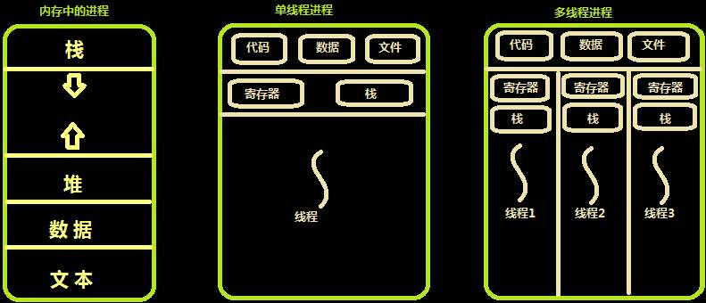
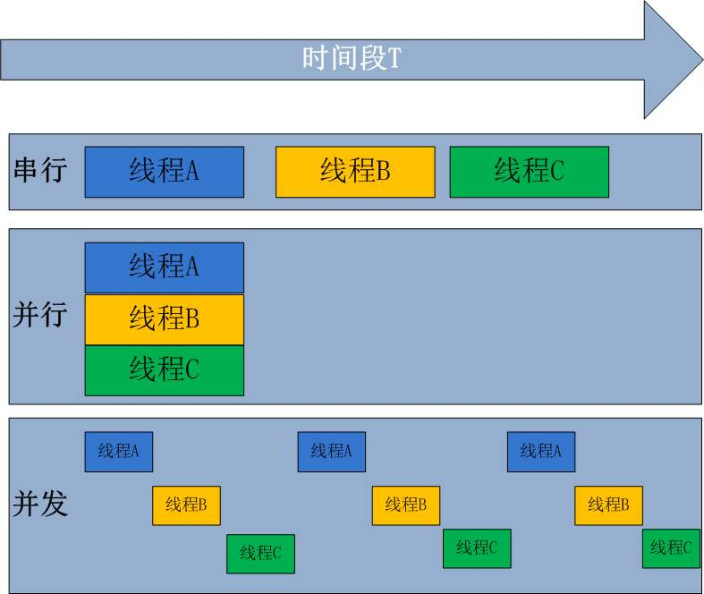
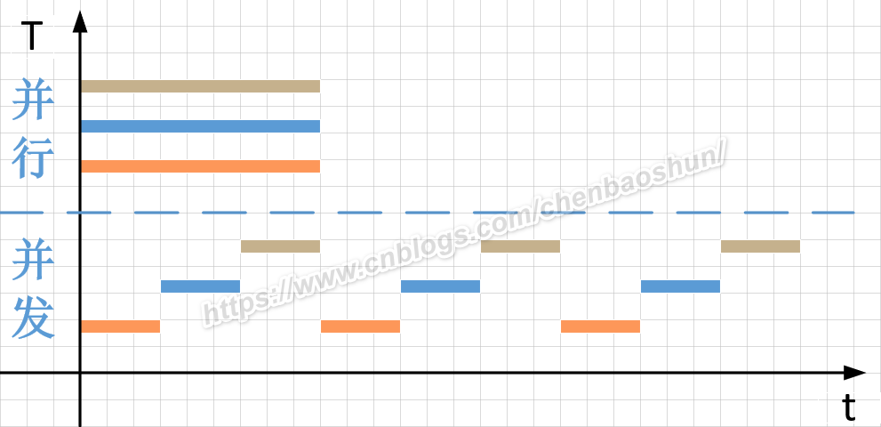

[TOC]

## 1. 进程 vs 线程

----

- 我在网上找了下，觉得这张图解释的已经很到位了 (也不知道哪位大佬画的，借用下！！！)
- 对一个 **进程 (process)** : 
  - 就是你使用 `ps -a` 或者 **进程管理器** 看到的一条一条的记录, 也叫做一个 **程序的实例**
  - 一个进程包含: 1) 栈 2) 堆 3) 数据 4) 代码 … 等等
- 对于一个 **线程 (thread)** :
  - 如果你的设备很古老，比如 dos 系统，那么他每一个进程，只支持 **一个线程** ，也称为 **主线程**
  - 但是现代的设备（cpu、操作系统内核）每一个进程，都支持 **N个线程**
- 你可以简单的理解: **1个进程 = 1个主线程 + N个子线程 + 一堆共享资源**

## 2. 串行、并行、并发

### 图1

- 这张图，我觉得已经基本说清楚 **串行、并行、并发** 之间的区别
- 但是唯一觉得有问题的地方就是，为什么每一个小方块，要强调为 **线程**
- 个人觉得 **进程** 也是可以 串行、并发、并行

### 图2

- 这张图可惜有 **水印** .. 但是消除了上图, 拘泥于 **线程** 的问题

### 总结

- **串行** : 就是所谓的 **任务** , 一个接着一个，按照 **顺序** 往下执行
- **并行** : 多个任务真正意义上的 **同时执行**，这种情况就必须要求 CPU 硬件支持 **多核计算**
- **并发** : 只有1个物理核情况下，**虚拟** 出一种 **假的** 同时执行 的现象
  - 肉眼看，好像确实是 **多个任务** 在同时执行
  - 计算机硬件看，实际上每一个很小的时间片内，只有 **一个任务** 在执行

