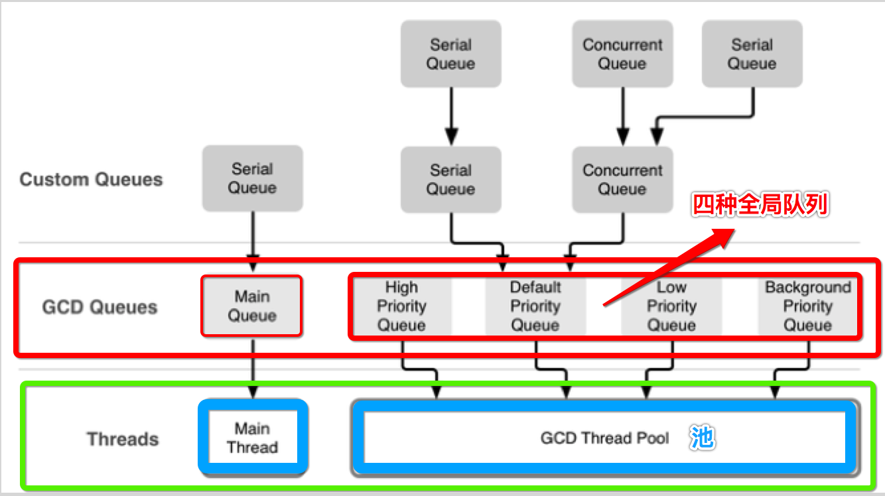

[TOC]


## 1. GCD Queue 结构图

如下图来源于 effective objective-c 2.0 一书中:



我这里给你稍微总结下:

- Main queue
- global queue
  - priority
    - high
    - default
    - low
    - backgroud
  - qos
    - 只是比上面 **多一种** queue
- Custom queue
  - serial queue
  - concurrent queue
- 主线程
- 线程池


## 2. 不同 priority ==global queue== 是不同的对象

```objective-c
@implementation ViewController

- (void)touchesBegan:(NSSet<UITouch *> *)touches withEvent:(UIEvent *)event {
  /**
    #define DISPATCH_QUEUE_PRIORITY_HIGH 2
    #define DISPATCH_QUEUE_PRIORITY_DEFAULT 0
    #define DISPATCH_QUEUE_PRIORITY_LOW (-2)
    #define DISPATCH_QUEUE_PRIORITY_BACKGROUND INT16_MIN
  */
  
  //1. high priority
  dispatch_queue_t highQ = dispatch_get_global_queue(2, 0);
  
  //2. default priority
  dispatch_queue_t defaultQ = dispatch_get_global_queue(0, 0);
  
  //3. low priority
  dispatch_queue_t lowQ = dispatch_get_global_queue(-2, 0);
  
  //4. backgroud priority
  dispatch_queue_t backgroudQ = dispatch_get_global_queue(INT16_MIN, 0);
  
  //5. 打印如上4个 queue 对象的【内存地址】
  NSLog(@"%p", highQ);
  NSLog(@"%p", defaultQ);
  NSLog(@"%p", lowQ);
  NSLog(@"%p", backgroudQ);
}

@end
```

```
2017-09-12 23:42:19.831 Demo[2375:38335] 0x10d3323c0
2017-09-12 23:42:19.831 Demo[2375:38335] 0x10d332240
2017-09-12 23:42:19.831 Demo[2375:38335] 0x10d3320c0
2017-09-12 23:42:19.832 Demo[2375:38335] 0x10d331f40
```

4个内存地址都是【不同】。


## 3. iOS8 使用 ==qos== 替代 priority 作为 queue 调度优先级

```c
typedef enum : unsigned int {
  QOS_CLASS_USER_INTERACTIVE = 0x21, //33，与用户交互的任务，这些任务通常跟UI有关，这些任务需要在`一瞬间`完成
  QOS_CLASS_USER_INITIATED = 0x19, //25，也是一些与UI相关的任务，但是对完成时间并不是需要一瞬间立刻完成，可以延迟一点点
  QOS_CLASS_UTILITY = 0x11, //17，一些可能需要花点时间的任务，这些任务不需要马上返回结果，可能需要几分钟
  QOS_CLASS_BACKGROUND = 0x09, //9，这些任务对用户不可见，比如后台进行备份的操作，执行时间可能很长
  QOS_CLASS_DEFAULT = 0x15, // 21，当没有 QoS信息时默认使用，苹果建议不要使用这个级别
  QOS_CLASS_UNSPECIFIED = 0x00,//0，这个是一个标记，没啥实际作用
} 
```


## 4. 同理 ==不同 qos== 也是 不同的的对象

```objective-c
@implementation ViewController

- (void)touchesBegan:(NSSet<UITouch *> *)touches withEvent:(UIEvent *)event {
//  * It is recommended to use quality of service class values to identify the
//  * well-known global concurrent queues:
//  *  - QOS_CLASS_USER_INTERACTIVE
//  *  - QOS_CLASS_USER_INITIATED
//  *  - QOS_CLASS_DEFAULT
//  *  - QOS_CLASS_UTILITY
//  *  - QOS_CLASS_BACKGROUND
  
  dispatch_queue_t queue1 = dispatch_get_global_queue(QOS_CLASS_USER_INTERACTIVE, 0);
  dispatch_queue_t queue2 = dispatch_get_global_queue(QOS_CLASS_USER_INITIATED, 0);
  dispatch_queue_t queue3 = dispatch_get_global_queue(QOS_CLASS_DEFAULT, 0);
  dispatch_queue_t queue4 = dispatch_get_global_queue(QOS_CLASS_UTILITY, 0);
  dispatch_queue_t queue5 = dispatch_get_global_queue(QOS_CLASS_BACKGROUND, 0);
  
  NSLog(@"%p", queue1);
  NSLog(@"%p", queue2);
  NSLog(@"%p", queue3);
  NSLog(@"%p", queue4);
  NSLog(@"%p", queue5);
}

@end
```

```
2019-02-16 00:52:24.196450+0800 app[40662:1079818] 0x11242a080
2019-02-16 00:52:24.196604+0800 app[40662:1079818] 0x112429f80
2019-02-16 00:52:24.196697+0800 app[40662:1079818] 0x112429e80
2019-02-16 00:52:24.196798+0800 app[40662:1079818] 0x112429d80
2019-02-16 00:52:24.196890+0800 app[40662:1079818] 0x112429c80
```

同样是4个 **不同的** 内存地址。


## 5. qos 与 priortiy 映射关系

### 1. 测试代码

```objective-c
@implementation ViewController

- (void)touchesBegan:(NSSet<UITouch *> *)touches withEvent:(UIEvent *)event {
  {
    /**
     * It is recommended to use quality of service class values to identify the
     * well-known global concurrent queues:
     *  - QOS_CLASS_USER_INTERACTIVE
     *  - QOS_CLASS_USER_INITIATED
     *  - QOS_CLASS_DEFAULT
     *  - QOS_CLASS_UTILITY
     *  - QOS_CLASS_BACKGROUND
     */
  
    dispatch_queue_t queue1 = dispatch_get_global_queue(QOS_CLASS_USER_INTERACTIVE, 0);
    dispatch_queue_t queue2 = dispatch_get_global_queue(QOS_CLASS_USER_INITIATED, 0);
    dispatch_queue_t queue3 = dispatch_get_global_queue(QOS_CLASS_DEFAULT, 0);
    dispatch_queue_t queue4 = dispatch_get_global_queue(QOS_CLASS_UTILITY, 0);
    dispatch_queue_t queue5 = dispatch_get_global_queue(QOS_CLASS_BACKGROUND, 0);
    
    NSLog(@"QOS_CLASS_USER_INTERACTIVE: %p", queue1);
    NSLog(@"QOS_CLASS_USER_INITIATED: %p", queue2);
    NSLog(@"QOS_CLASS_DEFAULT: %p", queue3);
    NSLog(@"QOS_CLASS_UTILITY: %p", queue4);
    NSLog(@"QOS_CLASS_BACKGROUND: %p", queue5);
  }
  
  {
    /**
     #define DISPATCH_QUEUE_PRIORITY_HIGH 2
     #define DISPATCH_QUEUE_PRIORITY_DEFAULT 0
     #define DISPATCH_QUEUE_PRIORITY_LOW (-2)
     #define DISPATCH_QUEUE_PRIORITY_BACKGROUND INT16_MIN
     */
    
    dispatch_queue_t queue1 = dispatch_get_global_queue(2, 0);
    dispatch_queue_t queue2 = dispatch_get_global_queue(0, 0);
    dispatch_queue_t queue3 = dispatch_get_global_queue(-2, 0);
    dispatch_queue_t queue4 = dispatch_get_global_queue(INT16_MIN, 0);
    
    NSLog(@"DISPATCH_QUEUE_PRIORITY_HIGH: %p", queue1);
    NSLog(@"DISPATCH_QUEUE_PRIORITY_DEFAULT: %p", queue2);
    NSLog(@"DISPATCH_QUEUE_PRIORITY_LOW: %p", queue3);
    NSLog(@"DISPATCH_QUEUE_PRIORITY_BACKGROUND: %p", queue4);
  }
}

@end
```

### 2. 运行输出

```
2019-02-16 01:03:06.024137+0800 app[40857:1086295] QOS_CLASS_USER_INTERACTIVE: 0x10ce5a080
2019-02-16 01:03:06.024262+0800 app[40857:1086295] QOS_CLASS_USER_INITIATED: 0x10ce59f80
2019-02-16 01:03:06.024344+0800 app[40857:1086295] QOS_CLASS_DEFAULT: 0x10ce59e80
2019-02-16 01:03:06.024416+0800 app[40857:1086295] QOS_CLASS_UTILITY: 0x10ce59d80
2019-02-16 01:03:06.024495+0800 app[40857:1086295] QOS_CLASS_BACKGROUND: 0x10ce59c80
2019-02-16 01:03:06.024567+0800 app[40857:1086295] DISPATCH_QUEUE_PRIORITY_HIGH: 0x10ce59f80
2019-02-16 01:03:06.024673+0800 app[40857:1086295] DISPATCH_QUEUE_PRIORITY_DEFAULT: 0x10ce59e80
2019-02-16 01:03:06.024744+0800 app[40857:1086295] DISPATCH_QUEUE_PRIORITY_LOW: 0x10ce59d80
2019-02-16 01:03:06.024799+0800 app[40857:1086295] DISPATCH_QUEUE_PRIORITY_BACKGROUND: 0x10ce59c80
```

### 3. 表格显示上面的输出内存地址

| qos/priority                       | 内存地址                              |
| ---------------------------------- | ------------------------------------- |
| QOS_CLASS_USER_INTERACTIVE         | **0x10ce5a080** (没有对应的 priority) |
| QOS_CLASS_USER_INITIATED           | 0x10ce59f80                           |
| QOS_CLASS_DEFAULT                  | 0x10ce59e80                           |
| QOS_CLASS_UTILITY                  | 0x10ce59d80                           |
| QOS_CLASS_BACKGROUND               | 0x10ce59c80                           |
| DISPATCH_QUEUE_PRIORITY_HIGH       | 0x10ce59f80                           |
| DISPATCH_QUEUE_PRIORITY_DEFAULT    | 0x10ce59e80                           |
| DISPATCH_QUEUE_PRIORITY_LOW        | 0x10ce59d80                           |
| DISPATCH_QUEUE_PRIORITY_BACKGROUND | 0x10ce59c80                           |

### 4. 内存地址 对应关系


| qos                        | 内存地址        | priority                           |
| -------------------------- | --------------- | ---------------------------------- |
| QOS_CLASS_USER_INTERACTIVE | **0x10ce5a080** | 没有                               |
| QOS_CLASS_USER_INITIATED   | 0x10ce59f80     | DISPATCH_QUEUE_PRIORITY_HIGH       |
| QOS_CLASS_DEFAULT          | 0x10ce59e80     | DISPATCH_QUEUE_PRIORITY_DEFAULT    |
| QOS_CLASS_UTILITY          | 0x10ce59d80     | DISPATCH_QUEUE_PRIORITY_LOW        |
| QOS_CLASS_BACKGROUND       | 0x10ce59c80     | DISPATCH_QUEUE_PRIORITY_BACKGROUND |

### 5. 对应关系总结

| priority                           | qualityOfService (QOS)     |
| :--------------------------------- | :------------------------- |
|                                    | QOS_CLASS_USER_INTERACTIVE |
| DISPATCH_QUEUE_PRIORITY_HIGH       | QOS_CLASS_USER_INITIATED   |
| DISPATCH_QUEUE_PRIORITY_DEFAULT    | QOS_CLASS_DEFAULT          |
| DISPATCH_QUEUE_PRIORITY_LOW        | QOS_CLASS_UTILITY          |
| DISPATCH_QUEUE_PRIORITY_BACKGROUND | QOS_CLASS_BACKGROUND       |

总结:  QOS **INTERACTIVE** 没有对应的 **priority**


## 6. suspend queue

### 1.「自己」创建的「串行」队列 => Yes

#### eg1

```objective-c
#import "ViewController.h"

@implementation ViewController {
  dispatch_queue_t queue;
}

- (void)viewDidLoad {
  [super viewDidLoad];
  queue = dispatch_queue_create("com.test.queue", DISPATCH_QUEUE_SERIAL);
}

- (void)touchesBegan:(NSSet<UITouch *> *)touches withEvent:(UIEvent *)event {
  // 1.
  dispatch_suspend(queue);
  NSLog(@"dispatch_suspend(queue)");
  
  // 2.
  dispatch_async(queue, ^{
    NSLog(@"[block] thread: %@", [NSThread currentThread]);
  });
  
  // 3.
  sleep(2);
  NSLog(@"after 2 seconds");
  
  // 4.
  dispatch_resume(queue);
  NSLog(@"dispatch_resume(queue)");
}

@end
```

```
2019-02-16 22:36:47.359789+0800 app[42651:1161809] dispatch_suspend(queue)
2019-02-16 22:36:49.360858+0800 app[42651:1161809] after 2 seconds
2019-02-16 22:36:49.361179+0800 app[42651:1161809] dispatch_resume(queue)
2019-02-16 22:36:49.361356+0800 app[42651:1161839] [block] thread: <NSThread: 0x600000662900>{number = 6, name = (null)}
```

**过了2秒** 之后，才会执行 async **serial** queue 中的 block .

#### eg2

```objective-c
#import "ViewController.h"

@interface ViewController ()
- (IBAction)suspend_click:(id)sender;
- (IBAction)resume_suspend:(id)sender;
@end

@implementation ViewController {
  dispatch_queue_t queue;
}

- (void)viewDidLoad {
  [super viewDidLoad];
  queue = dispatch_queue_create("com.test.queue", DISPATCH_QUEUE_SERIAL);
}

- (void)touchesBegan:(NSSet<UITouch *> *)touches withEvent:(UIEvent *)event {
  // 子线程 死循环 async block to serial queue
  // 不能直接在「主线程」，因为会「卡住 主线程」不再执行后续的任何代码 suspend_click:、resume_suspend: 方法
  dispatch_async(dispatch_get_global_queue(0, 0), ^{
    while (1) {
      dispatch_async(self->queue, ^{
        NSLog(@"thread: %@", [NSThread currentThread]);
      });
    }
  });
}

- (IBAction)suspend_click:(id)sender {
  dispatch_suspend(queue);
}

- (IBAction)resume_suspend:(id)sender {
  dispatch_resume(queue);
}

@end
```

结果：能够 挂起 和 恢复 队列执行。

### 2.「自己」创建的「并发」队列 => Yes

```objective-c
#import "ViewController.h"

@implementation ViewController {
  dispatch_queue_t queue;
}

- (void)viewDidLoad {
  [super viewDidLoad];
  queue = dispatch_queue_create("com.test.queue", DISPATCH_QUEUE_CONCURRENT);
}

- (void)touchesBegan:(NSSet<UITouch *> *)touches withEvent:(UIEvent *)event {
  // 1.
  dispatch_suspend(queue);
  NSLog(@"dispatch_suspend(queue)");
  
  // 2.
  dispatch_async(queue, ^{
    NSLog(@"[block] thread: %@", [NSThread currentThread]);
  });
  
  // 3.
  sleep(2);
  NSLog(@"after 2 seconds");
  
  // 4.
  dispatch_resume(queue);
  NSLog(@"dispatch_resume(queue)");
}

@end
```

```
2019-02-16 22:37:54.172375+0800 app[42687:1162957] dispatch_suspend(queue)
2019-02-16 22:37:56.173591+0800 app[42687:1162957] after 2 seconds
2019-02-16 22:37:56.173925+0800 app[42687:1162957] dispatch_resume(queue)
2019-02-16 22:37:56.174098+0800 app[42687:1162987] [block] thread: <NSThread: 0x600002cf0ec0>{number = 4, name = (null)}
```

同样是 **过了2秒** 之后，才会执行 async **concurrent** queue 中的 block .

### 3.「系统」的「并发」队列 => No

```objective-c
#import "ViewController.h"

@implementation ViewController {
  dispatch_queue_t queue;
}

- (void)viewDidLoad {
  [super viewDidLoad];
  queue = dispatch_get_global_queue(0, 0);
}

- (void)touchesBegan:(NSSet<UITouch *> *)touches withEvent:(UIEvent *)event {
  // 1.
  dispatch_suspend(queue);
  NSLog(@"dispatch_suspend(queue)");
  
  // 2.
  dispatch_async(queue, ^{
    NSLog(@"[block] thread: %@", [NSThread currentThread]);
  });
  
  // 3.
  sleep(2);
  NSLog(@"after 2 seconds");
  
  // 4.
  dispatch_resume(queue);
  NSLog(@"dispatch_resume(queue)");
}

@end
```

```
2019-02-16 22:39:11.592612+0800 app[42731:1164418] dispatch_suspend(queue)
2019-02-16 22:39:11.592807+0800 app[42731:1164465] [block] thread: <NSThread: 0x600000caabc0>{number = 4, name = (null)}
2019-02-16 22:39:13.593836+0800 app[42731:1164418] after 2 seconds
2019-02-16 22:39:13.594117+0800 app[42731:1164418] dispatch_resume(queue)
```

调用 dispatch_suspend() ==无法挂起== **global concurrent** queue 调度 block 执行。

结果：**无法** 挂起 和 恢复 队列执行。

### 4.「系统」的「main」队列 => Yes

```objective-c
#import "ViewController.h"

@implementation ViewController {
  dispatch_queue_t queue;
}

- (void)viewDidLoad {
  [super viewDidLoad];
  queue = dispatch_get_main_queue();
}

- (void)touchesBegan:(NSSet<UITouch *> *)touches withEvent:(UIEvent *)event {
  // 1.
  dispatch_suspend(queue);
  NSLog(@"dispatch_suspend(queue)");
  
  // 2.
  dispatch_async(queue, ^{
    NSLog(@"[block] thread: %@", [NSThread currentThread]);
  });
  
  // 3.
  sleep(2);
  NSLog(@"after 2 seconds");
  
  // 4.
  dispatch_resume(queue);
  NSLog(@"dispatch_resume(queue)");
}

@end
```

```
2019-02-16 22:41:05.518605+0800 app[42773:1165864] dispatch_suspend(queue)
2019-02-16 22:41:07.519801+0800 app[42773:1165864] after 2 seconds
2019-02-16 22:41:07.520064+0800 app[42773:1165864] dispatch_resume(queue)
2019-02-16 22:41:07.520479+0800 app[42773:1165864] [block] thread: <NSThread: 0x60000313e900>{number = 1, name = main}
```

同样 **过了2秒** 之后，才会执行 async **main** queue 中的 block .


