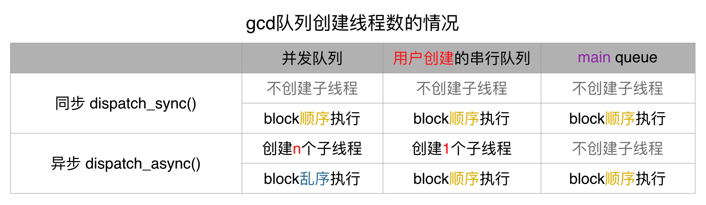

[TOC]


## 1. dispatch_once 让一段代码, 只执行一次

```c
void
_dispatch_once(dispatch_once_t *predicate,
		           DISPATCH_NOESCAPE dispatch_block_t block);
```

```c
+ (instancetype)person {
  static Person *p = nil;
  static dispatch_once_t onceToken;
  
//此处打一个断点: onceToken = 0   
  dispatch_once(&onceToken, ^{
    p = [[Person alloc] init];
  });
  
//此处打一个断点: onceToken = 1
  return p;
}
```

注意：

- 虽然目的是让一段代码执行一次,
- 但是并不是 **线程安全**
- 使用 dispatch_once 并 **不能防止线程安全** 的问题


## 2. dispatch_after 在给定的「线程队列」中「延迟」执行 block

```c
//1. 延迟执行时间
double delayInSeconds = 2.0;
    
//2. 包装延迟时间
dispatch_time_t popTime = dispatch_time(DISPATCH_TIME_NOW, (int64_t) (delayInSeconds * NSEC_PER_SEC));

//3. 指定延迟执行的Block任务，在哪一个线程队列调度
dispatch_after(popTime, dispatch_get_main_queue(), ^(void){
  NSLog(@"我是延迟2秒后执行的代码。。。\n");
});
```

注意，使用 `dispatch_after()` 延迟执行的代码块是 **不能取消** 执行。


## 3. dispatch_async

### 1. dispatch_async(串行队列)

```c
#import "ViewController.h"

@implementation ViewController {
  dispatch_queue_t queue;
}

- (void)viewDidLoad {
  [super viewDidLoad];
  
  queue = dispatch_queue_create("test", DISPATCH_QUEUE_SERIAL);
}

- (void)touchesBegan:(NSSet<UITouch *> *)touches withEvent:(UIEvent *)event {
  NSLog(@"1");
  
  dispatch_async(queue, ^{
    NSLog(@"Block任务1, 所在Thread: %@\n", [NSThread currentThread]);
  });
  
  NSLog(@"2");
  
  dispatch_async(queue, ^{
    NSLog(@"Block任务2, 所在Thread: %@\n", [NSThread currentThread]);
  });

  NSLog(@"3");

  dispatch_async(queue, ^{
    NSLog(@"Block任务3, 所在Thread: %@\n",[NSThread currentThread]);
  });
  
  NSLog(@"4");
    
  dispatch_async(queue, ^{
    NSLog(@"Block任务4, 所在Thread: %@\n",[NSThread currentThread]);
  });

  dispatch_async(queue, ^{
    NSLog(@"Block任务5, 所在Thread: %@\n",[NSThread currentThread]);
  });

  dispatch_async(queue, ^{
    NSLog(@"Block任务6, 所在Thread: %@\n",[NSThread currentThread]);
  });

  dispatch_async(queue, ^{
    NSLog(@"Block任务7, 所在Thread: %@\n",[NSThread currentThread]);
  });

  dispatch_async(queue, ^{
    NSLog(@"Block任务8, 所在Thread: %@\n",[NSThread currentThread]);
  });

  NSLog(@"5");
}

@end
```

```
2017-09-12 19:43:22.202 Demo[1970:33913] 1
2017-09-12 19:43:22.202 Demo[1970:33913] 2
2017-09-12 19:43:22.202 Demo[1970:33913] 3
2017-09-12 19:43:22.203 Demo[1970:33913] 4
2017-09-12 19:43:22.203 Demo[1970:33913] 5
2017-09-12 19:43:22.202 Demo[1970:33938] Block任务1, 所在Thread: <NSThread: 0x7fc20078c4d0>{number = 2, name = (null)}
2017-09-12 19:43:22.203 Demo[1970:33938] Block任务2, 所在Thread: <NSThread: 0x7fc20078c4d0>{number = 2, name = (null)}
2017-09-12 19:43:22.203 Demo[1970:33938] Block任务3, 所在Thread: <NSThread: 0x7fc20078c4d0>{number = 2, name = (null)}
2017-09-12 19:43:22.203 Demo[1970:33938] Block任务4, 所在Thread: <NSThread: 0x7fc20078c4d0>{number = 2, name = (null)}
2017-09-12 19:43:22.204 Demo[1970:33938] Block任务5, 所在Thread: <NSThread: 0x7fc20078c4d0>{number = 2, name = (null)}
2017-09-12 19:43:22.204 Demo[1970:33938] Block任务6, 所在Thread: <NSThread: 0x7fc20078c4d0>{number = 2, name = (null)}
2017-09-12 19:43:22.204 Demo[1970:33938] Block任务7, 所在Thread: <NSThread: 0x7fc20078c4d0>{number = 2, name = (null)}
2017-09-12 19:43:22.204 Demo[1970:33938] Block任务8, 所在Thread: <NSThread: 0x7fc20078c4d0>{number = 2, name = (null)}
```

- 1）block 是 **异步** 执行
- 2）block 都在 **一个子线程** 上执行
- 3）block 是按照 **顺序** 一个一个接着完成


### 2. dispatch_async(并发队列)

```c
#import "ViewController.h"

@implementation ViewController {
  dispatch_queue_t queue;
}

- (void)viewDidLoad {
  [super viewDidLoad];
  
  queue = dispatch_queue_create("test", DISPATCH_QUEUE_CONCURRENT);
}

- (void)touchesBegan:(NSSet<UITouch *> *)touches withEvent:(UIEvent *)event {
  NSLog(@"1");
  
  dispatch_async(queue, ^{
    NSLog(@"Block任务1, 所在Thread: %@\n", [NSThread currentThread]);
  });

  NSLog(@"2");

  dispatch_async(queue, ^{
    NSLog(@"Block任务2, 所在Thread: %@\n", [NSThread currentThread]);
  });

  NSLog(@"3");

  dispatch_async(queue, ^{
    NSLog(@"Block任务3, 所在Thread: %@\n",[NSThread currentThread]);
  });

  NSLog(@"4");

  dispatch_async(queue, ^{
    NSLog(@"Block任务4, 所在Thread: %@\n",[NSThread currentThread]);
  });

  dispatch_async(queue, ^{
    NSLog(@"Block任务5, 所在Thread: %@\n",[NSThread currentThread]);
  });

  dispatch_async(queue, ^{
    NSLog(@"Block任务6, 所在Thread: %@\n",[NSThread currentThread]);
  });

  dispatch_async(queue, ^{
    NSLog(@"Block任务7, 所在Thread: %@\n",[NSThread currentThread]);
  });

  dispatch_async(queue, ^{
    NSLog(@"Block任务8, 所在Thread: %@\n",[NSThread currentThread]);
  });

  NSLog(@"5");
}

@end
```

```
2018-02-24 11:09:43.432 iOS[5550:79890] 1
2018-02-24 11:09:43.432 iOS[5550:79890] 2
2018-02-24 11:09:43.432 iOS[5550:81153] Block任务1, 所在Thread: <NSThread: 0x7fcf03e54b90>{number = 18, name = (null)}
2018-02-24 11:09:43.432 iOS[5550:79890] 3
2018-02-24 11:09:43.433 iOS[5550:79890] 4
2018-02-24 11:09:43.433 iOS[5550:81156] Block任务2, 所在Thread: <NSThread: 0x7fcf03f1bb80>{number = 19, name = (null)}
2018-02-24 11:09:43.433 iOS[5550:79890] 5
2018-02-24 11:09:43.433 iOS[5550:81156] Block任务5, 所在Thread: <NSThread: 0x7fcf03f1bb80>{number = 19, name = (null)}
2018-02-24 11:09:43.433 iOS[5550:81158] Block任务4, 所在Thread: <NSThread: 0x7fcf03cefd10>{number = 20, name = (null)}
2018-02-24 11:09:43.433 iOS[5550:81153] Block任务3, 所在Thread: <NSThread: 0x7fcf03e54b90>{number = 18, name = (null)}
2018-02-24 11:09:43.433 iOS[5550:81159] Block任务6, 所在Thread: <NSThread: 0x7fcf03f18fd0>{number = 21, name = (null)}
2018-02-24 11:09:43.434 iOS[5550:81156] Block任务7, 所在Thread: <NSThread: 0x7fcf03f1bb80>{number = 19, name = (null)}
2018-02-24 11:09:43.434 iOS[5550:81160] Block任务8, 所在Thread: <NSThread: 0x7fcf03e19fd0>{number = 22, name = (null)}

```

- 1）block 是 **异步** 执行
- 2）block 都是在 **多个不同的子线程** 上同时执行
- 3）thread 是经过 **gcd线程池** 重用处理过的
- 4）block 是 **无序** 执行

### 3. 结论

- **一定会创建** 子线程
  - 1) serial queue: 创建 **1个** 子线程
  - 2) concurrent queue: 创建 **N个** 子线程

- async **serial** queue: block **顺序** 执行

- async **concurrent** queue: **并发 & 无序** 执行


## 4. dispatch_sync

### 1. dispatch_sync(串行队列)

```c
#import "ViewController.h"

@implementation ViewController {
  dispatch_queue_t queue;
}

- (void)viewDidLoad {
  [super viewDidLoad];
  
  queue = dispatch_queue_create("test", DISPATCH_QUEUE_SERIAL);
}

- (void)touchesBegan:(NSSet<UITouch *> *)touches withEvent:(UIEvent *)event {
  NSLog(@"1");
  
  dispatch_sync(queue, ^{
    NSLog(@"Block任务1, 所在Thread: %@\n", [NSThread currentThread]);
  });

  NSLog(@"2");

  dispatch_sync(queue, ^{
    NSLog(@"Block任务2, 所在Thread: %@\n", [NSThread currentThread]);
  });
  
  NSLog(@"3");
  
  dispatch_sync(queue, ^{
    NSLog(@"Block任务3, 所在Thread: %@\n",[NSThread currentThread]);
  });

  NSLog(@"4");

  dispatch_sync(queue, ^{
    NSLog(@"Block任务4, 所在Thread: %@\n",[NSThread currentThread]);
  });

  dispatch_sync(queue, ^{
    NSLog(@"Block任务5, 所在Thread: %@\n",[NSThread currentThread]);
  });
  
  dispatch_sync(queue, ^{
    NSLog(@"Block任务6, 所在Thread: %@\n",[NSThread currentThread]);
  });
}

@end
```

```
2017-09-12 19:53:41.224 Demo[2213:40964] 1
2017-09-12 19:53:41.225 Demo[2213:40964] Block任务1, 所在Thread: <NSThread: 0x7fad29d05640>{number = 1, name = main}
2017-09-12 19:53:41.225 Demo[2213:40964] 2
2017-09-12 19:53:41.225 Demo[2213:40964] Block任务2, 所在Thread: <NSThread: 0x7fad29d05640>{number = 1, name = main}
2017-09-12 19:53:41.226 Demo[2213:40964] 3
2017-09-12 19:53:41.226 Demo[2213:40964] Block任务3, 所在Thread: <NSThread: 0x7fad29d05640>{number = 1, name = main}
2017-09-12 19:53:41.226 Demo[2213:40964] 4
2017-09-12 19:53:41.226 Demo[2213:40964] Block任务4, 所在Thread: <NSThread: 0x7fad29d05640>{number = 1, name = main}
2017-09-12 19:53:41.226 Demo[2213:40964] Block任务5, 所在Thread: <NSThread: 0x7fad29d05640>{number = 1, name = main}
2017-09-12 19:53:41.226 Demo[2213:40964] Block任务6, 所在Thread: <NSThread: 0x7fad29d05640>{number = 1, name = main}
```

- 1）block 是 **同步** 按照顺序 **从上往下** 执行
- 2）**不会** 创建 子线程
- 3) block 是在【调用 dispatch_sync() 方法】所在的【主线程】执行

所以并 **不是** 在传入到 dispatch_sync() 中的 **queue 对应的线程** 上执行，而只是借助完成 **队列** 的数据结构。

### 2. dispatch_sync(并发队列)

```c
#import "ViewController.h"

@implementation ViewController {
  dispatch_queue_t queue;
}

- (void)viewDidLoad {
  [super viewDidLoad];
  
  queue = dispatch_queue_create("test", DISPATCH_QUEUE_CONCURRENT);
}

- (void)touchesBegan:(NSSet<UITouch *> *)touches withEvent:(UIEvent *)event {
  NSLog(@"1");
  
  dispatch_sync(queue, ^{
    NSLog(@"Block任务1, 所在Thread: %@\n", [NSThread currentThread]);
  });

  NSLog(@"2");

  dispatch_sync(queue, ^{
    NSLog(@"Block任务2, 所在Thread: %@\n", [NSThread currentThread]);
  });
  
  NSLog(@"3");
  
  dispatch_sync(queue, ^{
    NSLog(@"Block任务3, 所在Thread: %@\n",[NSThread currentThread]);
  });

  NSLog(@"4");

  dispatch_sync(queue, ^{
    NSLog(@"Block任务4, 所在Thread: %@\n",[NSThread currentThread]);
  });

  dispatch_sync(queue, ^{
    NSLog(@"Block任务5, 所在Thread: %@\n",[NSThread currentThread]);
  });
  
  dispatch_sync(queue, ^{
    NSLog(@"Block任务6, 所在Thread: %@\n",[NSThread currentThread]);
  });
}

@end
```

```
2017-09-12 19:50:06.611 Demo[2131:38438] 1
2017-09-12 19:50:06.611 Demo[2131:38438] Block任务1, 所在Thread: <NSThread: 0x7f8570c08620>{number = 1, name = main}
2017-09-12 19:50:06.612 Demo[2131:38438] 2
2017-09-12 19:50:06.612 Demo[2131:38438] Block任务2, 所在Thread: <NSThread: 0x7f8570c08620>{number = 1, name = main}
2017-09-12 19:50:06.612 Demo[2131:38438] 3
2017-09-12 19:50:06.612 Demo[2131:38438] Block任务3, 所在Thread: <NSThread: 0x7f8570c08620>{number = 1, name = main}
2017-09-12 19:50:06.612 Demo[2131:38438] 4
2017-09-12 19:50:06.612 Demo[2131:38438] Block任务4, 所在Thread: <NSThread: 0x7f8570c08620>{number = 1, name = main}
2017-09-12 19:50:06.612 Demo[2131:38438] Block任务5, 所在Thread: <NSThread: 0x7f8570c08620>{number = 1, name = main}
2017-09-12 19:50:06.612 Demo[2131:38438] Block任务6, 所在Thread: <NSThread: 0x7f8570c08620>{number = 1, name = main}
```

- 1）block 是 **同步** 按照顺序 **从上往下** 执行
- 2）同样 **不会** 创建 子线程
- 3) block 是在【调用 dispatch_sync() 方法】所在的【主线程】执行

### 3. dispatch_sync(串行队列 + 并发队列)

```objective-c
#import "ViewController.h"

@implementation ViewController {
  dispatch_queue_t queue1;
  dispatch_queue_t queue2;
}

- (void)viewDidLoad {
  [super viewDidLoad];
  
  queue1 = dispatch_queue_create("test", DISPATCH_QUEUE_SERIAL);
  queue2 = dispatch_queue_create("test", DISPATCH_QUEUE_CONCURRENT);
}

- (void)touchesBegan:(NSSet<UITouch *> *)touches withEvent:(UIEvent *)event {
  NSLog(@"1");
  
  dispatch_sync(queue1, ^{
    NSLog(@"Block任务1, 所在Thread: %@\n", [NSThread currentThread]);
  });
  
  NSLog(@"2");
  
  dispatch_sync(queue2, ^{
    NSLog(@"Block任务2, 所在Thread: %@\n", [NSThread currentThread]);
  });
  
  NSLog(@"3");
  
  dispatch_sync(queue1, ^{
    NSLog(@"Block任务3, 所在Thread: %@\n",[NSThread currentThread]);
  });
  
  NSLog(@"4");
  
  dispatch_sync(queue2, ^{
    NSLog(@"Block任务4, 所在Thread: %@\n",[NSThread currentThread]);
  });

  dispatch_sync(queue1, ^{
    NSLog(@"Block任务5, 所在Thread: %@\n",[NSThread currentThread]);
  });
  
  dispatch_sync(queue2, ^{
    NSLog(@"Block任务6, 所在Thread: %@\n",[NSThread currentThread]);
  });
  
  NSLog(@"5");
}

@end
```

```
2019-02-16 01:27:53.746384+0800 app[41087:1099366] 1
2019-02-16 01:27:53.746600+0800 app[41087:1099366] Block任务1, 所在Thread: <NSThread: 0x600002dfe900>{number = 1, name = main}

2019-02-16 01:27:53.746684+0800 app[41087:1099366] 2
2019-02-16 01:27:53.746806+0800 app[41087:1099366] Block任务2, 所在Thread: <NSThread: 0x600002dfe900>{number = 1, name = main}

2019-02-16 01:27:53.746892+0800 app[41087:1099366] 3
2019-02-16 01:27:53.746970+0800 app[41087:1099366] Block任务3, 所在Thread: <NSThread: 0x600002dfe900>{number = 1, name = main}

2019-02-16 01:27:53.747058+0800 app[41087:1099366] 4
2019-02-16 01:27:53.747157+0800 app[41087:1099366] Block任务4, 所在Thread: <NSThread: 0x600002dfe900>{number = 1, name = main}

2019-02-16 01:27:53.747249+0800 app[41087:1099366] Block任务5, 所在Thread: <NSThread: 0x600002dfe900>{number = 1, name = main}

2019-02-16 01:27:53.747324+0800 app[41087:1099366] Block任务6, 所在Thread: <NSThread: 0x600002dfe900>{number = 1, name = main}

2019-02-16 01:27:53.747387+0800 app[41087:1099366] 5
```

- 1) block 是 **同步** 按照顺序 **从上往下** 执行
- 2) 同样 **不会** 创建 子线程
- 3) block 是在 **调用 dispatch_sync() 所在** 的 **主线程** 上执行

- 结论: 对于 dispatch_sync() 来说，不管是 **串行** 还是 **并发** 类型的队列，都没任何区别

### 4. 结论

- 不管什么队列，都 **不会** 创建 子线程

- sync **serial** queue
  - 1) block **顺序** 执行
  - 2) 并且在 **调用 dispatch_sync() 所在** 的线程执行


- sync **concurrent** queue
  - 1) block **顺序** 执行
  - 2) 同样也是在 **调用 dispatch_sync() 所在** 的线程执行


## 5. dispatch_sync(主队列) 特例

### 1. 子线程 dispatch_sync(主队列)

```objective-c
#import "ViewController.h"

@implementation ViewController

- (void)touchesBegan:(NSSet<UITouch *> *)touches withEvent:(UIEvent *)event
{
  dispatch_async(dispatch_get_global_queue(0, 0), ^{
    NSLog(@"[1]: %@", [NSThread currentThread]);

    dispatch_sync(dispatch_get_main_queue(), ^{
      NSLog(@"[2]: %@", [NSThread currentThread]);
    });
    
    NSLog(@"[3]: %@", [NSThread currentThread]);
  });
}

@end
```

```
2019-05-10 23:14:49.503079+0800 DemoApp[33223:445632] [1]: <NSThread: 0x600000e628c0>{number = 3, name = (null)}
2019-05-10 23:14:49.503329+0800 DemoApp[33223:445574] [2]: <NSThread: 0x600000e2a900>{number = 1, name = main}
2019-05-10 23:14:49.503445+0800 DemoApp[33223:445632] [3]: <NSThread: 0x600000e628c0>{number = 3, name = (null)}
```

**[2]** 最终是在 **主线程** 上执行。

### 2. 子线程 dispatch_sync(系统并发队列)

```objective-c
#import "ViewController.h"

@implementation ViewController

- (void)touchesBegan:(NSSet<UITouch *> *)touches withEvent:(UIEvent *)event
{
  dispatch_async(dispatch_get_global_queue(0, 0), ^{
    NSLog(@"[1]: %@", [NSThread currentThread]);

    dispatch_sync(dispatch_get_global_queue(0, 0), ^{
      NSLog(@"[2]: %@", [NSThread currentThread]);
    });
    
    NSLog(@"[3]: %@", [NSThread currentThread]);
  });
}

@end
```

```
2019-05-10 23:16:20.268556+0800 DemoApp[33253:446954] [1]: <NSThread: 0x6000032199c0>{number = 3, name = (null)}
2019-05-10 23:16:20.268719+0800 DemoApp[33253:446954] [2]: <NSThread: 0x6000032199c0>{number = 3, name = (null)}
2019-05-10 23:16:20.268852+0800 DemoApp[33253:446954] [3]: <NSThread: 0x6000032199c0>{number = 3, name = (null)}
```

**[2]** 最终是在 **子线程** 上执行。

### 3. 子线程 dispatch_sync(主队列) , 再 dispatch_sync(系统并发队列)

```objective-c
#import "ViewController.h"

@implementation ViewController

- (void)touchesBegan:(NSSet<UITouch *> *)touches withEvent:(UIEvent *)event
{
  dispatch_async(dispatch_get_global_queue(0, 0), ^{
    NSLog(@"[1]: %@", [NSThread currentThread]);

    dispatch_sync(dispatch_get_main_queue(), ^{
      NSLog(@"[2]: %@", [NSThread currentThread]);
    });
    
    dispatch_sync(dispatch_get_global_queue(0, 0), ^{
      NSLog(@"[3]: %@", [NSThread currentThread]);
    });
    
    NSLog(@"[4]: %@", [NSThread currentThread]);
  });
}

@end
```

```
2019-05-10 23:19:05.262039+0800 DemoApp[33317:449137] [1]: <NSThread: 0x6000018aaa00>{number = 3, name = (null)}
2019-05-10 23:19:05.262206+0800 DemoApp[33317:449079] [2]: <NSThread: 0x6000018c9400>{number = 1, name = main}
2019-05-10 23:19:05.262324+0800 DemoApp[33317:449137] [3]: <NSThread: 0x6000018aaa00>{number = 3, name = (null)}
2019-05-10 23:19:05.262429+0800 DemoApp[33317:449137] [4]: <NSThread: 0x6000018aaa00>{number = 3, name = (null)}
```

- **[2]** 最终是在 **主线程** 上执行
- **[3]** 最终是在 **子线程** 上执行

### 4. 结论

```objective-c
dispatch_sync(dispatch_get_main_queue(), ^{
  NSLog(@"[3]: %@", [NSThread currentThread]);
});
```

- dispatch sync **main queue** 情况下，**block**  一定是在 **main thread** 执行
- 与 **当前线程** 没有关系


## 5. async、sync、串行队列、并发队列




## 6. dispatch_block_cancel

**iOS8** 之后提交到 queue 中的 block 可以 **取消**

```objective-c
#import "ViewController.h"

@interface ViewController ()

@end

@implementation ViewController {
  dispatch_queue_t queue;
}

- (void)viewDidLoad {
  [super viewDidLoad];
  queue = dispatch_queue_create("queue", DISPATCH_QUEUE_SERIAL);
}

- (void)touchesBegan:(NSSet<UITouch *> *)touches withEvent:(UIEvent *)event {
  // 1、注意，一定要保存这个 Block 对象，后续才能取消
  dispatch_block_t block1 = dispatch_block_create(0, ^{
    NSLog(@"block1 begin");
    [NSThread sleepForTimeInterval:2];
    NSLog(@"block1 end");
  });
  
  dispatch_block_t block2 = dispatch_block_create(0, ^{
    NSLog(@"block2 ");
  });
  
  // 2、
  dispatch_async(queue, block1);
  dispatch_async(queue, block2);
  
  // 3、取消执行
  dispatch_block_cancel(block1);
//  dispatch_block_cancel(block2);
}

@end
```

点击多次输出结果

```
2019-02-16 00:12:40.769177+0800 app[39589:1047552] block2
2019-02-16 00:12:40.959869+0800 app[39589:1047552] block2
2019-02-16 00:12:41.140449+0800 app[39589:1047552] block2
2019-02-16 00:12:41.310342+0800 app[39589:1047552] block2
2019-02-16 00:12:41.477388+0800 app[39589:1047552] block2
2019-02-16 00:12:41.635954+0800 app[39589:1047552] block2
```

注意：偶尔会发现 **block1** 仍然会被执行，所以 **dispatch_block_cancel()** 并不是一定会被 cancel 掉。


## 7. dispatch_async_f 

异步调用 **C 函数**

```objective-c
#import "ViewController.h"

static void *MyContext = &MyContext;

void func()
{
  NSLog(@"%@", [NSThread currentThread]);
}

@implementation ViewController {
  dispatch_queue_t queue;
}

- (void)viewDidLoad {
  [super viewDidLoad];
  
  queue = dispatch_queue_create("com.test.queue", DISPATCH_QUEUE_CONCURRENT);
}

- (void)touchesBegan:(NSSet<UITouch *> *)touches withEvent:(UIEvent *)event
{
  dispatch_async_f(queue, &MyContext, func);
}

@end
```

```
2017-09-12 21:20:31.821 Demo[4364:93895] <NSThread: 0x7fcc58d1b440>{number = 2, name = (null)}
```


## 8. dispatch_apply(repeat_count, queue, block)

```c
dispatch_queue_t queue = dispatch_get_global_queue(DISPATCH_QUEUE_PRIORITY_DEFAULT, 0);

/* 
参数1: 遍历的次数
参数2: 队列(并发队列)
参数3: i 索引
*/
dispatch_apply(10, queue, ^(size_t i) {
  NSLog(@"%zd-----%@",i,[NSThread currentThread]);
});
```

