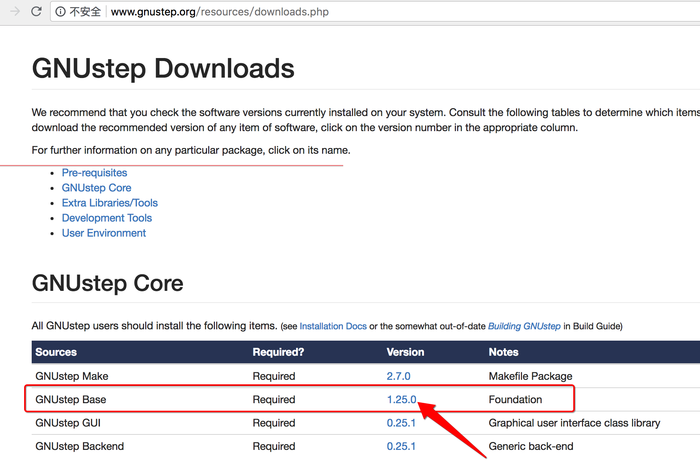

[TOC]


## 1.  performSelector:withObject:

### 1. global queue : YES

```c
#import "ViewController.h"

@implementation ViewController

- (void)work {
  NSLog(@"2");
}

- (void)touchesBegan:(NSSet<UITouch *> *)touches withEvent:(UIEvent *)event {
  dispatch_async(dispatch_get_global_queue(0, 0), ^{
    NSLog(@"1");
    [self performSelector:@selector(work) withObject:nil];
    NSLog(@"3");
  });
}

@end
```

```
2018-06-14 21:16:07.534 Test[27349:3283736] 1
2018-06-14 21:16:07.534 Test[27349:3283736] 2
2018-06-14 21:16:07.534 Test[27349:3283736] 3
```

可以打印输出 **2**

### 2. main queue : YES

```c
#import "ViewController.h"

@implementation ViewController

- (void)work {
  NSLog(@"2");
}

- (void)touchesBegan:(NSSet<UITouch *> *)touches withEvent:(UIEvent *)event {
  dispatch_async(dispatch_get_main_queue(), ^{
    NSLog(@"1");
    [self performSelector:@selector(work) withObject:nil];
    NSLog(@"3");
  });
}

@end
```

```
2019-01-16 23:59:04.001305+0800 App[4863:55140] 1
2019-01-16 23:59:04.001424+0800 App[4863:55140] 2
2019-01-16 23:59:04.001493+0800 App[4863:55140] 3
```

可以打印输出 **2**


## 2. performSelector:withObject:==afterDelay:==

### 1. ==global queue : NO==

```objective-c
#import "ViewController.h"

@implementation ViewController

- (void)work {
  NSLog(@"2");
}

- (void)touchesBegan:(NSSet<UITouch *> *)touches withEvent:(UIEvent *)event {
  dispatch_async(dispatch_get_global_queue(0, 0), ^{
    /**
     * 子线程
     * - 1）默认不开启runloop
     * - 2）也就【无法监听事件】
     * - 3）performSelector:withObject:afterDelay: 向当前线程的RunLoop添加source0类型事件
     */
    NSLog(@"1");
    [self performSelector:@selector(work) withObject:nil afterDelay:0.0];
    NSLog(@"3");
  });
}

@end
```

```
2018-06-14 21:14:22.721 Test[27202:3279855] 1
2018-06-14 21:14:22.722 Test[27202:3279855] 3
```

**没有** 执行 `[self work]` 打印输出 **2**

### 2. main queue : YES

```c
#import "ViewController.h"

@implementation ViewController

- (void)work
{
  NSLog(@"2");
}

- (void)touchesBegan:(NSSet<UITouch *> *)touches withEvent:(UIEvent *)event
{
  dispatch_async(dispatch_get_main_queue(), ^{
    /**
     * 主线程
     * - 1）主线程的runloop，默认是打开的
     * - 2）所以能够监听事件
     * - 3）performSelector:withObject:afterDelay: 实际上是向当前线程的RunLoop添加source0类型事件
     */
    NSLog(@"1");
    [self performSelector:@selector(work) withObject:nil afterDelay:0.0];
    NSLog(@"3");
  });
}

@end
```

```
2019-01-17 00:01:56.617578+0800 App[5045:59247] 1
2019-01-17 00:01:56.617711+0800 App[5045:59247] 3
2019-01-17 00:01:56.617894+0800 App[5045:59247] 2
```

- 1) 可以打印输出 **2**
- 2) 但是 2 是 **异步** 输出的 ( 1 -> 3 -> 2)

### 3. main thread : YES

```c
#import "ViewController.h"

@implementation ViewController

- (void)work {
  NSLog(@"2");
}

- (void)touchesBegan:(NSSet<UITouch *> *)touches withEvent:(UIEvent *)event {
  /**
   * 主线程
   * - 1）主线程的runloop，默认是打开的
   * - 2）所以能够监听事件
   * - 3）performSelector:withObject:afterDelay: 实际上是向当前线程的RunLoop添加source0类型事件
   */
  NSLog(@"1");
  [self performSelector:@selector(work) withObject:nil afterDelay:0.0];
  NSLog(@"3");
}

@end
```

```
2018-06-14 21:23:46.613 Test[27784:3296185] 1
2018-06-14 21:23:46.614 Test[27784:3296185] 3
2018-06-14 21:23:46.614 Test[27784:3296185] 2
```

- 1) 可以打印输出 **2**
- 2) 但是 2 是 **异步** 输出的 ( 1 -> 3 -> 2)


## 3. performSelector 方法簇 源码实现

### 1. performSelector:

```c
- (id)performSelector:(SEL)sel {
  if (!sel) [self doesNotRecognizeSelector:sel];
  return ((id(*)(id, SEL))objc_msgSend)(self, sel);
}
```

直接调用 objc_msgSend() 发送消息。

### 2. performSelector:withObject:

```c
- (id)performSelector:(SEL)sel withObject:(id)obj {
  if (!sel) [self doesNotRecognizeSelector:sel];
  return ((id(*)(id, SEL, id))objc_msgSend)(self, sel, obj);
}
```

直接调用 objc_msgSend() 发送消息。

### 3.  performSelector:withObject:withObject:

```c
- (id)performSelector:(SEL)sel withObject:(id)obj1 withObject:(id)obj2 {
  if (!sel) [self doesNotRecognizeSelector:sel];
  return ((id(*)(id, SEL, id, id))objc_msgSend)(self, sel, obj1, obj2);
}
```

- 1) 直接调用 objc_msgSend() 发送消息。
- 2) 实际上所有的 **objc消息** 也是一种 **source0** 类型的 **runloop source**

### 4. performSelector:withObject:==afterDelay:==

- 1）**performSelector:withObject:afterDelay:** 实现并没有在 **NSObject.mm** 文件中实现
- 2）而是出现在 **NSRunLoop.h** 中定义，说明与 **RunLoop** 有关系
- 3）但是 **没有开源**
- 4）但是可以参考 [**GNUStep**](http://www.gnustep.org/resources/downloads.php) 开源的代码实现



```c
@implementation NSObject (TimedPerformers)

.....

- (void) performSelector: (SEL)aSelector
        withObject: (id)argument
        afterDelay: (NSTimeInterval)seconds
{
  /**
   * 1. 获取 当前线程 runloop
   */
  NSRunLoop		*loop = [NSRunLoop currentRunLoop];

  /**
   * 2. 创建 timer 事件源
   */
  GSTimedPerformer	*item;
  item = [[GSTimedPerformer alloc] initWithSelector: aSelector
               target: self
             argument: argument
                delay: seconds];
  [[loop _timedPerformers] addObject: item];
  RELEASE(item);

  /**
   * 3. 将 timer 事件源，添加到 当前线程 runloop 监控
   */
  [loop addTimer: item->timer forMode: NSDefaultRunLoopMode];
}

.....

@end
```

这个方法内部实现时与 **RunLoop** 相关的。


## 4. gcd queue 与performSelector:withObject:==afterDelay:==

### 1. 会创建【timer 事件源】注册到【当前线程 runloop】

```c
[self performSelector:@selector(work) withObject:nil afterDelay:0.0];
```

- 1）创建一个timer定时器事件源，指定回调方法work
- 2）将timer事件源，添加到【当前线程的runloop】中监听
- 3）当runloop接受到timer事件，被唤醒时，才会去执行回调处理
- 4）所以该方法执行是有一定【延迟】性的
- 5）即使afterDeley时间指定为【0】，仍然会有【延迟】的

### 2.【主线程】执行 performSelector:withObject:afterDelay:

```c
- (void)touchesBegan:(NSSet<UITouch *> *)touches withEvent:(UIEvent *)event {
  NSLog(@"1");
  [self performSelector:@selector(work) withObject:nil afterDelay:0.0];
  NSLog(@"3");
}
```

- 1）执行 performSelector:withObject:afterDelay: 时，处于【主线程】
- 2）timer 事件源，会添加到【主线程 runloop】中
- 3）主线程 默认开启 runloop
- 4）【主线程 runloop】被唤醒回调处理事件时，才会执行设置的回调方法

### 3.【子线程】执行 performSelector:withObject:afterDelay:

```c
- (void)touchesBegan:(NSSet<UITouch *> *)touches withEvent:(UIEvent *)event {
  dispatch_async(dispatch_get_global_queue(0, 0), ^{
    NSLog(@"1");
    [self performSelector:@selector(work) withObject:nil afterDelay:0.0];
    NSLog(@"3");
  });
}
```

- 1）执行 performSelector:withObject:afterDelay: 时，处于【gcd 子线程】
- 2）但是【子线程】默认【没有】【开启】runloop
- 3）所以根本就 **无法** 注册 timer 事件源
- 4）也就根本 **无法回调**


## 5. 直接开启【子线程】【runloop】会造成【子线程】【无法释放】

- **线程** 的 runloop **无法停止**
- 那么 **线程(对象)** 也就 **无法释放**

```c
#import "ViewController.h"

@implementation ViewController

- (void)work {
  NSLog(@"2");
}

- (void)touchesBegan:(NSSet<UITouch *> *)touches withEvent:(UIEvent *)event {
  dispatch_async(dispatch_get_global_queue(0, 0), ^{
    NSLog(@"1");
    [self performSelector:@selector(work) withObject:nil afterDelay:0.0];
    NSLog(@"3");

    /**
     * 开启 gcd 子线程 runloop
     */
    [[NSRunLoop currentRunLoop] addPort:[NSPort port] forMode:NSDefaultRunLoopMode];
    [[NSRunLoop currentRunLoop] run];
  });
}

@end
```

```
2018-06-14 21:43:20.611 Test[29134:3398235] 1
2018-06-14 21:43:20.611 Test[29134:3398235] 3
2018-06-14 21:43:20.617 Test[29134:3398235] 2
```

- 1）虽然是可以打印输出2
- 2）但是 **不可取**，因为会导致 gcd 子线程 **无法退出**
- 3）必须要【停止运行 runloop】，才能够 **释放掉** 线程对象


## 6. 而使用【一次性】方式开启 runloop, 当处理完【一次事件】后又会退出

```c
#import "ViewController.h"

@implementation ViewController

- (void)work {
  NSLog(@"2");
}

- (void)touchesBegan:(NSSet<UITouch *> *)touches withEvent:(UIEvent *)event {
  dispatch_async(dispatch_get_global_queue(0, 0), ^{
    /**
     * 1、添加 runloop source
     */
    [[NSRunLoop currentRunLoop] addPort:[NSPort port] forMode:NSDefaultRunLoopMode];

    /**
     * 2、使用【一次性】模式，开启 子线程的 runloop
     */
    [[NSRunLoop currentRunLoop] runMode:NSDefaultRunLoopMode
    														beforeDate:[NSDate distantFuture]];

    // 3、添加事件
    NSLog(@"1");
    [self performSelector:@selector(work) withObject:nil afterDelay:0.0];
    NSLog(@"3");
  });
}

@end
```

```
2018-06-15 17:19:12.268 Test[13666:864609] 1
2018-06-15 17:19:12.275 Test[13666:864609] 3
2018-06-15 17:19:12.289 Test[13666:864609] 2
```

[NSThread 保活](../../../02/02/02/README.md)

