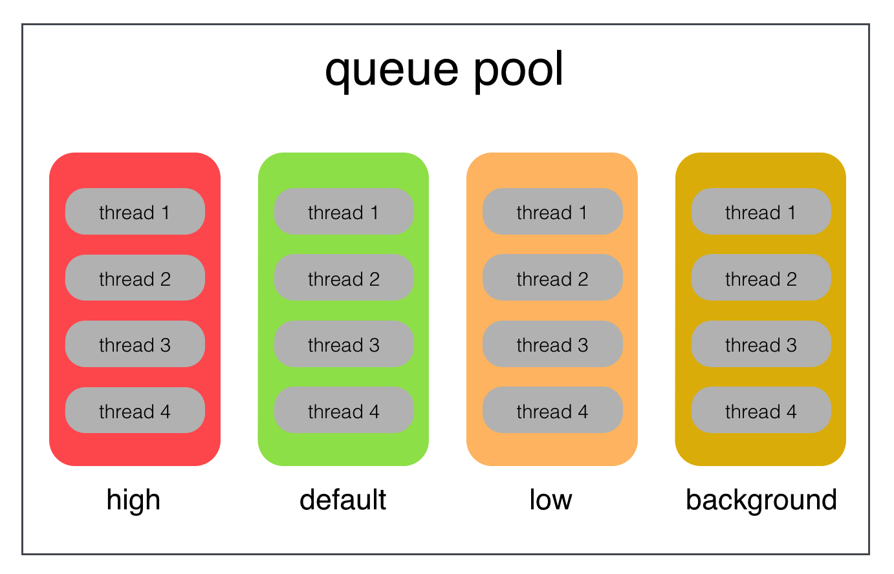
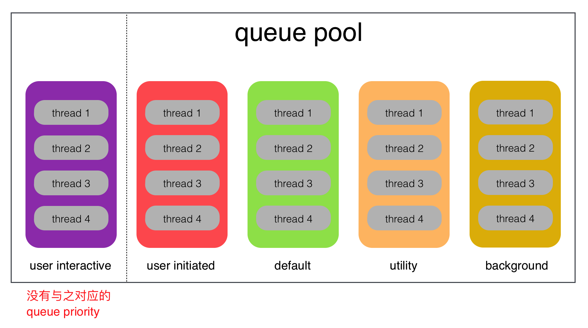
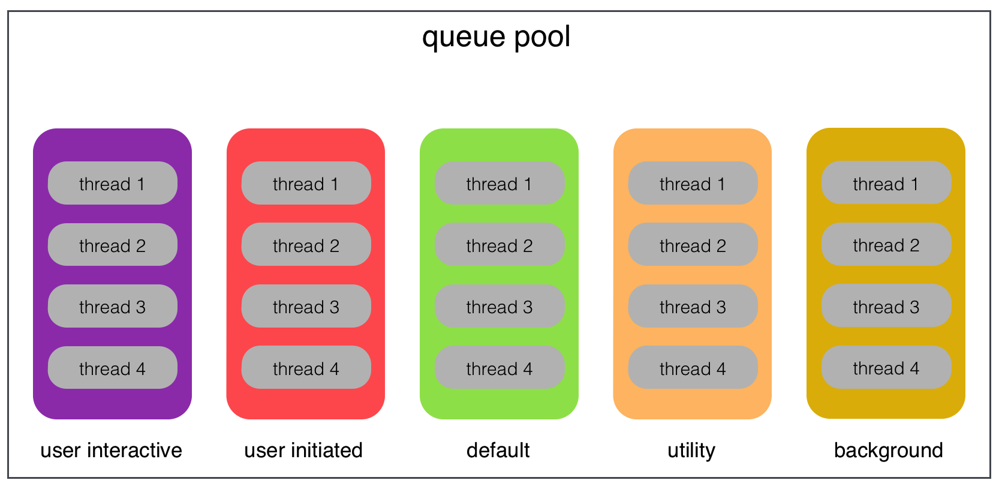
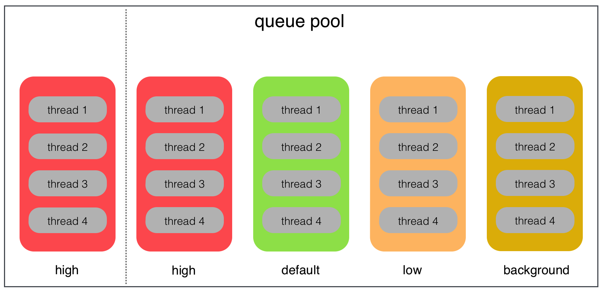

[TOC]


## 1. 利用 ==serial== queue 特性

- `1个 serial queue` 至始至终只会创建 `一个子线程`，并且排队按顺序调度任务
- 缓存 与 CPU 激活核心数 相等的 `serial queue` 队列实例


## 2. 以 ==CPU 激活核心数== 为指标

- 1、假设等于 **4**
- 2、每一种模式下，并发 **4个** 子线程
- 3、每一种模式对应的 context，存储 **4个  serial queue 实例**


## 3. iOS8以下按照 `dispatch_queue_priority_t`划分结构

### 1. 4种 priority 优先级

```c
#define DISPATCH_QUEUE_PRIORITY_HIGH 2
#define DISPATCH_QUEUE_PRIORITY_DEFAULT 0
#define DISPATCH_QUEUE_PRIORITY_LOW (-2)
#define DISPATCH_QUEUE_PRIORITY_BACKGROUND INT16_MIN
```

### 2. queue 缓存结构



```
- (1) High Priority Context
  - dispatch high priority 串行 queue 实例1
  - dispatch high priority 串行 queue 实例2
  - dispatch high priority 串行 queue 实例3
  - dispatch high priority 串行 queue 实例4

- (2) Default Priority Context
  - dispatch default priority 串行 queue 实例1
  - dispatch default priority 串行 queue 实例2
  - dispatch default priority 串行 queue 实例3
  - dispatch default priority 串行 queue 实例4

- (3) Low Priority Context
  - dispatch low priority 串行 queue 实例1
  - dispatch low priority 串行 queue 实例2
  - dispatch low priority 串行 queue 实例3
  - dispatch low priority 串行 queue 实例4

- (4) Backgroud Priority Context
  - dispatch backgroud priority 串行 queue 实例1
  - dispatch backgroud priority 串行 queue 实例2
  - dispatch backgroud priority 串行 queue 实例3
  - dispatch backgroud priority 串行 queue 实例4
```


## 4. iOS8 及以上, 按照 `qos_class_t ` 划分结构

### 1. 5种 qos 服务质量

```c
typedef enum : unsigned int 
{
  QOS_CLASS_USER_INTERACTIVE = 0x21, //33，与用户交互的任务，这些任务通常跟UI有关，这些任务需要在`一瞬间`完成
  QOS_CLASS_USER_INITIATED = 0x19, //25，也是一些与UI相关的任务，但是对完成时间并不是需要一瞬间立刻完成，可以延迟一点点
  QOS_CLASS_UTILITY = 0x11, //17，一些可能需要花点时间的任务，这些任务不需要马上返回结果，可能需要几分钟
  QOS_CLASS_BACKGROUND = 0x09, //9，这些任务对用户不可见，比如后台进行备份的操作，执行时间可能很长
  QOS_CLASS_DEFAULT = 0x15, // 21，当没有 QoS信息时默认使用，苹果建议不要使用这个级别
  QOS_CLASS_UNSPECIFIED = 0x00,//0，这是一个mask值，没有对应的queue
} qos_class_t;
```

### 2. queue 缓存结构



```
- (1) QOS_CLASS_USER_INTERACTIVE
  - dispatch high priority 串行 queue 实例1
  - dispatch high priority 串行 queue 实例2
  - dispatch high priority 串行 queue 实例3
  - dispatch high priority 串行 queue 实例4

- (2) QOS_CLASS_USER_INITIATED
  - dispatch default priority 串行 queue 实例1
  - dispatch default priority 串行 queue 实例2
  - dispatch default priority 串行 queue 实例3
  - dispatch default priority 串行 queue 实例4

- (3) QOS_CLASS_DEFAULT
  - dispatch low priority 串行 queue 实例1
  - dispatch low priority 串行 queue 实例2
  - dispatch low priority 串行 queue 实例3
  - dispatch low priority 串行 queue 实例4

- (4) QOS_CLASS_UTILITY
  - dispatch backgroud priority 串行 queue 实例1
  - dispatch backgroud priority 串行 queue 实例2
  - dispatch backgroud priority 串行 queue 实例3
  - dispatch backgroud priority 串行 queue 实例4

- (5) QOS_CLASS_BACKGROUND
  - dispatch backgroud priority 串行 queue 实例1
  - dispatch backgroud priority 串行 queue 实例2
  - dispatch backgroud priority 串行 queue 实例3
  - dispatch backgroud priority 串行 queue 实例4
```

注意只有iOS8及之后，通过`QOS_CLASS_USER_INTERACTIVE`这个QOS才能获取得到这个queue实例。

### 4. 这种结构带来的好处

- 1、任务可以分为多种优先级进行调度
  - qos 1
  - qos 2
  - qos 3
  - qos 4
  - qos 5

- 2、缓存的都是`serial 串行`队列，至始至终只会产生`一个子线程`

- 3、每一种qos下，缓存`serial 串行`队列的个数，等于`当前CPU激活核心数`，保持了CPU的最大并发数


## 5. 两种类型, 对于 ==default 队列== 有区别

### 1. QOS

QOS 苹果是不推荐使用`DEFAULT`，具体注释如下

```c
Default QoS indicates the absence of QoS information.
（QOS_CLASS_DEFAULT 表示一种缺省默认的 QOS类型）

Whenever possible QoS information will be inferred from other sources.
（该服务质量类型将会从其他类型来进行推断）

If such inference is not possible, a QoS between UserInitiated and Utility will be used
（可能不是确定的，可能选择 UserInitiated 或 Utility 进行代替）
```

- 从注释大概意思看到，`QOS_CLASS_DEFAULT`不是一种确认的模式，
- 有时候可能是`UserInitiated`模式，也可能是`Utility`模式，
- 所以在使用QOS时不要去使用`DEFAULT`模式

### 2. Priority

Priority，貌似我们大部分情况下都在使用`DEFAULT`，具体注释如下

```c
the queue will be scheduled for execution after all high priority queues have been scheduled,
but before any low priority queues have been scheduled.

（当所有的高优先级队列调度完毕，再进行default级别队列调度，但是比一些low优先级队列先调度）
```


## 6. 兼容 qos 与 priority ==获取== 队列

### 1. qos 与 priority 对应关系

| 序号 | qualityOfService 服务质量  | priority 优先级                    |
| :--- | :------------------------- | :--------------------------------- |
| 1    | QOS_CLASS_USER_INTERACTIVE |                                    |
| 2    | QOS_CLASS_USER_INITIATED   | DISPATCH_QUEUE_PRIORITY_HIGH       |
| 3    | QOS_CLASS_DEFAULT          | DISPATCH_QUEUE_PRIORITY_DEFAULT    |
| 4    | QOS_CLASS_UTILITY          | DISPATCH_QUEUE_PRIORITY_LOW        |
| 5    | QOS_CLASS_BACKGROUND       | DISPATCH_QUEUE_PRIORITY_BACKGROUND |


```c
#import "ViewController.h"

@implementation ViewController

- (void)touchesBegan:(NSSet<UITouch *> *)touches withEvent:(UIEvent *)event
{
  dispatch_queue_t high_priority = dispatch_get_global_queue(2, 0);
  dispatch_queue_t default_priority = dispatch_get_global_queue(0, 0);
  dispatch_queue_t low_priority = dispatch_get_global_queue(-2, 0);
  dispatch_queue_t backgroud_priority = dispatch_get_global_queue(INT16_MIN, 0);
  
  NSLog(@"high_priority           %p", high_priority);
  NSLog(@"default_priority        %p", default_priority);
  NSLog(@"low_priority            %p", low_priority);
  NSLog(@"backgroud_priority      %p", backgroud_priority);
  NSLog(@"\n");
  
  dispatch_queue_t qos_user_interactive = dispatch_get_global_queue(QOS_CLASS_USER_INTERACTIVE, 0);
  dispatch_queue_t qos_user_initiated = dispatch_get_global_queue(QOS_CLASS_USER_INITIATED, 0);
  dispatch_queue_t qos_default = dispatch_get_global_queue(QOS_CLASS_DEFAULT, 0);
  dispatch_queue_t qos_ulity = dispatch_get_global_queue(QOS_CLASS_UTILITY, 0);
  dispatch_queue_t qos_backgroud = dispatch_get_global_queue(QOS_CLASS_BACKGROUND, 0);
  
  NSLog(@"qos_user_interactive    %p", qos_user_interactive);
  NSLog(@"qos_user_initiated      %p", qos_user_initiated);
  NSLog(@"qos_default             %p", qos_default);
  NSLog(@"qos_ulity               %p", qos_ulity);
  NSLog(@"qos_backgroud           %p", qos_backgroud);
}

@end
```

```
2017-09-13 09:50:00.667 Demo[1724:26768] high_priority           0x1100d03c0
2017-09-13 09:50:00.667 Demo[1724:26768] default_priority        0x1100d0240
2017-09-13 09:50:00.667 Demo[1724:26768] low_priority            0x1100d00c0
2017-09-13 09:50:00.668 Demo[1724:26768] backgroud_priority      0x1100cff40
2017-09-13 09:50:00.668 Demo[1724:26768] 
2017-09-13 09:50:00.668 Demo[1724:26768] qos_user_interactive    0x1100d0540
2017-09-13 09:50:00.668 Demo[1724:26768] qos_user_initiated      0x1100d03c0
2017-09-13 09:50:00.668 Demo[1724:26768] qos_default             0x1100d0240
2017-09-13 09:50:00.668 Demo[1724:26768] qos_ulity               0x1100d00c0
2017-09-13 09:50:00.668 Demo[1724:26768] qos_backgroud           0x1100cff40
```

可以看到只有`qos_user_interactive`没有与之对应的`priority`。

### 2. `dispatch_get_global_queue()` 在iOS8之前与iOS8及之后identifier参数的区别 

```c
/*!
 * @function dispatch_get_global_queue
 *
 * @abstract
 * Returns a well-known global concurrent queue of a given quality of service
 * class.
 *
 * @discussion
 * The well-known global concurrent queues may not be modified. Calls to
 * dispatch_suspend(), dispatch_resume(), dispatch_set_context(), etc., will
 * have no effect when used with queues returned by this function.
 *
 * @param identifier
 * A quality of service class defined in qos_class_t or a priority defined in
 * dispatch_queue_priority_t.
 *
 * It is recommended to use quality of service class values to identify the
 * well-known global concurrent queues:
 *  - QOS_CLASS_USER_INTERACTIVE
 *  - QOS_CLASS_USER_INITIATED
 *  - QOS_CLASS_DEFAULT
 *  - QOS_CLASS_UTILITY
 *  - QOS_CLASS_BACKGROUND
 *
 * The global concurrent queues may still be identified by their priority,
 * which map to the following QOS classes:
 *  - DISPATCH_QUEUE_PRIORITY_HIGH:         QOS_CLASS_USER_INITIATED
 *  - DISPATCH_QUEUE_PRIORITY_DEFAULT:      QOS_CLASS_DEFAULT
 *  - DISPATCH_QUEUE_PRIORITY_LOW:          QOS_CLASS_UTILITY
 *  - DISPATCH_QUEUE_PRIORITY_BACKGROUND:   QOS_CLASS_BACKGROUND
 *
 * @param flags
 * Reserved for future use. Passing any value other than zero may result in
 * a NULL return value.
 *
 * @result
 * Returns the requested global queue or NULL if the requested global queue
 * does not exist.
 */
dispatch_queue_t dispatch_get_global_queue(long identifier, unsigned long flags);
```

- (1) identifier参数，在iOS8以下与iOS8及以上时，传入的类型不同
- (2) iOS8以下，传入 `dispatch_queue_priority_t` 选项值
- (3) iOS8及以上，传入 `qos_class_t` 选项值
- (4) 苹果更推荐使用 `quality of service` 代替 `priority`

### 3. 苹果更推荐使用 ==服务质量==

| 队列描述（服务质量 or 优先级） | 最终执行线程描述                                            |
| ------------------------------ | ----------------------------------------------------------- |
| 服务质量 Quality Of Service    | thread.qualityOfService = NSQualityOfServiceUserInteractive |
| 优先级 Queue Priority          | thread.threadPriority = 0.5                                 |

对于优先级，最终被执行的线程是通过一个`数值`来表示，可能有时候根本无法分别0.5和0.6之间有什么区别。

### 4. 兼容方案

- **iOS8以下**，使用 `priority` 来构建队列
- **iOS8及以上**，使用 `qos` 来构建队列

### 5. 在 ==iOS8 以下== 将 qos 转换成 priority 

```objective-c
if (kCFCoreFoundationVersionNumber < kCFCoreFoundationVersionNumber_iOS_8_0)
{
  dispatch_queue_priority_t priority = XZHQosToPriority(XZHQualityOfService...);
}
```

上面调用的 XZHQosToPriority() 内联函数:

```objective-c
/**
 *  将传入的 qos 转换为对应的 priority
 *
 *  传入:    qos
 *  返回:    priority
 */
static inline dispatch_queue_priority_t XZHQosToPriority(XZHQualityOfService qos)
{
  switch (qos)
  {
    /**
     *  1. 手动将 qos user interactive ==> priority high
     */
    case XZHQualityOfServiceUserInteractive: {return DISPATCH_QUEUE_PRIORITY_HIGH;}
        
    /**
     *  2. qos 与 priority 一一对应
     */
    case XZHQualityOfServiceUserInitiated: {return DISPATCH_QUEUE_PRIORITY_HIGH;}
    case XZHQualityOfServiceUtility: {return DISPATCH_QUEUE_PRIORITY_LOW;}
    case XZHQualityOfServiceBackground: {return DISPATCH_QUEUE_PRIORITY_BACKGROUND;}
    case XZHQualityOfServiceDefault: {return DISPATCH_QUEUE_PRIORITY_DEFAULT;}
        
    /**
     *  3. default
     */
    default: {return DISPATCH_QUEUE_PRIORITY_DEFAULT;}
  }
}
```


## 7. 兼容 qos 与 priority ==创建== 队列

### 1. iOS8 之前, 只能 ==复制系统队列== 优先级

系统创建出来的`4种全局并发队列`、`主线程队列`他们的优先级都是已经设置好了的。

```c
static dispatch_queue_t get_queue()
{
  //1. 创建一个串行队列，此时是没有指定队列优先级的
  dispatch_queue_t source = dispatch_queue_create("haha", DISPATCH_QUEUE_SERIAL);
  
  //2. 得到将要复制其优先级的系统队列
  dispatch_queue_t target = dispatch_get_global_queue(DISPATCH_QUEUE_PRIORITY_DEFAULT, 0);
  
  //3. 使用dispatch_set_target_queue()函数，将source的优先级复制给target
  dispatch_set_target_queue(target, source);
  
  return target;
}
```

### 2. iOS8之后, 直接创建队列时，指定 ==服务质量==

```c
static dispatch_queue_t get_queue()
{
  //1. 服务质量
  qos_class_t qosClass = QOS_CLASS_DEFAULT;
  
  //2. 使用服务质量，创建 attr
  dispatch_queue_attr_t queue_attr;
  queue_attr = dispatch_queue_attr_make_with_qos_class(
                  DISPATCH_QUEUE_SERIAL, /* 指定为串行队列 */
                  qosClass,              /* 指定queue的qos */
                  -1                     /* 默认值 */
                );
  
  //3. 使用 queue attr，创建queue，直接指定队列的优先级
  dispatch_queue_t queue = dispatch_queue_create("haha", queue_attr);
  return queue;
}
```

注意`dispatch_queue_attr_make_with_qos_class()`只能在`iOS8`之后的系统才能使用。

```c
__OSX_AVAILABLE_STARTING(__MAC_10_10, __IPHONE_8_0)
dispatch_queue_attr_t dispatch_queue_attr_make_with_qos_class(dispatch_queue_attr_t attr,
        dispatch_qos_class_t qos_class, int relative_priority);
```

苹果的注释使用demo:

```c
* Example:
 * <code>
 *	dispatch_queue_t queue;
 *	dispatch_queue_attr_t attr;
 *	attr = dispatch_queue_attr_make_with_qos_class(DISPATCH_QUEUE_SERIAL,
 *			QOS_CLASS_UTILITY, 0);
 *	queue = dispatch_queue_create("com.example.myqueue", attr);
 * </code>
```

### 3. 兼容后的实现

```c
static dispatch_queue_t get_queue(qos_class_t qos)
{
  /**
   *  1. iOS8以下，使用 priority 构建队列
   */
  if (kCFCoreFoundationVersionNumber < kCFCoreFoundationVersionNumber_iOS_8_0)
  {
    /**
     * qos => priority
     */
    dispatch_queue_priority_t priority = XZHQosToPriority(qos);

    dispatch_queue_t source = dispatch_queue_create("haha", DISPATCH_QUEUE_SERIAL);
    dispatch_queue_t target = dispatch_get_global_queue(priority, 0);
    dispatch_set_target_queue(target, source);
    return target;
  }
  
  /**
   *  2. iOS8及以上，使用 qos 构建队列
   */
  dispatch_queue_attr_t queue_attr;
  queue_attr = dispatch_queue_attr_make_with_qos_class(
                  DISPATCH_QUEUE_SERIAL, /* 指定为串行队列 */
                  qos,                   /* 指定queue的qos */
                  -1                     /* 默认值 */
                );
  return dispatch_queue_create("haha", queue_attr);
}
```


## 8. 每一种 QOS 对应一个 Context 实例

### 1. 根据 qos 不同级别，划分为不同的 context

```
- (1) QOS_CLASS_USER_INTERACTIVE Context 
- (2) QOS_CLASS_USER_INITIATED Context
- (3) QOS_CLASS_DEFAULT Context
- (4) QOS_CLASS_UTILITY Context
- (5) QOS_CLASS_BACKGROUND Context
```

### 2. iOS8 及以上, 直接使用 qos 构建 queue



```
- (1) QOS_CLASS_USER_INTERACTIVE Context
  - dispatch high priority 串行 queue 实例1
  - dispatch high priority 串行 queue 实例2
  - dispatch high priority 串行 queue 实例3
  - dispatch high priority 串行 queue 实例4

- (2) QOS_CLASS_USER_INITIATED Context
  - dispatch default priority 串行 queue 实例1
  - dispatch default priority 串行 queue 实例2
  - dispatch default priority 串行 queue 实例3
  - dispatch default priority 串行 queue 实例4

- (3) QOS_CLASS_DEFAULT Context
  - dispatch low priority 串行 queue 实例1
  - dispatch low priority 串行 queue 实例2
  - dispatch low priority 串行 queue 实例3
  - dispatch low priority 串行 queue 实例4

- (4) QOS_CLASS_UTILITY Context
  - dispatch backgroud priority 串行 queue 实例1
  - dispatch backgroud priority 串行 queue 实例2
  - dispatch backgroud priority 串行 queue 实例3
  - dispatch backgroud priority 串行 queue 实例4

- (5) QOS_CLASS_BACKGROUND Context
  - dispatch backgroud priority 串行 queue 实例1
  - dispatch backgroud priority 串行 queue 实例2
  - dispatch backgroud priority 串行 queue 实例3
  - dispatch backgroud priority 串行 queue 实例4
```

### 3. iOS8以下, 使用 priority 构建



```
- (1) High Priority Context
  - dispatch high priority 串行 queue 实例1
  - dispatch high priority 串行 queue 实例2
  - dispatch high priority 串行 queue 实例3
  - dispatch high priority 串行 queue 实例4

- (2) High Priority Context
  - dispatch high priority 串行 queue 实例1
  - dispatch high priority 串行 queue 实例2
  - dispatch high priority 串行 queue 实例3
  - dispatch high priority 串行 queue 实例4

- (3) Default Priority Context
  - dispatch default priority 串行 queue 实例1
  - dispatch default priority 串行 queue 实例2
  - dispatch default priority 串行 queue 实例3
  - dispatch default priority 串行 queue 实例4

- (4) Low Priority Context
  - dispatch low priority 串行 queue 实例1
  - dispatch low priority 串行 queue 实例2
  - dispatch low priority 串行 queue 实例3
  - dispatch low priority 串行 queue 实例4

- (5) Backgroud Priority Context
  - dispatch backgroud priority 串行 queue 实例1
  - dispatch backgroud priority 串行 queue 实例2
  - dispatch backgroud priority 串行 queue 实例3
  - dispatch backgroud priority 串行 queue 实例4
```

### 4. Context 持有 ==queue 对象数组==

```c
struct dispatch_queue_context 
{
  /**
   *  1. 自定义的服务质量，值参考 qos_class_t
   */
  XZHQualityOfService qos;
  
  /**
   *  2. dispatch_queue_t[] queue对象数组
   *  => void* ==> dispatch_queue_t实例
   *	=> void** ==> void* arr[n] 数组
    */
  void** queues;
  
  /**
   *  3. 缓存的 dispatch_queue_t 实例的总个数
   */
  NSUInteger count;
  
  /**
   *  4. 记录当前获取缓存的 dispatch_queue_t 实例进行调度任务的总操作次数，
   *     并且操作次数是累加的
   */
  int32_t offset;
};
typedef struct dispatch_queue_context* dispatch_queue_context_t;
```

### 5. Pool 持有 ==Context 对象数组==

```c
struct dispatch_queue_pool
{
  /**
   *  1. 缓存池的名字
   */
  char name[64];
  
  /**
   *  2. 五种qos对应的context对象数组
   *
   *  context_array[0] ==> useractive context
   *  context_array[1] ==> userinitialed context
   *  context_array[2] ==> ulity context
   *  context_array[3] ==> backgroud context
   *  context_array[4] ==> default context
   */
  struct dispatch_queue_context context_array[5];
};
typedef struct dispatch_queue_pool* dispatch_queue_pool_t;
```

### 6. 从 qos 对应的 context 获取 queue

```c
#import <libkern/OSAtomic.h>

/**
 * 【循环队列】取出context中的queue
 *  index = (context->offset + 1) % context->count
 */
static dispatch_queue_t
__dispatch_queue_get_from_context(dispatch_queue_context_t ctx)
{
  //1. 保存从context取出的queue
  dispatch_queue_t queue;

  //2. 使用原子性同步 context对象的成员值修改
  int32_t offset = OSAtomicIncrement32(&(ctx->offset));

  //3. offset 取余总queue数，得到取出queue的index
  int32_t index = offset % ctx->count;

  //4. 取出index位置的queue对象
  // 注意：
  // 这里指针类型转换，不要使用 __bridge_transfer，
  // __bridge_transfer会对指针进行release，会导致内存释放
  queue = (__bridge id)(ctx->queues[index]);

  //5. 防止queue=nil，dispatch_astync(nil, block);崩溃
  if (!queue) {
    queue = dispatch_get_global_queue(0, 0);
  }

  //6.
  return queue;
}
```

涉及到多线程同步修改`context->offset`，因为就只有一个变量，所以直接使用`osatomic`原子操作进程同步即可。

### 7. 从 pool 中某个 qos.context[i] 随机取 queue


```c
/**
 *  @param pool 从哪个pool池子获取queue
 *  @param qos  获取哪一个context下的queue
 */
dispatch_queue_t
dispatch_queue_get_from_pool(dispatch_queue_pool_t pool, XZHQualityOfService qos)
{
  /**
   *  从对应QOS的Context实例中，查询queue实例
   */
  
  switch (qos)
  {
    case XZHQualityOfServiceUserInteractive: {
      return __dispatch_queue_get_from_context(&(pool->context_array[0]));
    }
    case XZHQualityOfServiceUserInitiated: {
      return __dispatch_queue_get_from_context(&(pool->context_array[1]));
    }
    case XZHQualityOfServiceUtility: {
      return __dispatch_queue_get_from_context(&(pool->context_array[2]));
    }
    case XZHQualityOfServiceBackground: {
      return __dispatch_queue_get_from_context(&(pool->context_array[3]));
    }
    case XZHQualityOfServiceDefault: {
      return __dispatch_queue_get_from_context(&(pool->context_array[4]));
    }
  }
}
```

### 8. 还可以提供一些更方便的 api 函数

```c
/**
 *  缓存池创建
 */
void dispatch_queue_pool_create();

/**
 *  缓存池废弃
 */
void dispatch_queue_pool_create_release();

/**
 *  在【默认】的缓存池pool中的queue进行任务调度
 */
void dispatch_queue_global_pool_async_with_qos(XZHQualityOfService qos, void (^block)(void));
void dispatch_queue_global_pool_async_with_qos_userinteractive(void (^block)(void));
void dispatch_queue_global_pool_async_with_qos_userinitiated(void (^block)(void));
void dispatch_queue_global_pool_async_with_qos_ulity(void (^block)(void));
void dispatch_queue_global_pool_async_with_qos_backgroud(void (^block)(void));
void dispatch_queue_global_pool_async_with_qos_default(void (^block)(void));

/**
 *  在【自己创建】的缓存池pool中的queue进行任务调度
 */
void dispatch_queue_pool_async_with_qos(dispatch_queue_pool_t pool, XZHQualityOfService qos, void (^block)(void));
void dispatch_queue_pool_async_with_qos_userinteractive(dispatch_queue_pool_t pool, void (^block)(void));
void dispatch_queue_pool_async_with_qos_userinitiated(dispatch_queue_pool_t pool, void (^block)(void));
void dispatch_queue_pool_async_with_qos_ulity(dispatch_queue_pool_t pool, void (^block)(void));
void dispatch_queue_pool_async_with_qos_backgroud(dispatch_queue_pool_t pool, void (^block)(void));
void dispatch_queue_pool_async_with_qos_default(dispatch_queue_pool_t pool, void (^block)(void));
```


## 9. 当没有编译 Pool 库代码时, 临时组织一个 Queue Pool

### 1. 获取一个 ==非耗时== 任务 queue

```c
static dispatch_queue_t YYAsyncLayerGetReleaseQueue() {
#ifdef YYDispatchQueuePool_h
  // 如果已经导入 YYDispatchQueuePool 库代码实现，则调用【库】方法实现
  return YYDispatchQueueGetForQOS(NSQualityOfServiceDefault);
#else
  // 如果没有导入 YYDispatchQueuePool 库代码实现，则使用【系统】方法实现
  return dispatch_get_global_queue(DISPATCH_QUEUE_PRIORITY_LOW, 0);
#endif
}
```

### 2. 获取一个 ==耗时== 任务 queue

```c
static dispatch_queue_t YYAsyncLayerGetDisplayQueue()
{
#ifdef YYDispatchQueuePool_h

  /**
   * 如果已经导入 YYDispatchQueuePool.h ，说明已经有 YYDispatchQueuePool_h 宏定义
   */
  return YYDispatchQueueGetForQOS(NSQualityOfServiceUserInitiated);

#else

  /**
   * 没有导入 YYDispatchQueuePool 库，手动使用 gcd 队列, 实现缓存池
   */
  #define MAX_QUEUE_COUNT 16
  static int queueCount;
  static dispatch_queue_t queues[MAX_QUEUE_COUNT]; // 缓存池队列数组
  static dispatch_once_t onceToken;
  static int32_t counter = 0;
  
  // 单例初始化缓存池中的队列
  // => 不像 YYDispatchQueuePool 开源库实现，存在多种Context
  // => 此时只是创建与CPU激活核心相等的队列，作为缓存队列
  dispatch_once(
    &onceToken,
    ^{
      queueCount = (int)[NSProcessInfo processInfo].activeProcessorCount;
      queueCount = queueCount < 1 ? 1 : queueCount > MAX_QUEUE_COUNT ? MAX_QUEUE_COUNT : queueCount;
      if ([UIDevice currentDevice].systemVersion.floatValue >= 8.0) 
      {
        for (NSUInteger i = 0; i < queueCount; i++) {
          dispatch_queue_attr_t attr = dispatch_queue_attr_make_with_qos_class(DISPATCH_QUEUE_SERIAL, QOS_CLASS_USER_INITIATED, 0);
          queues[i] = dispatch_queue_create("com.ibireme.yykit.render", attr);
        }
      } 
      else
      {
        for (NSUInteger i = 0; i < queueCount; i++) {
          queues[i] = dispatch_queue_create("com.ibireme.yykit.render", DISPATCH_QUEUE_SERIAL);
          dispatch_set_target_queue(queues[i], dispatch_get_global_queue(DISPATCH_QUEUE_PRIORITY_DEFAULT, 0));
        }
      }
    }
  });

  // atomic 方式, 计算 获取队列的下标志
  int32_t cur = OSAtomicIncrement32(&counter);
  if (cur < 0) cur = -cur; // 防止负数
  return queues[(cur) % queueCount]; // 返回队列数组中的某一个队列
#undef MAX_QUEUE_COUNT
#endif
}
```

### 3. 上面代码 简化版

```c
#import <libkern/OSAtomic.h>

dispatch_queue_t XZHRuntimeTaskQueue()
{
#ifdef XZHGCDDispatcher_H
  return [XZHDispatchQueuePool defaultQueueWithQOS:NSQualityOfServiceUserInitiated];
#else
  static const NSInteger MAX_QUEUE_COUNT = 16;
  static int queueCount;
  static dispatch_queue_t queues[MAX_QUEUE_COUNT];
  static dispatch_once_t onceToken;
  static int32_t counter = 0;
  
  dispatch_once(
    &onceToken,
    ^{
      queueCount = (int)[NSProcessInfo processInfo].activeProcessorCount;
      queueCount = (queueCount > 0) ? queueCount : ((queueCount > MAX_QUEUE_COUNT) ? MAX_QUEUE_COUNT : queueCount);
      for (NSUInteger i = 0; i < queueCount; i++)
      {
        dispatch_queue_attr_t attr = dispatch_queue_attr_make_with_qos_class(DISPATCH_QUEUE_SERIAL, QOS_CLASS_USER_INITIATED, 0);
        queues[i] = dispatch_queue_create("XZHRuntime.json_model.queue", attr);
      }
    }
  );
  
  int32_t cur = OSAtomicIncrement32(&counter);
  if (cur < 0) {cur = -cur;}
  return queues[(cur) % queueCount];
#endif
}
```