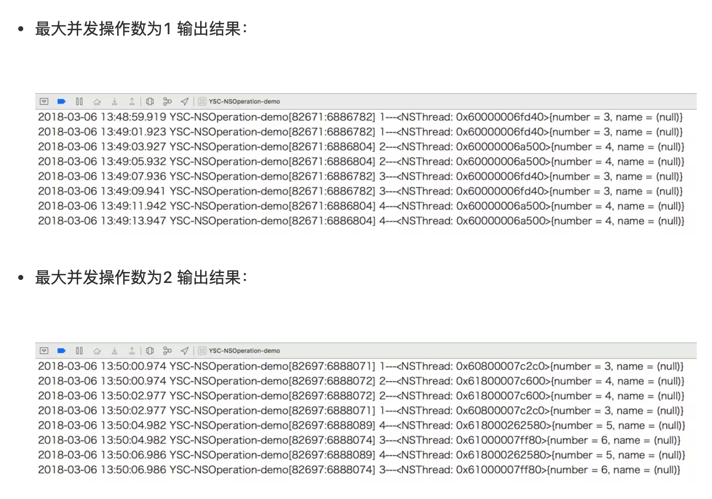

[TOC]

## 1. NSInvocationOperation

```objective-c
/**
 * 使用子类 NSInvocationOperation
 */
- (void)useInvocationOperation {
    // 1.创建 NSInvocationOperation 对象
    NSInvocationOperation *op = [[NSInvocationOperation alloc] initWithTarget:self selector:@selector(task1) object:nil];

    // 2.调用 start 方法开始执行操作
    [op start];
}

/**
 * 任务1
 */
- (void)task1 {
    for (int i = 0; i < 2; i++) {
        [NSThread sleepForTimeInterval:2]; // 模拟耗时操作
        NSLog(@"1---%@", [NSThread currentThread]); // 打印当前线程
    }
}
```

- 在没有使用 NSOperationQueue 情况下, 可以单独使用使用子类
- NSInvocationOperation 执行一个操作的情况下，操作是在 **当前线程** 执行的，并没有开启新线程


## 2. NSBlockOperation

### 1. 与 NSInvocationOperation 使用一样

```objective-c
/**
 * 使用子类 NSBlockOperation
 */
- (void)useBlockOperation {
    // 1.创建 NSBlockOperation 对象
    NSBlockOperation *op = [NSBlockOperation blockOperationWithBlock:^{
        for (int i = 0; i < 2; i++) {
            [NSThread sleepForTimeInterval:2]; // 模拟耗时操作
            NSLog(@"1---%@", [NSThread currentThread]); // 打印当前线程
        }
    }];

    // 2.调用 start 方法开始执行操作
    [op start];
}
```

- 但是 NSBlockOperation 还提供了一个方法 `addExecutionBlock:`
- 通过 `addExecutionBlock:` 就可以为 NSBlockOperation 添加额外的操作

### 2. addExecutionBlock: 增加额外的 block 任务

```objective-c
/**
 * 使用子类 NSBlockOperation
 * 调用方法 AddExecutionBlock:
 */
- (void)useBlockOperationAddExecutionBlock {
    // 1.创建 NSBlockOperation 对象
    NSBlockOperation *op = [NSBlockOperation blockOperationWithBlock:^{
        for (int i = 0; i < 2; i++) {
            [NSThread sleepForTimeInterval:2]; // 模拟耗时操作
            NSLog(@"1---%@", [NSThread currentThread]); // 打印当前线程
        }
    }];

    // 2.添加额外的操作
    [op addExecutionBlock:^{
        for (int i = 0; i < 2; i++) {
            [NSThread sleepForTimeInterval:2]; // 模拟耗时操作
            NSLog(@"2---%@", [NSThread currentThread]); // 打印当前线程
        }
    }];
    [op addExecutionBlock:^{
        for (int i = 0; i < 2; i++) {
            [NSThread sleepForTimeInterval:2]; // 模拟耗时操作
            NSLog(@"3---%@", [NSThread currentThread]); // 打印当前线程
        }
    }];
    [op addExecutionBlock:^{
        for (int i = 0; i < 2; i++) {
            [NSThread sleepForTimeInterval:2]; // 模拟耗时操作
            NSLog(@"4---%@", [NSThread currentThread]); // 打印当前线程
        }
    }];
    [op addExecutionBlock:^{
        for (int i = 0; i < 2; i++) {
            [NSThread sleepForTimeInterval:2]; // 模拟耗时操作
            NSLog(@"5---%@", [NSThread currentThread]); // 打印当前线程
        }
    }];
    [op addExecutionBlock:^{
        for (int i = 0; i < 2; i++) {
            [NSThread sleepForTimeInterval:2]; // 模拟耗时操作
            NSLog(@"6---%@", [NSThread currentThread]); // 打印当前线程
        }
    }];
    [op addExecutionBlock:^{
        for (int i = 0; i < 2; i++) {
            [NSThread sleepForTimeInterval:2]; // 模拟耗时操作
            NSLog(@"7---%@", [NSThread currentThread]); // 打印当前线程
        }
    }];
    [op addExecutionBlock:^{
        for (int i = 0; i < 2; i++) {
            [NSThread sleepForTimeInterval:2]; // 模拟耗时操作
            NSLog(@"8---%@", [NSThread currentThread]); // 打印当前线程
        }
    }];

    // 3.调用 start 方法开始执行操作
    [op start];
}
```

- NSBlockOperation 是否开启新线程，取决于 **操作的个数**
- 如果添加的 **操作数多**，就会自动 **开启新线程**
- 开启的 **线程数** 是由 **gcd 底层实现决定**


## 3. addDependency: 添加依赖

```c
@implementation ViewController
-(void)touchesBegan:(NSSet<UITouch *> *)touches withEvent:(UIEvent *)event
{
  //创建队列
  NSOperationQueue *queue=[[NSOperationQueue alloc] init];
  
  //创建操作1（注意：NSBlockOperation继承自NSOperation）
  NSBlockOperation *operation1=[NSBlockOperation blockOperationWithBlock:^(){
    NSLog(@"执行第1次操作，线程：%@",[NSThread currentThread]);
  }];
  
  //创建操作2
  NSBlockOperation *operation2=[NSBlockOperation blockOperationWithBlock:^(){
    NSLog(@"执行第2次操作，线程：%@",[NSThread currentThread]);
  }];
  
  //创建操作3
  NSBlockOperation *operation3=[NSBlockOperation blockOperationWithBlock:^(){
    NSLog(@"执行第3次操作，线程：%@",[NSThread currentThread]);
  }];
  
  //添加依赖
#if 0
  /**
   * 执行顺序：op3 -> op2 -> op1
   */
  [operation1 addDependency:operation2]; // op1 依赖 op2 执行结束后才能开始
  [operation2 addDependency:operation3]; // op2 依赖 op3 执行结束后才能开始
#endif
  
  //将操作添加到队列中去
  [queue addOperation:operation1];
  [queue addOperation:operation2];
  [queue addOperation:operation3];
}
@end
```

不使用addDependency:添加依赖情况下，**并发无序**执行operation

```
2018-06-09 16:02:31.456 Test[4024:49255] 执行第2次操作，线程：<NSThread: 0x7ff360e05ea0>{number = 2, name = (null)}
2018-06-09 16:02:31.456 Test[4024:49253] 执行第3次操作，线程：<NSThread: 0x7ff360c09d90>{number = 4, name = (null)}
2018-06-09 16:02:31.456 Test[4024:49254] 执行第1次操作，线程：<NSThread: 0x7ff360f0fbf0>{number = 3, name = (null)}
```

使用addDependency:添加依赖情况下，永远都是按照**依赖关系**执行operation

```
2018-06-09 16:03:49.800 Test[4114:50477] 执行第3次操作，线程：<NSThread: 0x7fb363530ff0>{number = 2, name = (null)}
2018-06-09 16:03:49.800 Test[4114:50477] 执行第2次操作，线程：<NSThread: 0x7fb363530ff0>{number = 2, name = (null)}
2018-06-09 16:03:49.800 Test[4114:50474] 执行第1次操作，线程：<NSThread: 0x7fb36352ba70>{number = 3, name = (null)}
```


## 4.  子类化 NSOperation

- 可以通过重写 `main` 或者 `start` 方法 来定义自己的 NSOperation 对象
- 重写`main`方法比较简单，我们不需要管理操作的状态属性 `isExecuting` 和 `isFinished`
- 当 `main` 执行完返回的时候，这个操作就结束了

```objective-c
@interface MyOperation : NSOperation
@end

@implementation MyOperation
- (void)main {
    if (!self.isCancelled) {
        for (int i = 0; i < 2; i++) {
            [NSThread sleepForTimeInterval:2];
            NSLog(@"1---%@", [NSThread currentThread]);
        }
    }
}
@end
```


## 5. NSOperationQueue

### 1. 获取 主队列

```objective-c
NSOperationQueue *queue = [NSOperationQueue mainQueue];
```

### 2. 创建自定义的队列

```objective-c
NSOperationQueue *queue = [[NSOperationQueue alloc] init];
```

### 3. 将操作加入到队列中

#### 1. addOperation:

```objective-c
/**
 * 使用 addOperation: 将操作加入到操作队列中
 */
- (void)addOperationToQueue {
    // 1.创建队列
    NSOperationQueue *queue = [[NSOperationQueue alloc] init];

    // 2.创建操作
    // 使用 NSInvocationOperation 创建操作1
    NSInvocationOperation *op1 = [[NSInvocationOperation alloc] initWithTarget:self selector:@selector(task1) object:nil];

    // 使用 NSInvocationOperation 创建操作2
    NSInvocationOperation *op2 = [[NSInvocationOperation alloc] initWithTarget:self selector:@selector(task2) object:nil];

    // 使用 NSBlockOperation 创建操作3
    NSBlockOperation *op3 = [NSBlockOperation blockOperationWithBlock:^{
        for (int i = 0; i < 2; i++) {
            [NSThread sleepForTimeInterval:2]; // 模拟耗时操作
            NSLog(@"3---%@", [NSThread currentThread]); // 打印当前线程
        }
    }];
    [op3 addExecutionBlock:^{
        for (int i = 0; i < 2; i++) {
            [NSThread sleepForTimeInterval:2]; // 模拟耗时操作
            NSLog(@"4---%@", [NSThread currentThread]); // 打印当前线程
        }
    }];

    // 3.使用 addOperation: 添加所有操作到队列中
    [queue addOperation:op1]; // [op1 start]
    [queue addOperation:op2]; // [op2 start]
    [queue addOperation:op3]; // [op3 start]
}
```

#### 2. addOperationWithBlock:

```objective-c
/**
 * 使用 addOperationWithBlock: 将操作加入到操作队列中
 */
- (void)addOperationWithBlockToQueue {
    // 1.创建队列
    NSOperationQueue *queue = [[NSOperationQueue alloc] init];

    // 2.使用 addOperationWithBlock: 添加操作到队列中
    [queue addOperationWithBlock:^{
        for (int i = 0; i < 2; i++) {
            [NSThread sleepForTimeInterval:2]; // 模拟耗时操作
            NSLog(@"1---%@", [NSThread currentThread]); // 打印当前线程
        }
    }];
    [queue addOperationWithBlock:^{
        for (int i = 0; i < 2; i++) {
            [NSThread sleepForTimeInterval:2]; // 模拟耗时操作
            NSLog(@"2---%@", [NSThread currentThread]); // 打印当前线程
        }
    }];
    [queue addOperationWithBlock:^{
        for (int i = 0; i < 2; i++) {
            [NSThread sleepForTimeInterval:2]; // 模拟耗时操作
            NSLog(@"3---%@", [NSThread currentThread]); // 打印当前线程
        }
    }];
}
```

### 4. maxConcurrentOperationCount

#### 1. maxConcurrentOperationCount 作用

- 并不是控制 线程的 并发数量

- 而是 控制 队列中 **同时执行任务** 最大数

#### 2. maxConcurrentOperationCount 值的含义

- `maxConcurrentOperationCount` 默认情况下为 `-1`
  - 表示 **不进行限制**
  - 可进行并发执行
- `maxConcurrentOperationCount` 为1时
  - 队列为 **串行** 队列
  - **只能串行** 执行
- `maxConcurrentOperationCount` 大于1时
  - 队列为 **并发** 队列
  - 操作并发执行，当然这个值不应超过系统限制
  - 即使自己设置一个很大的值，系统也会自动调整为 **min{自己设定的值，系统设定的默认最大值}**

#### 3. 示例

```objective-c
/**
 * 设置 MaxConcurrentOperationCount（最大并发操作数）
 */
- (void)setMaxConcurrentOperationCount {
    // 1.创建队列
    NSOperationQueue *queue = [[NSOperationQueue alloc] init];

    // 2.设置最大并发操作数
    queue.maxConcurrentOperationCount = 1; // 串行队列
// queue.maxConcurrentOperationCount = 2; // 并发队列, 并发2个任务
// queue.maxConcurrentOperationCount = 8; // 并发队列, 并发8个任务

    // 3.添加操作
    [queue addOperationWithBlock:^{
        for (int i = 0; i < 2; i++) {
            [NSThread sleepForTimeInterval:2]; // 模拟耗时操作
            NSLog(@"1---%@", [NSThread currentThread]); // 打印当前线程
        }
    }];
    [queue addOperationWithBlock:^{
        for (int i = 0; i < 2; i++) {
            [NSThread sleepForTimeInterval:2]; // 模拟耗时操作
            NSLog(@"2---%@", [NSThread currentThread]); // 打印当前线程
        }
    }];
    [queue addOperationWithBlock:^{
        for (int i = 0; i < 2; i++) {
            [NSThread sleepForTimeInterval:2]; // 模拟耗时操作
            NSLog(@"3---%@", [NSThread currentThread]); // 打印当前线程
        }
    }];
    [queue addOperationWithBlock:^{
        for (int i = 0; i < 2; i++) {
            [NSThread sleepForTimeInterval:2]; // 模拟耗时操作
            NSLog(@"4---%@", [NSThread currentThread]); // 打印当前线程
        }
    }];
}
```



当最大并发操作数为1时，操作是按顺序串行执行的，并且一个操作完成之后，下一个操作才开始执行。

当最大操作并发数为2时，操作是并发执行的，可以同时执行两个操作。而开启线程数量是由系统决定的，不需要我们来管理。


## 6. NSOperationQueue 线程间 通信

```objective-c
/**
 * 线程间通信
 */
- (void)communication {
    // 1.创建队列
    NSOperationQueue *queue = [[NSOperationQueue alloc]init];

    // 2.添加操作
    [queue addOperationWithBlock:^{
        // 异步进行耗时操作
        for (int i = 0; i < 2; i++) {
            [NSThread sleepForTimeInterval:2]; // 模拟耗时操作
            NSLog(@"1---%@", [NSThread currentThread]); // 打印当前线程
        }

        // 回到主线程
        [[NSOperationQueue mainQueue] addOperationWithBlock:^{
            // 进行一些 UI 刷新等操作
            for (int i = 0; i < 2; i++) {
                [NSThread sleepForTimeInterval:2]; // 模拟耗时操作
                NSLog(@"2---%@", [NSThread currentThread]); // 打印当前线程
            }
        }];
    }];
}
```

