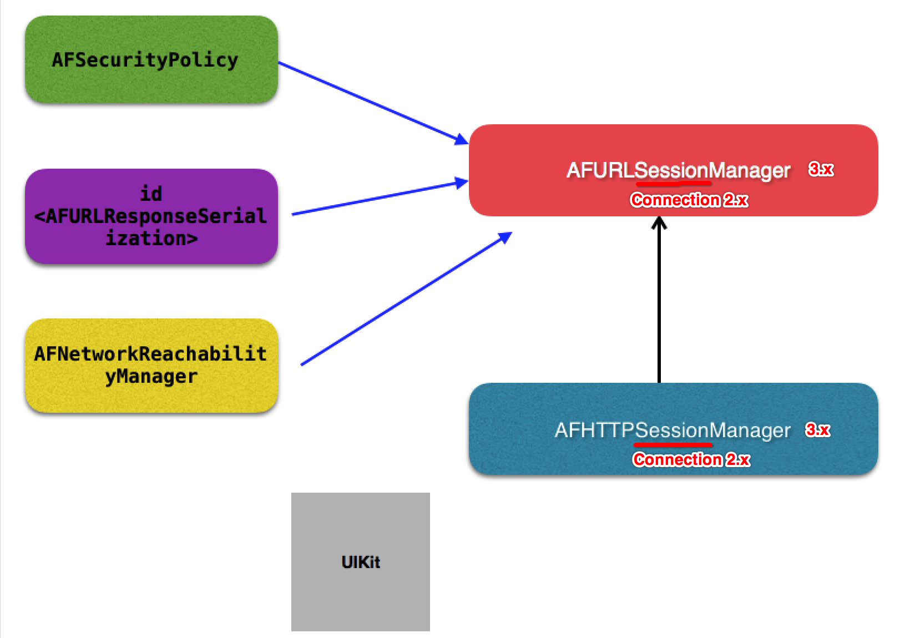

[TOC]


[TOC]


## 1. AFNetworking 2.X 基本架构



- 1）网络通信
  - http 1.1、http2.0 => NSURL**Session**
  - http 1.0 => NSURL**Connection**
- 2）网络安全 AFSecurityPolicy
- 3）请求参数序列化 
  - AFURL**Request**Serialization
  - AFURL**Response**Serialization
- 4）网络状态监测 AFNetwork**Reachability**Manager


## 2. AFURLConnectionOperation + NSURLConnection

### 1. AFURLConnectionOperation 实例的生命周期方法

- start
- cancel
- pause
- resume
- finish

### 2. start

当AFURLConnectionOperation对象被所在**NSOperationQueue**对象调度执行时，其start方法被执行

```objc
@implementation AFURLConnectionOperation

- (void)start 
{
  [self.lock lock];

  if ([self isCancelled]) //operation已经被取消
  {
    // 在单例子线程上执行 cancelConnection
    [self performSelector:@selector(cancelConnection) onThread:[[self class] networkRequestThread] withObject:nil waitUntilDone:NO modes:[self.runLoopModes allObjects]];

  } 
  else if ([self isReady]) //operation准备就绪
  {
    // 修改 operatin状态 => executing
    self.state = AFOperationExecutingState;

    // 在单例子线程上执行 operationDidStart
    // 并指定 runloop mode => default
    [self performSelector:@selector(operationDidStart) onThread:[[self class] networkRequestThread] withObject:nil waitUntilDone:NO modes:[self.runLoopModes allObjects]];
  }

  [self.lock unlock];
}

@end
```

如上的`cancelConnection 方法`和`operationDidStart 方法`都是在全局单例子线程上执行。

### 3. 单例 NSThread 对象对象

```objc
@implementation AFURLConnectionOperation

//线程创建
+ (NSThread *)networkRequestThread {
  static NSThread *_networkRequestThread = nil;
  static dispatch_once_t oncePredicate;
  dispatch_once(&oncePredicate, ^{
    _networkRequestThread = [[NSThread alloc] initWithTarget:self selector:@selector(networkRequestThreadEntryPoint:) object:nil];
    [_networkRequestThread start];
  });

  return _networkRequestThread;
}

//线程入口
+ (void)networkRequestThreadEntryPoint:(id)__unused object 
{
  //创建自动释放池autorelease pool
  @autoreleasepool 
  {
    // 设置子线程名
    [[NSThread currentThread] setName:@"AFNetworking"];

    // 打开子线程的runloop
    NSRunLoop *runLoop = [NSRunLoop currentRunLoop];
    
    // 添加一个port类型的runloop source，让runloop处于监听
    [runLoop addPort:[NSMachPort port] forMode:NSDefaultRunLoopMode];
    
    // 启动runloop（启动前必须添加runloop source）
    [runLoop run];
  }
}

@end
```

### 4. operationDidStart

如下的`-[AFURLConnectionOperation operationDidStart]` 实例方法，最终在单例NSThread子线程上执行 `NSURLConnection操作`。

```objc
@implementation AFURLConnectionOperation

- (void)operationDidStart 
{
  [self.lock lock];
    
     //1. 首先判断是否已经被取消执行
     //（这里只能在operation执行前取消，运行中进行取消的，需要判断 isCanceled在执行block代码之前。）
    if (![self isCancelled]) 
    {
      //1.1 创建NSURLConnection对象，指定回调delegate为 `单例NSThread子线程`
      self.connection = [[NSURLConnection alloc] initWithRequest:self.request delegate:self startImmediately:NO];
  
      //1.2 获取当前所在线程（单例子线程）的runloop
      NSRunLoop *runLoop = [NSRunLoop currentRunLoop];
        
      //1.3 指定runloop监听将NSURLConnection对象、NSOutputStream对象的事件源
      // => 单例子线程的runloop监听事件源
      // => 将事件源添加到【self.runLoopModes】指定的【mode】下
      for (NSString *runLoopMode in self.runLoopModes) 
      {
        [self.connection scheduleInRunLoop:runLoop forMode:runLoopMode];
        [self.outputStream scheduleInRunLoop:runLoop forMode:runLoopMode];
      }

       //1.4 打开输出流
       //（将接收到的网络数据，写入到手机内存中）
      [self.outputStream open];
        
      //1.5 在【单例子线程】上 `同步` 执行connection
      [self.connection start];
    }
    
    //2. 解锁同步
    [self.lock unlock];

    //3. 发送一个开始网络请求的通知，告知任务已经开始
    // => 当前代码执行在【单例子线程】
    // => 为了防止外部调用者在【通知回调中操作UI对象】，所以将【发送通知】的操作转到【主线程】异步执行
    dispatch_async(dispatch_get_main_queue(), ^{
      [[NSNotificationCenter defaultCenter] postNotificationName:AFNetworkingOperationDidStartNotification object:self];
    });
}

@end
```

我log了一下这个方法所在的线程:

```
<NSThread: 0x7fa2e0562020>{number = 3, name = AFNetworking}
```

- 确实是在AFNetworking创建的 `单例子线程` 上执行网络请求操作的

然后又在`NSURLConnectionDelegate 回调函数`中log了一下

```
<NSThread: 0x7fa2e0562020>{number = 3, name = AFNetworking}
```

- 发现也是在**单例子线程**上执行的

得出的结论:

- 所有网络请求的过程，都是放在一个 `单独的子线程` 上完成的.
- 对我们【主线程】、【NSOperation线程】都没有任何影响.

### 5. cancel

AFURLConnectionOperation对象取消执行cancel，仅仅只是取消执行**operation**对象.

```objc
@implementation AFURLConnectionOperation

- (void)cancel {

  //1.
  [self.lock lock];

  //2. 必须是 没有完成 与 没有取消过
  if (![self isFinished] && ![self isCancelled]) 
  {
    //2.1 执行父类NSOperation实例的cancel方法，取消执行operation
    //到此为止，仅仅只是取消了operation执行
    //但是operation对象的NSURLConnection操作没有被取消
    [super cancel];

    //2.2 继续取消operation对象的NSURLConnection操作
    //因为 NSURLConnection操作、事件源 都是与 单例子线程 相关
    //所以也必须回到 单例子线程上
    if ([self isExecuting]) 
    {
      //因为重写了 isExecuting函数，所以此时不是 executing 状态
      [self performSelector:@selector(cancelConnection)
                   onThread:[[self class] networkRequestThread]
                 withObject:nil
              waitUntilDone:NO
                      modes:[self.runLoopModes allObjects]];
    }
  }

  //3.
  [self.lock unlock];
}

@end
```

### 6. cancelConnection

```objc
@implementation AFURLConnectionOperation

- (void)cancelConnection 
{
  //1. 构造 userInfo字典，保存此次取消执行operation的相关信息
  NSDictionary *userInfo = nil;
  if ([self.request URL]) {
    userInfo = @{NSURLErrorFailingURLErrorKey : [self.request URL]};
  }

  //2. 使用前面的userInfo字典，构造取消执行operation的NSError
  NSError *error = [NSError errorWithDomain:NSURLErrorDomain
                                       code:NSURLErrorCancelled//Cancelled
                                   userInfo:userInfo];

  //3. 如果已经完成的operation
  //就不用执行取消connection
  //完成的operation会做connection取消操作
  if (![self isFinished])
  {
    //区分operation是否包含NSURLConnection对网络请求象
    if (self.connection)
    {
      //取消执行connection
      [self.connection cancel];

      //手动调用NSURLConnectionDelegate的错误回调函数
      [self performSelector:@selector(connection:didFailWithError:)
                 withObject:self.connection
                 withObject:error];

    } else {
      // Accommodate race condition where `self.connection` has not yet been set before cancellation
      //保存错误
      self.error = error;

      //结束执行operation
      [self finish];
    }
  }
}

@end
```

如上代码得知，结束执行operation对象的NSURLConnection操作时分两种情况:

- operation.connection为`空`
- operation.connection为`非空`

### 7. operation 对象, 拥有一个 NSURLConnection 对象（`非空`）

#### 1. 手动调用 NSURLConnectionDelegate 的错误回调函数

```c
//1. 
[self.connection cancel];

//2.
[self performSelector:@selector(connection:didFailWithError:)
                       withObject:self.connection
                       withObject:error];
```

#### 2. 被调用的 NSURLConnectionDelegate 函数

```objc
@implementation AFURLConnectionOperation

#pragma mark - NSURLConnectionDelegate

- (void)connection:(NSURLConnection __unused *)connection
  didFailWithError:(NSError *)error
{
  //1. 保存请求错误
  self.error = error;

  //2. 关闭operation对象的输出流
  [self.outputStream close];
    
  //3. 如果存在responseData数据，说明输出流使用过
  if (self.responseData) {
    self.outputStream = nil; //如果存在输出流对象，还需要释放内存
  }

  //4. 释放掉connection
  self.connection = nil;

  //5. 结束执行operation，执行回调completionblock
  [self finish];
}

@end
```

- 1）关闭并释放 **outputstream** 输出流
- 2）关闭并释放 **connection** 网络连接

### 8. operation 对象的 connection 为`空`

因为没有connection对象了，所以直接结束执行operation.

```c
//1.
self.error = error;

//2.
[self finish];
```

### 9. finish

AFURLConnectionOperation对象结束执行

```c
@implementation AFURLConnectionOperation

- (void)finish 
{
  //1. 加锁同步
  [self.lock lock];

  //2. 修改【当前operation对象】的状态为【finish】
  self.state = AFOperationFinishedState; // => setState: 

  //3. 解锁
  [self.lock unlock];

  //4. 告诉operation执行完毕
  dispatch_async(dispatch_get_main_queue(), ^{
    [[NSNotificationCenter defaultCenter] postNotificationName:AFNetworkingOperationDidFinishNotification object:self];
  });
}

@end
```

- 1）调用`-[AFURLConnectionOperation setState:]`修改当前operation对象的state属性值
- 2）在`-[AFURLConnectionOperation setState:]`方法中，发出 `_isFinish`属性修改的KVO通知
- 3）最终被系统监听收到，知道这个operation执行完毕了
- 4）就会执行给operation设置的completionBlock，完成了向用户回调

### 10. setState: 

```c
- (void)setState:(AFOperationState)state 
{
  // 1、判断状态转移是否合法
  if (!AFStateTransitionIsValid(self.state, state, [self isCancelled])) {
    return;
  }
  [self.lock lock];

  // 2. 调用 AFKeyPathFromOperationState() 获取【当前】operation的状态
  NSString *oldStateKey = AFKeyPathFromOperationState(self.state);

  // 3. 调用 AFKeyPathFromOperationState() 获取【将要变化成】的operation的状态
  NSString *newStateKey = AFKeyPathFromOperationState(state);

  // 4. 手动发出KVO属性值改变：old => new
  [self willChangeValueForKey:newStateKey];
  [self willChangeValueForKey:oldStateKey];
  _state = state;
  [self didChangeValueForKey:oldStateKey];
  [self didChangeValueForKey:newStateKey];
  [self.lock unlock];
}
```

### 11. AFStateTransitionIsValid() 

维护一个**状态机**从A状态是否能够转换为B状态。

```c
static inline BOOL 
AFStateTransitionIsValid(
  AFOperationState fromState, 
  AFOperationState toState, 
  BOOL isCancelled) 
{
  switch (fromState) {
    case AFOperationReadyState:
        switch (toState) {
            case AFOperationPausedState:
            case AFOperationExecutingState:
                return YES;
            case AFOperationFinishedState:
                return isCancelled;
            default:
                return NO;
        }
    case AFOperationExecutingState:
        switch (toState) {
            case AFOperationPausedState:
            case AFOperationFinishedState:
                return YES;
            default:
                return NO;
        }
    case AFOperationFinishedState:
        return NO;
    case AFOperationPausedState:
        return toState == AFOperationReadyState;
    default: {
#pragma clang diagnostic push
#pragma clang diagnostic ignored "-Wunreachable-code"
        switch (toState) {
            case AFOperationPausedState:
            case AFOperationReadyState:
            case AFOperationExecutingState:
            case AFOperationFinishedState:
                return YES;
            default:
                return NO;
        }
    }
#pragma clang diagnostic pop
  }
}
```

### 12. AFKeyPathFromOperationState()

```c
static inline NSString* 
AFKeyPathFromOperationState(AFOperationState state) 
{
  switch (state) 
  {
    case AFOperationReadyState:
      return @"isReady";
    case AFOperationExecutingState:
      return @"isExecuting";
    case AFOperationFinishedState:
      return @"isFinished"; // 标记operation结束执行
    case AFOperationPausedState:
      return @"isPaused";
    default: {
#pragma clang diagnostic push
#pragma clang diagnostic ignored "-Wunreachable-code"
      return @"state";
#pragma clang diagnostic pop
    }
  }
}
```

- 1）当传入**state == AFOperationFinishedState**时，返回对应的字符串为**isFinished**
- 2）当给某个NSOperation对象，发送 **isFinished** KVO通知时，意味着这个**NSOperation对象即将结束执行**

### 13. 发送 **isFinished** KVO 通知时, 回调 setCompletionBlock: 设置回调代码块

```objective-c
- (void)setCompletionBlock:(void (^)(void))block 
{
  [self.lock lock];
  if (!block) {
    [super setCompletionBlock:nil];
  } else {
    __weak __typeof(self)weakSelf = self;
    
    /**
     * 给operation对象设置回调代码块
     */
    [super setCompletionBlock:^ {
      __strong __typeof(weakSelf)strongSelf = weakSelf;

#pragma clang diagnostic push
#pragma clang diagnostic ignored "-Wgnu"
      dispatch_group_t group = strongSelf.completionGroup ?: url_request_operation_completion_group();
      dispatch_queue_t queue = strongSelf.completionQueue ?: dispatch_get_main_queue();
#pragma clang diagnostic pop
      
      /**
       * 回调外界给operation对象，设置的请求回调代码块
       */
      dispatch_group_async(group, queue, ^{
        block();
      });

      dispatch_group_notify(group, url_request_operation_completion_queue(), ^{
        [strongSelf setCompletionBlock:nil];
      });
    }];
  }
  [self.lock unlock];
}
```

至此一个请求完成执行完毕。

### 14. pause

AFURLConnectionOperation对象暂停执行

```objc
@implementation AFURLConnectionOperation

- (void)pause 
{
  //1. 如果当前operation处于 暂停、结束、取消，不能暂停
  if ([self isPaused] || [self isFinished] || [self isCancelled]) {
    return;
  }

  //2. 同步加锁
  [self.lock lock];

  //3. 只有处于 `执行中` 的operation可以被pause
  if ([self isExecuting])
  {
    //3.1 一样的 单例子线程上 执行暂停operation
    [self performSelector:@selector(operationDidPause)
                  onThread:[[self class] networkRequestThread]
                withObject:nil
            waitUntilDone:NO
                    modes:[self.runLoopModes allObjects]];

    //3.2 发送通知，告知operation暂停
    dispatch_async(dispatch_get_main_queue(), ^{
        NSNotificationCenter *notificationCenter = [NSNotificationCenter defaultCenter];
        [notificationCenter postNotificationName:AFNetworkingOperationDidFinishNotification object:self];
    });
  }

  //4. 修改state为pause暂停
  self.state = AFOperationPausedState;

  //5. 解锁同步
  [self.lock unlock];
}

@end
```

```objc
@implementation AFURLConnectionOperation

- (void)operationDidPause 
{
  //1.
  [self.lock lock];
  
  //2. 只是取消NSURLConnection对象执行
  //那么runloop也不再接收事件
  [self.connection cancel];
  
  //3.
  [self.lock unlock];
}

@end
```

- 1）其实并不是真正的**pause**暂停请求
- 2）而是**cancel**取消掉operation

### 15. resume

AFURLConnectionOperation对象恢复执行

```objc
@implementation AFURLConnectionOperation

- (void)resume 
{
  //1. 只有被pause的operation，才可以被resume
  if (![self isPaused]) {
    return;
  }

  //2. 加锁
  [self.lock lock];

  //3. operation state 为 ready
  self.state = AFOperationReadyState;

  //4. 手动调用 -[NSOperation start] 重新执行operation
  [self start];

  //5. 解锁
  [self.lock unlock];
}

@end
```

实际上也不是什么**恢复**，而是**重新发起网络请求**。


## 3. 线程组织关系


- 每一个网络请求，都是一个新的**NSOperation子线程**

- 但是最终所有的**网络连接数据传输**耗时代码，都是在**单例子线程NSThread**
- 单例子线程NSThread的runloop
  - 注册监听NSURLConnection事件源、NSOutputStream事件源
  - 开启runloop
- 当网络连接数据传输回调时，单例子线程NSThread的runloop接收到事件源被唤醒处理
- 单例子线程NSThread修改**当前operation对象的状态为finish**
- operation.completionBlock被执行


## 5. batchOfRequestOperations

### 1. 过程解析

```c
// 1、创建 group ，因为只有 group 才有 dispatch_group_notify() 统一回调的功能
__block dispatch_group_t group = dispatch_group_create();

// 2、创建 batchedOperation
// => batchedOperation：就是一个 NSBlockOperation 类型的对象
// => block回调中执行 dispatch_group_notify() 
// => 让 group 中的【所有任务】都完成时，再统一回调
NSBlockOperation *batchedOperation = [NSBlockOperation blockOperationWithBlock:^{
  /**
   * dispatch_group_notify() 等待计数器值 == 0，所有的任务全部完成
   */
  dispatch_group_notify(group, dispatch_get_main_queue(), ^{
    if (completionBlock) {
      completionBlock(operations);
    }
  });
}];

// 3、创建 operation 任务操作数组
NSOperation* op1 = [NSOperation new];
NSOperation* op2 = [NSOperation new];
NSOperation* op3 = [NSOperation new];
NSArray *operations = @[op1, op2, op3];

// 4、遍历operation数组
for (NSOperation *op in operations) 
{
  // 4.1 将每一个operation，交给group统一监督
  op.completionGroup = group;

  // 4.2 拷贝一份 operation 最初的 completionBlock 属性值
  void (^originalCompletionBlock)(void) = [operation.completionBlock copy];

  // 4.3 修改 operation 当前的 completionBlock 属性值
  __weak __typeof(operation)weakOperation = op;
  op.completionBlock = ^{
    __strong __typeof(weakOperation)strongOperation = weakOperation;
#pragma clang diagnostic push
#pragma clang diagnostic ignored "-Wgnu"
    dispatch_queue_t queue = strongOperation.completionQueue ?: dispatch_get_main_queue();
#pragma clang diagnostic pop

    /**
     * 将operation的回调block执行的代码，
     * 放到 group 中统一监督完成
     */
    dispatch_group_async(group, queue, ^{

      // 执行每一个operation的回调block
      if (originalCompletionBlock) {
        originalCompletionBlock();
      }

      // 统计已经完成的 operation 个数
      NSUInteger numberOfFinishedOperations = [[operations indexesOfObjectsPassingTest:^BOOL(id op, NSUInteger __unused idx,  BOOL __unused *stop) {
        return [op isFinished];
      }] count];

      // 回传完成比例： (当前已经完成的operation个数, operation总个数)
      if (progressBlock) {
        progressBlock(numberOfFinishedOperations, [operations count]);
      }

      // 告诉 group 已经【完成】一个存在的任务 => -1
      // => 与block外面执行的dispatch_group_enter(group);匹配
      dispatch_group_leave(group);
    });
  };

  // 4.4、告诉 group 已经【加入】一个新任务 => +1
  // => 与completionBlock里面的dispatch_group_leave(group);匹配
  dispatch_group_enter(group); 

  // 4.5、atchedOperation 依赖所有添加的任务操作，
  // 即在所有的任务操作结束执行之后，才会执行batchedOperation
  [batchedOperation addDependency:operation];
}
```

### 2. 源码实现

```c
+ (NSArray *)batchOfRequestOperations:(NSArray *)operations
                        progressBlock:(void (^)(NSUInteger numberOfFinishedOperations, NSUInteger totalNumberOfOperations))progressBlock
                      completionBlock:(void (^)(NSArray *operations))completionBlock
{
  // 1. 传入的operations任务数组为空，或者长度为0
  if (!operations || [operations count] == 0) {
    return @[[NSBlockOperation blockOperationWithBlock:^{
      dispatch_async(dispatch_get_main_queue(), ^{
        if (completionBlock) {
          completionBlock(@[]); // 直接回调一个空的数组
        }
      });
    }]];
  }

  // 2.
  __block dispatch_group_t group = dispatch_group_create();
  NSBlockOperation *batchedOperation = [NSBlockOperation blockOperationWithBlock:^{
    dispatch_group_notify(group, dispatch_get_main_queue(), ^{
      if (completionBlock) {
        completionBlock(operations);
      }
    });
  }];

  // 3.
  for (AFURLConnectionOperation *operation in operations) 
  {
    operation.completionGroup = group;
    void (^originalCompletionBlock)(void) = [operation.completionBlock copy];
    __weak __typeof(operation)weakOperation = operation;
    operation.completionBlock = ^{
      __strong __typeof(weakOperation)strongOperation = weakOperation;
    #pragma clang diagnostic push
    #pragma clang diagnostic ignored "-Wgnu"
      dispatch_queue_t queue = strongOperation.completionQueue ?: dispatch_get_main_queue();
    #pragma clang diagnostic pop
      dispatch_group_async(group, queue, ^{
        if (originalCompletionBlock) {
          originalCompletionBlock();
        }

        NSUInteger numberOfFinishedOperations = [[operations indexesOfObjectsPassingTest:^BOOL(id op, NSUInteger __unused idx,  BOOL __unused *stop) {
          return [op isFinished];
        }] count];

        if (progressBlock) {
          progressBlock(numberOfFinishedOperations, [operations count]);
        }

        dispatch_group_leave(group);
      });
    };

    dispatch_group_enter(group);
    [batchedOperation addDependency:operation];
  }

  // 4. 将最终的统一回调operation任务加入到所有的任务数组
  return [operations arrayByAddingObject:batchedOperation];
}
```