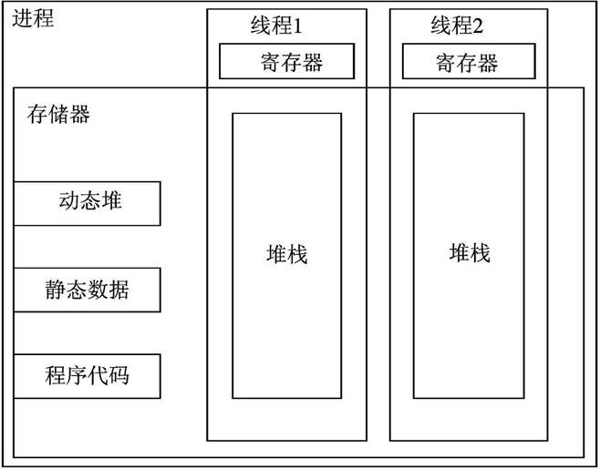
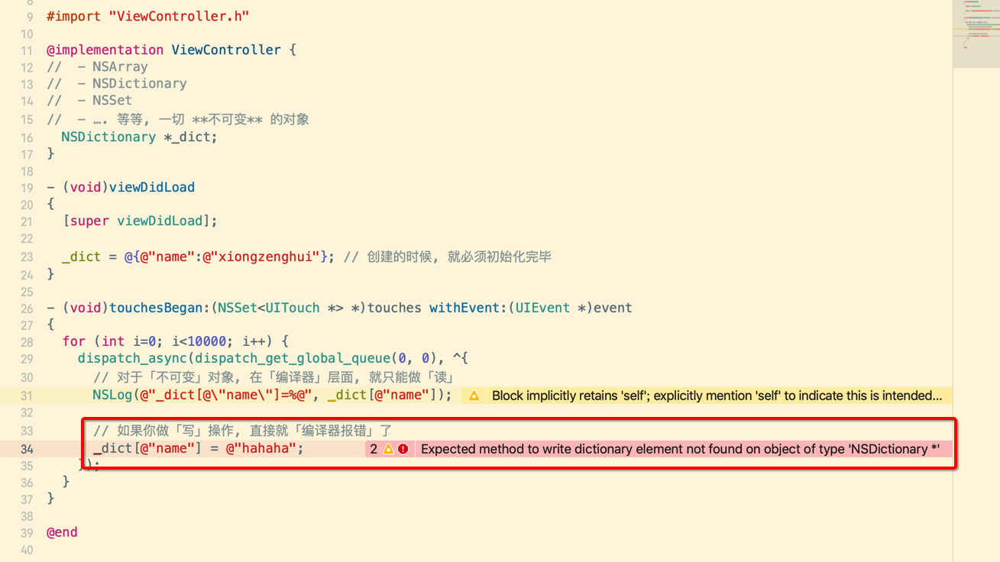
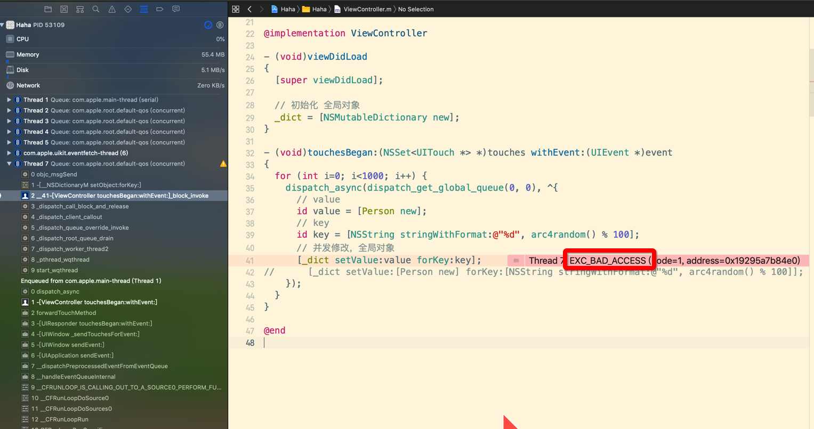
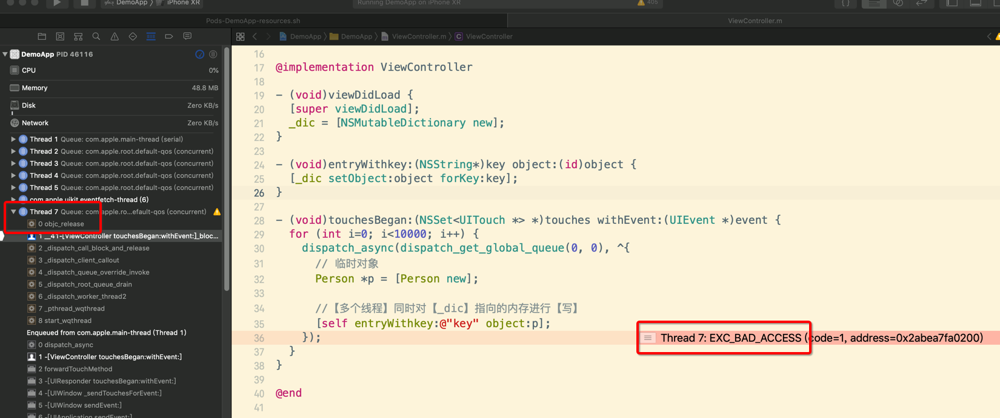

[TOC]


## 1. OK: 每一个线程【栈】都是【独立】的

```objective-c
#import "ViewController.h"

@interface Person : NSObject
@end
@implementation Person
- (void)dealloc {
  NSLog(@"dealloc: %p", self);
}
@end

@interface ViewController () {
  NSMutableDictionary *_dic;
}

@end

@implementation ViewController

- (void)viewDidLoad {
  [super viewDidLoad];
  _dic = [NSMutableDictionary new];
}

- (void)entry {
  // 1. [Person new] 在【堆区】分配一块内存
  // 2. 当前线程的【栈】上分配一块【局部存储】变量 p
  // 3. 变量 p 保存在【堆区】分配的【内存地址】
  Person *p = [Person new]; // retain
} // release

- (void)touchesBegan:(NSSet<UITouch *> *)touches withEvent:(UIEvent *)event {
  for (int i=0; i<10; i++) {
    dispatch_async(dispatch_get_global_queue(0, 0), ^{
      [self entry];
    });
  }
}

@end

```

- 对于每一个线程来说，**栈** 都是 **独立** 的
- 所以对于不同的线程 `&p` 的 内存地址值，都是 **不同** 的




## 2. OK: 并发【读】【同一块内存】

```objective-c
@implementation ViewController {
  NSMutableDictionary *_dict;
}

- (void)viewDidLoad
{
  [super viewDidLoad];

  _dict = [NSMutableDictionary dictionaryWithCapacity:3];
  _dict[@"name"] = @"xiongzenghui";
}

- (void)touchesBegan:(NSSet<UITouch *> *)touches withEvent:(UIEvent *)event
{
  for (int i=0; i<10000; i++) {
    dispatch_async(dispatch_get_global_queue(0, 0), ^{
      NSLog(@"_dict[@\"name\"]=%@", _dict[@"name"]);
    });
  }
}

@end
```

这段代码，你就是在1W个子线程上同时跑，都没有任何的问题 。


## 3. OK: 【只读】内存

- NSArray
- NSDictionary
- NSSet
- …. 等等, 一切 **不可变** 的对象

```objective-c
@implementation ViewController {
//  - NSArray
//  - NSDictionary
//  - NSSet
//  - …. 等等, 一切 **不可变** 的对象
  NSDictionary *_dict;
}

- (void)viewDidLoad
{
  [super viewDidLoad];

  _dict = @{@"name":@"xiongzenghui"}; // 创建的时候, 就必须初始化完毕
}

- (void)touchesBegan:(NSSet<UITouch *> *)touches withEvent:(UIEvent *)event
{
  for (int i=0; i<10000; i++) {
    dispatch_async(dispatch_get_global_queue(0, 0), ^{
      // 对于「不可变」对象, 在「编译器」层面, 就只能做「读」
      NSLog(@"_dict[@\"name\"]=%@", _dict[@"name"]);
      
      // 如果你做「写」操作, 直接就「编译器报错」了
      _dict[@"name"] = @"hahaha";
    });
  }
}

@end
```



从语法的层面，就不允许你做修改，当然也就不存在任何的问题。


## 4. Error: 并发【写】【同一块内存】

### 1. 全局变量

#### 1. 代码

```objective-c
// 全局变量
NSMutableDictionary *_dict;

@interface Person : NSObject
@end
@implementation Person
- (void)dealloc {
  NSLog(@"dealloc: %p", self);
}
@end

@implementation ViewController

- (void)viewDidLoad
{
  [super viewDidLoad];

  // 初始化 全局对象
  _dict = [NSMutableDictionary new];
}

- (void)touchesBegan:(NSSet<UITouch *> *)touches withEvent:(UIEvent *)event
{
  for (int i=0; i<1000; i++) {
    dispatch_async(dispatch_get_global_queue(0, 0), ^{
      // value
      id value = [Person new];
      
      // key
      // 注意：这里我还随机了下，避免了 key 重复
      // 但是日常开发时，通常这个 key 重复性很高
      // 所以崩溃的几率要比这个例子高的多
      id key = [NSString stringWithFormat:@"%d", arc4random() % 100];
      
      // 并发修改，全局对象
      [_dict setValue:value forKey:key];
      
      // 效果同上
			// [_dict setValue:[Person new] forKey:[NSString stringWithFormat:@"%d", arc4random() % 100]];
    });
  }
}

@end

```

#### 2. 崩溃



#### 3. 原因

- 1) 多个线程同时【修改】 `_dic` 保存的【内存地址】
- 2) 导致有一个【Dog 对象】的【内存地址】会重复【释放2次】导致崩溃

### 2. 可变对象/缓存对象

#### 1. 代码

```objective-c
@interface Person : NSObject
@end
@implementation Person
- (void)dealloc {
  NSLog(@"dealloc: %p", self);
}
@end

@interface ViewController () {
  /**
   * 通常我们会使用一个 ivar 来持有住一个 mutable array/dict,
   * 作为一个 内存缓存 容器对象，
   * 来保存一些经常使用的 内存对象，
   * 想法很不错 ...
   */
  NSMutableDictionary *_dic;
}

@end

@implementation ViewController

- (void)viewDidLoad {
  [super viewDidLoad];
  _dic = [NSMutableDictionary new];
}

- (void)entryWithkey:(NSString*)key object:(id)object {
  [_dic setObject:object forKey:key];
}

- (void)touchesBegan:(NSSet<UITouch *> *)touches withEvent:(UIEvent *)event {
  for (int i=0; i<10000; i++) {
    dispatch_async(dispatch_get_global_queue(0, 0), ^{
      // 临时对象
      Person *p = [Person new];
      
      //【多个线程】同时对【_dic】指向的内存进行【写】
      [self entryWithkey:@"key" object:p];
    });
  }
}

@end
```

#### 2. 崩溃



#### 3. 原因

同上，没任何区别。


## 5. 总结产生崩溃的原因

```objective-c
- (void)entry {
  // 这是一个新的 Person 堆区对象, 这一句是没有任何问题的
  Person *p = [Person new];
  
  // dict set 操作, 会触发2个操作, 产生问题的关键地点
  // - 1) release dict[@"key"] 之前的对象
  // - 2) retain 新的 Person 堆区对象
  [_dic setObject:p forKey:@"key"];
}
```

- 出问题的情况就是, 如果当执行 **setObject:forKey** 时, 同时进入 **2个以上** 的子线程
  - 线程1, 塞入 Person 对象2, 释放 Person **对象1**
  - 线程2, 塞入 Person 对象3, 释放 Person **对象1**
  - ….
  - 线程N, 塞入 Person 对象N, 释放 Person **对象1**
- 在这种情况下，对于 **对象1** 可能会瞬间被 **释放N次** ， 就会产生 **多次释放** 造成崩溃
