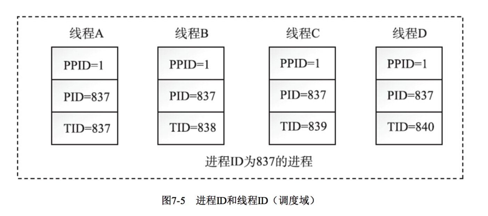
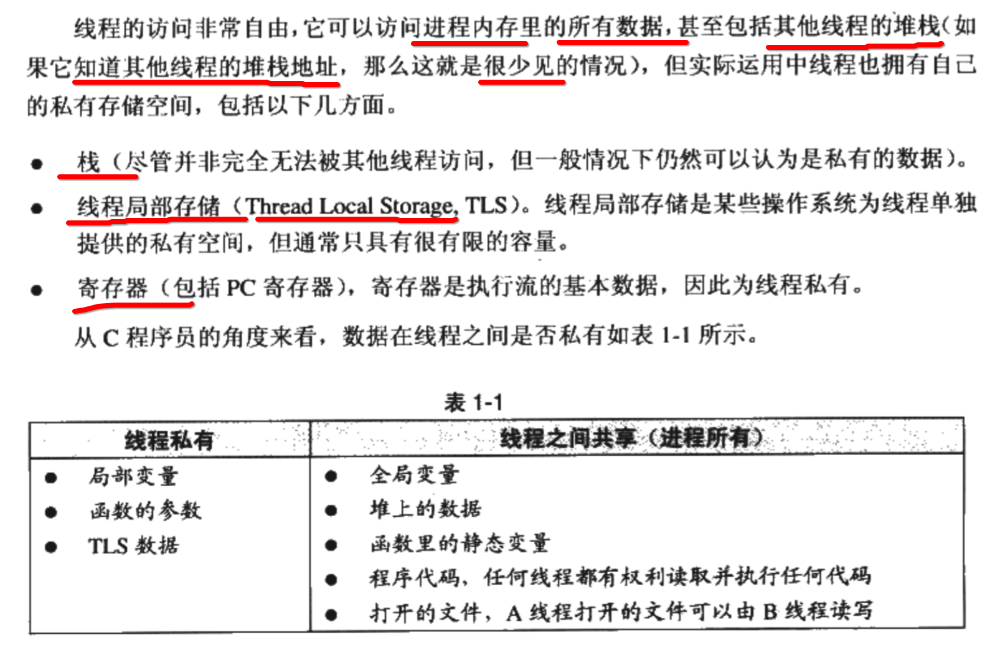
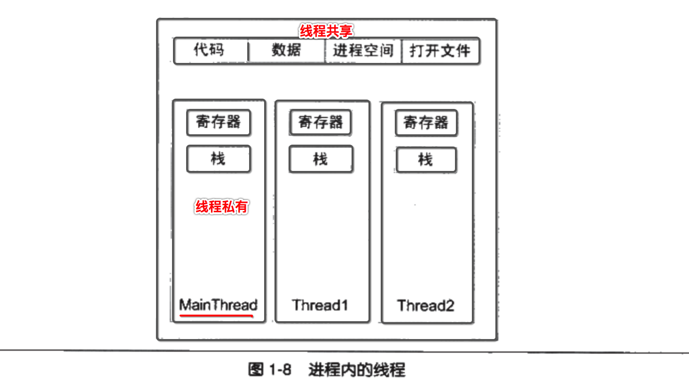

[TOC]


## 1. Linux/Unix 将 ==线程== 看做是一种 ==light weight(轻量级) 进程==



---

- 在 linux 早期只有 **进程**，并没有 **线程**
- **线程** 是 **后期** 才补加到 unix/linux 中的
- **线程** 在 linux 中，看做是 **轻量级进程**，也存在与之对应的 **task_struct** 对象
- 一个 **进程** 内部，可包含 **n个线程** ，作为 **最小** 分配 **CPU 时间片** 的单位
- 每一个 **子线程** 都有自己的 **线程 id（轻量级 进程 id）**
- 结论是，你可以将 **一个线程**，认为是一种 **比较小的 进程**，因为实际上二者确实没有太大的区别


## 2. `ps -Lf` 查看 一个进程 内的 所有线程

```
->  ps -e | grep "firefox"
 4020 ?        00:00:05 firefox
->
```

```
->  ps -Lf 4020
UID        PID  PPID   LWP  C NLWP STIME TTY      STAT   TIME CMD
xzh       4020  1615  4020  7   52 21:07 ?        Sl     0:04 /usr/lib/firefox/firefox
xzh       4020  1615  4026  0   52 21:07 ?        Sl     0:00 /usr/lib/firefox/firefox
xzh       4020  1615  4027  0   52 21:07 ?        Sl     0:00 /usr/lib/firefox/firefox
xzh       4020  1615  4028  0   52 21:07 ?        Sl     0:00 /usr/lib/firefox/firefox
xzh       4020  1615  4029  0   52 21:07 ?        Sl     0:00 /usr/lib/firefox/firefox
xzh       4020  1615  4030  0   52 21:07 ?        Sl     0:00 /usr/lib/firefox/firefox
xzh       4020  1615  4031  0   52 21:07 ?        Sl     0:00 /usr/lib/firefox/firefox
xzh       4020  1615  4032  0   52 21:07 ?        Sl     0:00 /usr/lib/firefox/firefox
xzh       4020  1615  4033  0   52 21:07 ?        Sl     0:00 /usr/lib/firefox/firefox
xzh       4020  1615  4034  0   52 21:07 ?        Sl     0:00 /usr/lib/firefox/firefox
xzh       4020  1615  4035  0   52 21:07 ?        Sl     0:00 /usr/lib/firefox/firefox
..................................................
```

- 你可以看到 4020 这个进程，内部所有的子线程
- 这种情况下的 **进程** ，已经退化为 **管理** 内部 **n个线程** 的载体
- 核心执行路径，已经交给了 **主线程**
- 每一个 **进程** 都有自己唯一的标识符 **PID** 值，就是上面的 **4020**
- 而 **一个进程** 内所有的 **线程 PID** 值，都等于 **所属进程** 的 **PID** 值
- 所有的 **线程 LWP** 都是不同的，类似于 **PID** 区别 每一个 进程
- 区分 主线程 和 子线程
  - **主**线程 => **LWP == PID**
  - **子**线程 => **LWP != PID** 
- **内核** 也是根据 ==LWP== 区分 ==进程== 与 ==线程==


## 3. 主线程

- 进程内（线程组）中的  **第一个线程**

- 将  **进程 id（线程组id）** 作为 **第一个线程** 的 标识符 id
- **用户态** 中叫做 **主线程**
- **内核态** 中叫做 **Group Leader**


## 4. 主线程 与 子线程 之间的组织关系

- **主** 线程的 **group_leader** 指向 **自己**
- **子** 线程的 **group_leader** 指向 **主线程**
- 所有的 **线程** 都组织为一个 **链表** 结构
  - **链表头部** ==> **主**线程
  - 其他的 **链表节点** ==> 其他的 **子线程**

```c
p->tgid = p->pid; 
p->group_leader = p;
INIT_LIST_HEAD(&p->thread_group);
```


## 5. 每一个线程，都有自己的 ==工作目录==

查看挂载目录 **进程 pid = 4020** 内部, 所有 **子线程** 的 工作目录

```
->  ls /proc/4020/task/
4020  4028  4031  4034	4037  4040  4046  4049	4055  4058  4061  4064	4074  4100  4105  4114	4118  4136
4026  4029  4032  4035	4038  4043  4047  4053	4056  4059  4062  4071	4075  4101  4109  4115	4124
4027  4030  4033  4036	4039  4045  4048  4054	4057  4060  4063  4072	4078  4102  4113  4116	4125
->
```

- 每一个线程，都对应一个工作目录
- 目录的名字，就是线程的id


## 6. 线程 ==私有== 的东西



---

- 对于上面这几种线程 **私有** 类型数据，你不需要做任何的 **线程安全处理**
- 因为他们天生就是 **线程安全** 的


## 7. 线程 ==共享== 的东西



---

- 而对上这图中的所有线程 **共享** 类型的数据，不管是 **读** 还是 **写** 
- 你都需要特别的小心
- 一定要做 **线程安全处理**
- 否则比较轻的情况，只是产生 **脏数据**
- 而比较坏的情况，就是各种 **内存重复释放** 导致的进程崩溃

