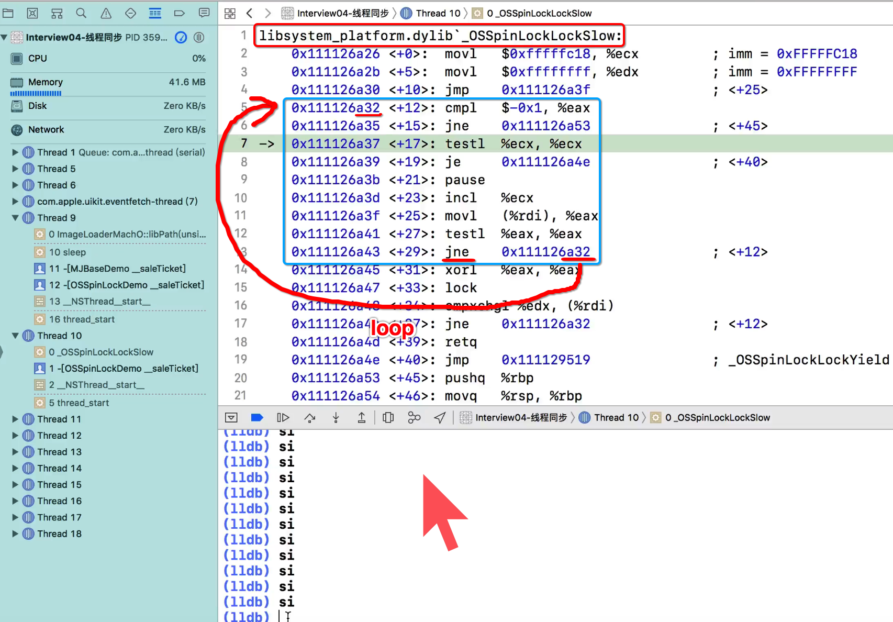

[TOC]


## 1. OSSPinLock（iOS 10 以前）

### 1. init、lock、unlock

```c
// 1. 初始化锁
OSSpinLock lock = OS_SPINLOCK_INIT;

// 2. 直接加锁
OSSpinLockLock(&_lock);

// 3. 读写临界区
.........

// 4. 解锁
OSSpinLockUnlock(&_lock);
```

### 2. tryLock、unlock

- 1、尝试加锁
- 2、加锁成功后则解锁，否则啥也不做

```c
// 1. 初始化锁
OSSpinLock lock = OS_SPINLOCK_INIT;

// 2. 尝试【获取锁】
bool ret = OSSpinLockTry(&_lock);

// 3. 只有当【获取成功】时候，才会【加锁】
if (ret) {
  // 3.1 读写临界区
  .........

  // 3.2 解锁
  OSSpinLockUnlock(&_lock);
}

// 3. 获取锁失败
...............
```


## 2. lock && unlock 示例

```c
#import "ViewController.h"
#import <libkern/OSAtomic.h>

@interface ViewController ()
@property (assign, nonatomic) int money;
@property (assign, nonatomic) int ticketsCount;
@property (assign, nonatomic) OSSpinLock lock;  // 控制卖票的多线程，顺序一个个执行
@property (assign, nonatomic) OSSpinLock lock1; // 控制存钱与取钱的线程，顺序一个个执行
@end

@implementation ViewController

- (void)viewDidLoad {
  [super viewDidLoad];
  
  // 初始化锁
  self.lock = OS_SPINLOCK_INIT;
  self.lock1 = OS_SPINLOCK_INIT;
  
  [self ticketTest];
  [self moneyTest];
}

/**
存钱、取钱演示
*/
- (void)moneyTest
{
  self.money = 100;
  
  dispatch_queue_t queue = dispatch_get_global_queue(0, 0);
  
  dispatch_async(queue, ^{
    for (int i = 0; i < 10; i++) {
      [self saveMoney];
    }
  });

  dispatch_async(queue, ^{
    for (int i = 0; i < 10; i++) {
      [self drawMoney];
    }
  });
}

/**
存钱
*/
- (void)saveMoney {
  // 加锁
  OSSpinLockLock(&_lock1);
  
  int oldMoney = self.money;
  sleep(.2);
  oldMoney += 50;
  self.money = oldMoney;
  
  NSLog(@"存50，还剩%d元 - %@", oldMoney, [NSThread currentThread]);
  
  // 解锁
  OSSpinLockUnlock(&_lock1);
}

/**
取钱
*/
- (void)drawMoney
{
  // 加锁
  OSSpinLockLock(&_lock1);
  
  int oldMoney = self.money;
  sleep(.2);
  oldMoney -= 20;
  self.money = oldMoney;
  
  NSLog(@"取20，还剩%d元 - %@", oldMoney, [NSThread currentThread]);
  // 解锁
  OSSpinLockUnlock(&_lock1);
}

/**
卖1张票
*/
- (void)saleTicket
{
#if 0
  if (OSSpinLockTry(&_lock)) 
  {
    int oldTicketsCount = self.ticketsCount;
    sleep(.2);
    oldTicketsCount--;
    self.ticketsCount = oldTicketsCount;
    NSLog(@"还剩%d张票 - %@", oldTicketsCount, [NSThread currentThread]);

    OSSpinLockUnlock(&_lock);
  }
#else
  // 加锁
  OSSpinLockLock(&_lock);

  int oldTicketsCount = self.ticketsCount;
  sleep(.2);
  oldTicketsCount--;
  self.ticketsCount = oldTicketsCount;
  NSLog(@"还剩%d张票 - %@", oldTicketsCount, [NSThread currentThread]);
  
  // 解锁
  OSSpinLockUnlock(&_lock);
#endif
}

/**
卖票演示
*/
- (void)ticketTest
{
  self.ticketsCount = 15;
  
  dispatch_queue_t queue = dispatch_get_global_queue(0, 0);
  
  dispatch_async(queue, ^{
    for (int i = 0; i < 5; i++) {
      [self saleTicket];
    }
  });

  dispatch_async(queue, ^{
    for (int i = 0; i < 5; i++) {
      [self saleTicket];
    }
  });

  dispatch_async(queue, ^{
    for (int i = 0; i < 5; i++) {
      [self saleTicket];
    }
  });
}

@end
```


## 3. ==tryLock== && unlock 示例

```c
/**
卖1张票
*/
- (void)saleTicket
{
  if (OSSpinLockTry(&_lock)) // try lock
  {
    int oldTicketsCount = self.ticketsCount;
    sleep(.2);
    oldTicketsCount--;
    self.ticketsCount = oldTicketsCount;
    NSLog(@"还剩%d张票 - %@", oldTicketsCount, [NSThread currentThread]);

    OSSpinLockUnlock(&_lock); // unLock
  }
}
```

- 1）tryLock() 获取锁失败之后，**直接返回**，而不会**阻塞**
- 2）OSSPinLock 当获取锁失败时，会让线程一直执行**空转**，消耗CPU时间片资源


## 4. for/while 循环中, 必须使用 ==tryLock==

- 1）防止在循环中使用pthread_mutex_lock()出现线程死锁，前面的锁没有解除，又继续加锁
- 2）pthread_mutex_trylock(): 尝试获取锁，获取成功之后才加锁，否则不执行加锁

```objc
while (!finish) {
  if (OSSpinLockTry(&_lock)) { // 进入到if块，说明获取锁成功
    // 读写临界区
    int oldTicketsCount = self.ticketsCount;
    sleep(.2);
    oldTicketsCount--;
    self.ticketsCount = oldTicketsCount;

    // 出if块时，完成解锁
    OSSpinLockUnlock(&_lock);
  } else {
    //获取锁失败，让线程休眠10秒后再执行解锁
    usleep(10 * 1000);
  }
}
```


## 5. 获取锁【失败】时，线程会执行【空转】, 导致【占用】CPU 时间片

### 1. 相当于执行一段 while() 循环

```c
while(条件);
```

### 2. 如何测试

- 【A线程】先获取到 spinlock
- 然后让【A线程】sleep(60) 休眠 60秒
- 【B线程】再获取 spinlock
- 在【A线程】持有 spinlock 的 60秒内，查看【B线程】【执行的代码】即可

### 3. x86 汇编中的 系统调用



不断的执行一段 **jne** 跳转循环。

### 4. x86 汇编, loop 执行循环

```asm
loop:
  ................
  jne loop # jne: 当条件值==0时，执行jmp
```

只有当 spinlock 被别人 **释放掉** 之后，才会取 **消掉** 这段 loop 代码。


## 6.【线程优先级】导致 OSSPinLock 会产生【线程死锁】

- 1、【高优先级】的线程，拿到 spinlock，读写临界区
- 2、【低优先级】的线程，则无法拿到 spinlock，导致开始执行【空转】
- 3、【高优先级】在没有释放掉 spinlock 时，会【空转】一直占有 CPU 时间片
- 4、【低优先级】线程的【释放spinlock】操作，则永远【无法被执行】
- 5、造成【互相等待】的情况
  - 1）【高优先级】的线程，执行【空转】占有CPU时间片，等待【获取】spinlock
  - 2）【低优先级】的线程，因获【取不到CPU时间片】，而无法执行【释放】spinlock的操作


## 7. 通过【挂起线程】让线程让出 CPU 时间片

- 1、采用【挂起】线程的方式
- 2、让【无法获取锁】的线程，进入【挂起】状态
- 3、而【挂起】状态的线程，【不会占用CPU时间片】
- 4、不会产生像【OSSpinLock线程死锁】的问题


## 8、结论

- 1、【用户空间】不要使用 spinlock，可能造成线程死锁
- 2、【内核空间】只能使用【spinlock 空转线程】，而不能够【挂起线程】