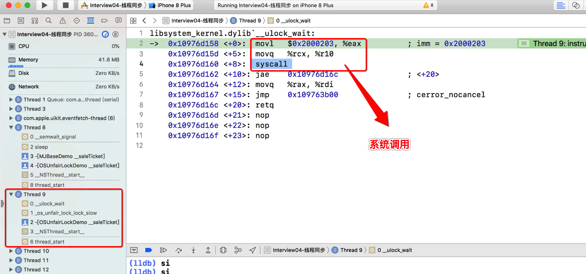
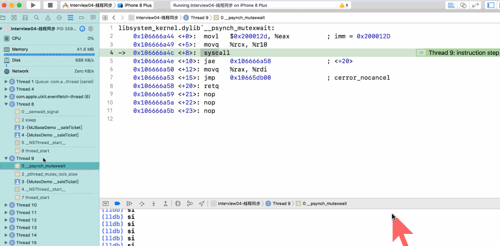

[TOC]


## 1. ==iOS 10== 替代 OSSPinLock

- 1) 用于替代 OSSPinLock 
- 2) 但是只能在 **iOS 10 之后** 才能使用
- 3) 无法获取 os_unfair_lock 的线程
  - 1) 处于 **挂起（休眠）**
  - 2) **不占用** CPU 时间片


## 2. os_unfair_lock 基本使用

```c
#import "OSUnfairLockDemo.h"
#import <os/lock.h>

@interface OSUnfairLockDemo()

@property (assign, nonatomic) os_unfair_lock moneyLock;
@property (assign, nonatomic) os_unfair_lock ticketLock;

@end

@implementation OSUnfairLockDemo

- (instancetype)init {
  if (self = [super init]) {

    self.moneyLock = OS_UNFAIR_LOCK_INIT;
    self.ticketLock = OS_UNFAIR_LOCK_INIT;
  }
  return self;
}

- (void)__saleTicket {
  os_unfair_lock_lock(&_ticketLock);
  
  [super __saleTicket];
  
  os_unfair_lock_unlock(&_ticketLock);
}

- (void)__saveMoney {
  os_unfair_lock_lock(&_moneyLock);
  
  [super __saveMoney];
  
  os_unfair_lock_unlock(&_moneyLock);
}

- (void)__drawMoney {
  os_unfair_lock_lock(&_moneyLock);
  
  [super __drawMoney];
  
  os_unfair_lock_unlock(&_moneyLock);
}

@end
```


## 3. 获取锁【失败】的线程, 会【挂起】释放 CPU 时间片

### 1. x86 汇编, 系统调用



- 1、执行的是一个 **系统调用**
  - 1）eax 接收【系统调用号】
  - 2）syscall 执行【系统调用】
- 2、最终会 **挂起** 当前线程

### 2. syscall 系统调用后，线程进入挂起态，不再占用CPU时间片



断点没有执行，说明线程已经被挂起进入休眠，等待被唤醒。