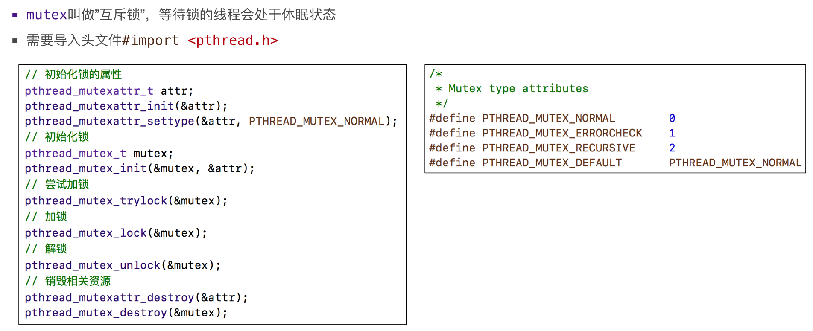
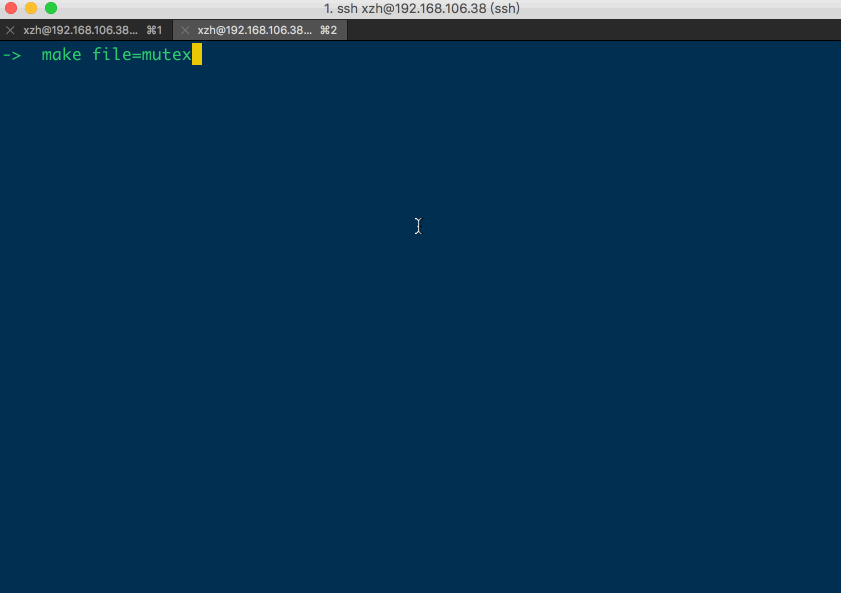
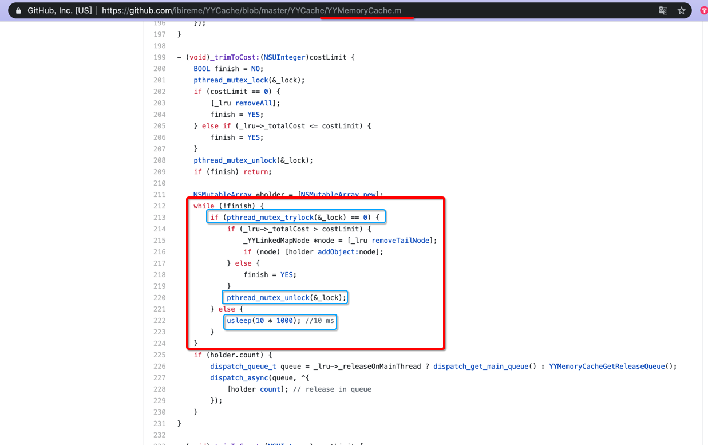
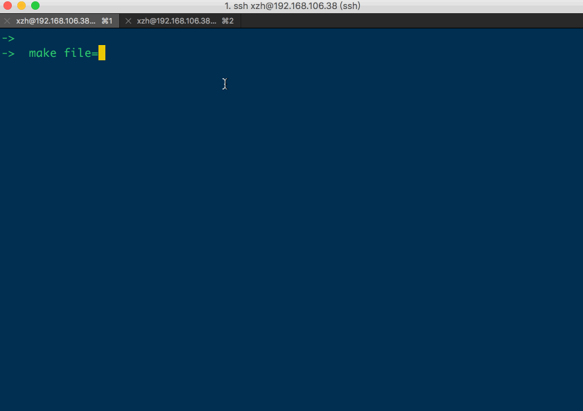
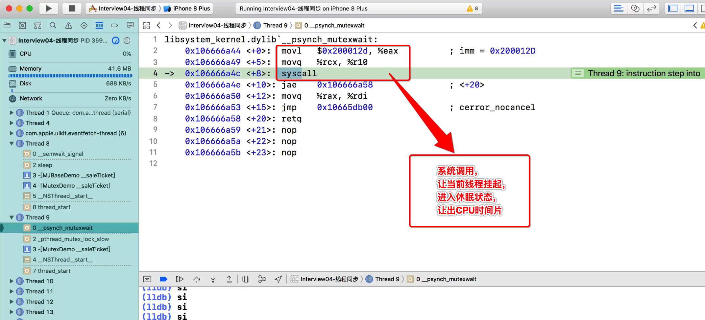

[TOC]

## 1. mutex 基本操作




## 2. mutex 初始化

### 1. 全局 mutex 初始化

```c
/**
 * pthread_mutex_t _mutex = {_PTHREAD_MUTEX_SIG_init, {0}};
 * 
 * 而如下语法错误：
 * pthread_mutex_t _mutex;
 * _mutex = {_PTHREAD_MUTEX_SIG_init, {0}};
 */
pthread_mutex_t _mutex = PTHREAD_MUTEX_INITIALIZER;

int main()
{}
```

### 2. 函数内 局部 mutex 初始化

```c
int main()
{
  // 1、创建局部的mutex结构体实例
  static pthread_mutex_t _mutex;

  // 2、初始化mutex结构体实例的成员变量
  pthread_mutex_init(&_mutex, NULL);
}
```


## 3. mutex 基本使用

```c
@interface ViewController
@property(nonatomic, assgin) pthread_mutex_t mutex; // 对象的成员变量 mutex
@end
@implemtation ViewController
- (id)init {
  ..........

  // 1、
  pthread_mutexattr_t mattr;
  pthread_mutexattr_init(&mattr);
  pthread_mutexattr_setpshared(
    &mattr, 
    PTHREAD_PROCESS_PRIVATE
  );

  // 2、初始化mutex结构体实例的成员变量
  pthread_mutex_init(&_mutex, &mattr);
  pthread_mutexattr_destroy(&mattr);
  
  // error: 只能在定义【全局变量 mutex】时初始化
  // _mutex = PTHREAD_MUTEX_INITIALIZER;

  ..........
  return self;
}

- (void)dealloc
{
  pthread_mutex_destroy(&_mutex);
}
@end
```


## 4. pthread_mutex_t 线程安全 模板代码

### 1. objc

```objc
@implementation ClassMapper {
  Class _class;
}

+ (instancetype)classMapperWithClass:(Class)cls {
  if (NULL == cls) {return nil;}
  
  //1. 初始化mutex、缓存对象
  static pthread_mutex_t _mutex;
  static NSMutableDictionary *_cache = nil;
  static dispatch_once_t onceToken;
  dispatch_once(&onceToken, ^{
    pthread_mutex_init(&_mutex, NULL);
    _cache = [NSMutableDictionary new];
  });
  
  //2. 读缓存加锁同步
  pthread_mutex_lock(&_mutex);
  ClassMapper *mapper = [_cache objectForKey:NSStringFromClass(cls)];
  pthread_mutex_unlock(&_mutex);

  //3. 缓存存在
  if (mapper) {return mapper;}

  //4. 缓存不存在
  mapper = [[ClassMapper alloc] initWithClass:cls];
  pthread_mutex_lock(&_mutex);
  [_cache setObject:mapper forKey:NSStringFromClass(cls)];
  pthread_mutex_unlock(&_mutex);
  
  //5.
  return mapper;
}

@end
```

与使用 `dispatch_semaphore` 效果一样的。

### 2. c++

#### 1. cpp

```c++
#include <stdlib.h>
#include <stdio.h>
#include <string.h>
#include <unistd.h>
#include <pthread.h>
#include <time.h>

//【全局变量】多线程不安全
int value = 0;

// 互斥量
pthread_mutex_t mutex;

// 线程体函数
void* thread_entry_func(void* arg)
{
  //1. 【进入】到临界区【加锁】
  pthread_mutex_lock(&mutex);

  //2. 访问共享区数据
  value++;
  printf("value = %d\n", value);

  //3.【离开】临界区【解锁】
  pthread_mutex_unlock(&mutex);

  return NULL;
}

int main()
{
  //1. 初始化互斥量
  pthread_mutex_init(&mutex, NULL);

  //2. 循环创建多个ptread线程，同时并发访问【全局变量】
  pthread_t tids[10];
  for (int i = 0; i < 10; i++)
    pthread_create(&tids[i], NULL, thread_entry_func, NULL);

  //3. join()等待回收子线程
  for (int i = 0; i < 10; i++)
    pthread_join(tids[i], NULL);
  
  //4. 释放互斥量
  pthread_mutex_destroy(&mutex);

  //5. 退出主线程
  printf("main thread finished\n");
    pthread_exit(NULL);
}
```

#### 2. Makefile

```makefile
all:
	gcc $(file).c -lpthread
.PHONY: clean
clean:
	rm a.out
```

#### 3. make

```
->  make file=mutex1
gcc mutex1.c -lpthread
->  ./a.out
value = 1
value = 2
value = 6
value = 3
value = 4
value = 5
value = 7
value = 8
value = 9
value = 10
main thread finished
->
```


## 5. ==重复== 加锁 mutex, 会造成 ==线程死锁==

```c
#include <stdlib.h>
#include <stdio.h>
#include <string.h>
#include <unistd.h>
#include <pthread.h>
#include <time.h>

//【全局变量】多线程不安全
int value = 0;

// 互斥量
pthread_mutex_t mutex;

// 线程体函数
void* thread_entry_func(void* arg)
{
  //1. 【进入】到临界区【加锁】
  pthread_mutex_lock(&mutex);

  //2. 访问共享区数据
  value++;
  printf("value = %d\n", value);

  //3.【离开】临界区【解锁】
  // => 当全局变量值==6时，不执行解锁
  // => 当下一个线程进入thread_entry_func()时，就会造成重复加锁
  if (6 != value)
    pthread_mutex_unlock(&mutex);

  return NULL;
}

int main()
{
  //1. 初始化互斥量
  pthread_mutex_init(&mutex, NULL);

  //2. 循环创建多个 ptread 线程，同时并发访问【全局变量】
  pthread_t tids[10];
  for (int i = 0; i < 10; i++)
    pthread_create(&tids[i], NULL, thread_entry_func, NULL);

  //3. join()等待回收子线程
  for (int i = 0; i < 10; i++)
    pthread_join(tids[i], NULL);
  
  //4. 释放互斥量
  pthread_mutex_destroy(&mutex);

  //5. 退出主线程
  printf("main thread finished\n");
    pthread_exit(NULL);
}
```



- 线程进入到**死锁**状态，无法继续往下执行
- 最终并未执行**主线程**的打印，说明主线程处于死锁


## 6. for/while 循环内使用 tryLock, 而不要直接使用 lock

### 1. YYMemoryCache 代码



### 2. 实例

- 在for/while循环中，可能因为某一次代码执行时间很长
- 没有对mutex解除锁
- 下一次循环进入时，直接使用lock()加锁mutex，就会造成死锁

#### 1. C 文件

```c
#include <stdlib.h>
#include <stdio.h>
#include <string.h>
#include <unistd.h>
#include <pthread.h>
#include <sys/syscall.h>

//【全局变量】多线程不安全
int value = 0;

// 互斥量
pthread_mutex_t mutex;

// 线程体函数
void* thread_entry_func(void* arg)
{
  /**
   * 将 trylock()、lock()、unlock() 等逻辑，放置在for(;;)死循环中执行
   * => trylock() == 0 成功获取到锁，并自动【完成加锁】
   *	==> 进入临界区读写
   *	==> 离开时执行unlock()
   *  ==> 结束当前子线程
   * => trylock() != 0 获取锁失败时
   *	==> sleep(1) 休眠一段时间，等待其他的线程使用完临界区
   *  ==> 继续回到for(;;)执行trylock()逻辑
   */
  for(;;)
  {
    //1. 【进入】到临界区【尝试性获取锁，再加锁】
    int ret = pthread_mutex_trylock(&mutex);

    //2. 判断 trylock() 返回值
    // => ret == 0 ，则说明获取锁成功 =>【自动】执行lock() 读写临界区
    // => ret != 0 ，则说明获取锁失败 =>【手动】执行sleep(1)让当前线程稍微休眠1秒后重试
    if (0 == ret)
    {
      // 2.1 访问共享区数据
      printf("%ld lock success:  value = %d\n", syscall(SYS_gettid), ++value);

      // 2.2 解除对临界区的锁定
      pthread_mutex_unlock(&mutex);
      printf("%ld unlock success:  value = %d\n", syscall(SYS_gettid), ++value);

      // 2.3 跳出循环，结束线程
      //break;
      //return NULL;
      pthread_exit(NULL);
    }
    else
    {
      printf("%ld trylock() failed\n", syscall(SYS_gettid));
      sleep(1);//休眠1秒，然后继续从for(;;)开始执行
    }
  }

  return NULL;
}

int main()
{
  //1. 初始化互斥量
  pthread_mutex_init(&mutex, NULL);

  //2. 循环创建多个ptread线程，同时并发访问【全局变量】
  pthread_t tids[10];
  for (int i = 0; i < 10; i++)
    pthread_create(&tids[i], NULL, thread_entry_func, NULL);


  //3. join()等待回收子线程
  for (int i = 0; i < 10; i++)
    pthread_join(tids[i], NULL);

  //4.
  pthread_mutex_destroy(&mutex);

  //5. 退出主线程
  printf("main thread finished\n");
  pthread_exit(NULL);
}
```

#### 2. Makefile

```makefile
all:
	gcc $(file).c -lpthread
.PHONY: clean
clean:
	rm a.out
```

#### 3. make

```
➜  pthread gcc main.c -lpthread
➜  pthread ./a.out
4217 lock success:  value = 1
4217 unlock success:  value = 2
4219 trylock() failed
4218 trylock() failed
4220 lock success:  value = 3
4220 unlock success:  value = 4
4216 trylock() failed
4215 lock success:  value = 5
4215 unlock success:  value = 6
4214 lock success:  value = 7
4214 unlock success:  value = 8
4213 lock success:  value = 9
4213 unlock success:  value = 10
4212 lock success:  value = 11
4212 unlock success:  value = 12
4211 lock success:  value = 13
4211 unlock success:  value = 14
4219 lock success:  value = 15
4219 unlock success:  value = 16
4216 trylock() failed
4218 trylock() failed
4216 lock success:  value = 17
4216 unlock success:  value = 18
4218 trylock() failed
4218 lock success:  value = 19
4218 unlock success:  value = 20
main thread finished
➜  pthread
```

- 这样就不会造成重复对同一把锁加锁，导致线程死锁
- 但是仍然使用的是 **普通版 互斥锁**
- 更好的方式是使用 **递归锁** 彻底解决重复加锁的问题


## 7. mutex attr

### 1. GNUStep NSLock 源码实现

```c
static pthread_mutex_t deadlock;
static pthread_mutexattr_t attr_normal;
static pthread_mutexattr_t attr_reporting;
static pthread_mutexattr_t attr_recursive;

NSString *NSLockException = @"NSLockException";

@implementation NSLock

+ (void) initialize
{
  static BOOL	beenHere = NO;

  if (beenHere == NO)
  {
    beenHere = YES;

    /* Initialise attributes for the different types of mutex.
      * We do it once, since attributes can be shared between multiple
      * mutexes.
      * If we had a pthread_mutexattr_t instance for each mutex, we would
      * either have to store it as an ivar of our NSLock (or similar), or
      * we would potentially leak instances as we couldn't destroy them
      * when destroying the NSLock.  I don't know if any implementation
      * of pthreads actually allocates memory when you call the
      * pthread_mutexattr_init function, but they are allowed to do so
      * (and deallocate the memory in pthread_mutexattr_destroy).
      */
    pthread_mutexattr_init(&attr_normal);
    pthread_mutexattr_settype(&attr_normal, PTHREAD_MUTEX_NORMAL);
    pthread_mutexattr_init(&attr_reporting);
    pthread_mutexattr_settype(&attr_reporting, PTHREAD_MUTEX_ERRORCHECK);
    pthread_mutexattr_init(&attr_recursive);
    pthread_mutexattr_settype(&attr_recursive, PTHREAD_MUTEX_RECURSIVE);

    /* To emulate OSX behavior, we need to be able both to detect deadlocks
      * (so we can log them), and also hang the thread when one occurs.
      * the simple way to do that is to set up a locked mutex we can
      * force a deadlock on.
      */
    pthread_mutex_init(&deadlock, &attr_normal);
    pthread_mutex_lock(&deadlock);
  }
}

#define MFINALIZE \
- (void) finalize\
{\
  pthread_mutex_destroy(&_mutex);\
}
```

### 2. 示例

```c
int main()
{
  // 1、创建局部的mutex结构体实例
  static pthread_mutex_t _mutex;

  // 2、attr
  pthread_mutexattr_t mattr;
  pthread_mutexattr_init(&mattr);
  pthread_mutexattr_setpshared(
    &mattr, 
    PTHREAD_PROCESS_PRIVATE
  );

  // 3、初始化 mutex 结构体实例 的成员变量
  pthread_mutex_init(&_mutex, &mattr);
  pthread_mutexattr_destroy(&mattr);

  // 4、同步互斥的逻辑
  // ..............

  // 5、最终废弃mutex
  pthread_mutex_destroy(&_mutex);
}
```


## 8. mutex attr 指定为 ==递归锁==

### 1. 死锁情况1

```c
static pthread_mutex_t mutex;

void func1()
{
  //1. 【进入】到临界区【加锁】
  pthread_mutex_lock(&mutex);

  //2. 访问共享区数据
  ......

  //3.【离开】临界区【解锁】
  pthread_mutex_unlock(&mutex);
}

void func2()
{
  //1. 【进入】到临界区【加锁】
  pthread_mutex_lock(&mutex);

  //2. 调用func()1
  func1();

  //3.【离开】临界区【解锁】
  pthread_mutex_unlock(&mutex);
}
```

### 2. 死锁情况2

```c
void func1()
{
  //1. 【进入】到临界区【加锁】
  pthread_mutex_lock(&mutex);

  //2. 递归调用自己
  func1();

  //3.【离开】临界区【解锁】
  pthread_mutex_unlock(&mutex);
}
```

### 3. 初始化 mutex 时, 使用 attr 指定为 ==recursive 递归锁==

```c
static void __init_mutext(pthread_mutex_t* m)
{
  // 1、attr
  pthread_mutexattr_t mattr;
  pthread_mutexattr_init(&mattr);
  pthread_mutexattr_setpshared(
    &mattr, 
    PTHREAD_MUTEX_RECURSIVE // 指定为递归锁
  );

  // 2、初始化mutex结构体实例的成员变量
  pthread_mutex_init(m, &mattr);
  pthread_mutexattr_destroy(&mattr);
}
```

上面的lock和unlock的代码，都不需要修改。

### 4. ==递归锁== 可防止 线程死锁

- 1）条件1：【同一个】线程
- 2）条件2：对【同一把 mutex 锁】
- 3）重复的加锁多次，不会造成死锁
- 4）但是对于**不同的**线程，无法获取锁时，线程会被挂起

进入函数内部递归加锁：

```
- 线程1 - 1（+
  - 线程1 - 2（+
    - 线程1 - 3（+
```

出函数递归解锁，从第二次递归调用时，开始执行解锁

```
- 线程1 - 1（+
  - 线程1 - 2（+
    - 线程1 - 3（+-）
```

退出到第一次递归调用时，开始执行解锁

```
- 线程1 - 1（+
  - 线程1 - 2（+-）
    - 线程1 - 3（+-）
```

退出到最开始函数调用时，开始执行解锁

```
- 线程1 - 1（+-）
  - 线程1 - 2（+-）
    - 线程1 - 3（+-）
```

此时全部解锁完毕。


## 9. A 持有 B 的 mutex, B 持有 A 的 mutex 造成死锁

```c
#include <stdio.h>
#include <stdlib.h>
#include <unistd.h>
#include <pthread.h>

int value = 0; // 临界资源
pthread_mutex_t mutexA; // 线程A的mutex
pthread_mutex_t mutexB; // 线程B的mutex

// 线程A与线程B同时访问的公共函数
void common()
{
  //1. 获取mutexA和mutexB同时加锁
  // => A线程，已经持有mutexB，想要持有mutexA
  // => B线程，已经持有mutexA，想要持有mutexB
  // => 但是此时并不会执行unlock()，所以A和B线程都不会得到想要的mutex
  // => 产生线程死锁
  pthread_mutex_lock(&mutexA);
  pthread_mutex_lock(&mutexB);

  //2. 临界区
  printf("value = %d\n", value++);

  //3. 释放mutexA和mutexB
  pthread_mutex_unlock(&mutexA);
  pthread_mutex_unlock(&mutexB);
}

// 线程A的入口函数
void* thread_A_entry_point(void* info)
{
  //1. 首先持有线程B的mutex
  pthread_mutex_lock(&mutexB);

  //2. 再访问公共函数
  common();
}

// 线程B的入口函数
void* thread_B_entry_point(void* info)
{
  //1. 首先持有线程A的mutex
  pthread_mutex_lock(&mutexA);

  //2. 再访问公共函数
  common();
}

int main()
{
  //1. 初始化A和B的mutex互斥量
  pthread_mutex_init(&mutexA, (void*)0);
  pthread_mutex_init(&mutexA, (void*)0);

  //2.
  pthread_t t1, t2;
  pthread_create(&t1, NULL, thread_A_entry_point, NULL);
  pthread_create(&t2, NULL, thread_B_entry_point, NULL);

  //3. 等待回收子线程
  pthread_join(t1, NULL);
  pthread_join(t2, NULL);

  //4.
  pthread_mutex_destroy(&mutexA);
  pthread_mutex_destroy(&mutexB);

  //5. 退出主线程
  printf("main thread finished\n");
  pthread_exit(NULL);
}
```

Makefile

```makefile
all:
	gcc $(file).c -lpthread
.PHONY: clean
clean:
	rm a.out
```

make



- 主线程被**卡主**，不会往下执行
- 因为子线程A和子线程B产生死锁，都不会往下执行
- 主线程执行了join()等待A和B两个子线程结束执行
- 所以最终主线程也被阻塞


## 9. 让获取锁失败的线程，【挂起休眠】暂停运行

### 1. x86 汇编中 系统调用



### 2. syscall系统调用后，线程进入休眠态，让出CPU时间片


断点没有执行，说明线程已经被挂起进入休眠，等待被唤醒。


## 10. mutex 还可用于 ==进程间== 同步

- 1）使用mmap()创建共享内存映射区
- 2）在共享映射区内填充mutex实例
- 3）多个进程间，就能够拿到mutex实例，完成同步互斥

[点击我](linux_process_sync_mmap_mutex.md)

