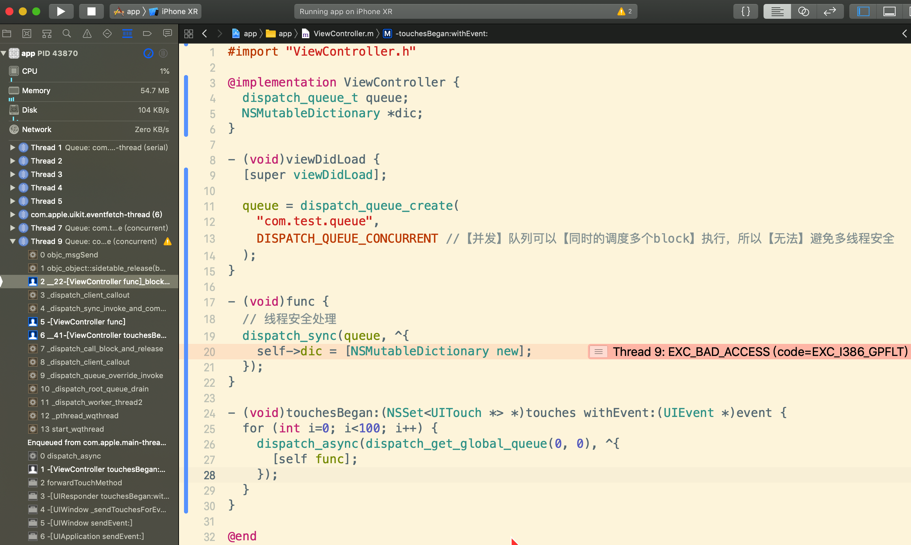

[TOC]


## 1.【并发】队列 => No

```objective-c
#import "ViewController.h"

@implementation ViewController {
  dispatch_queue_t queue;
  NSMutableDictionary *dic;
}

- (void)viewDidLoad {
  [super viewDidLoad];
  
  queue = dispatch_queue_create(
    "com.test.queue", 
    DISPATCH_QUEUE_CONCURRENT //【并发】队列可以【同时的调度多个block】执行，所以【无法】避免多线程安全
  );
}

- (void)func {
  // 线程安全处理
  dispatch_sync(queue, ^{
    self->dic = [NSMutableDictionary new]; // 会崩溃
  });
}

- (void)touchesBegan:(NSSet<UITouch *> *)touches withEvent:(UIEvent *)event {
  for (int i=0; i<100; i++) {
    dispatch_async(dispatch_get_global_queue(0, 0), ^{
      [self func];
    });
  }
}

@end
```




## 2.【串行】队列 => Yes

```objective-c
#import "ViewController.h"

@implementation ViewController {
  dispatch_queue_t queue;
  NSMutableDictionary *dic;
}

- (void)viewDidLoad {
  [super viewDidLoad];
  
  queue = dispatch_queue_create(
    "com.test.queue", 
    DISPATCH_QUEUE_SERIAL // 必须是【串行】队列
  );
}

- (void)func {
  // 线程安全处理
  dispatch_sync(queue, ^{
    self->dic = [NSMutableDictionary new];
  });
}

- (void)touchesBegan:(NSSet<UITouch *> *)touches withEvent:(UIEvent *)event {
  for (int i=0; i<100; i++) {
    dispatch_async(dispatch_get_global_queue(0, 0), ^{
      [self func];
    });
  }
}

@end
```

正常运行，没有崩溃。


