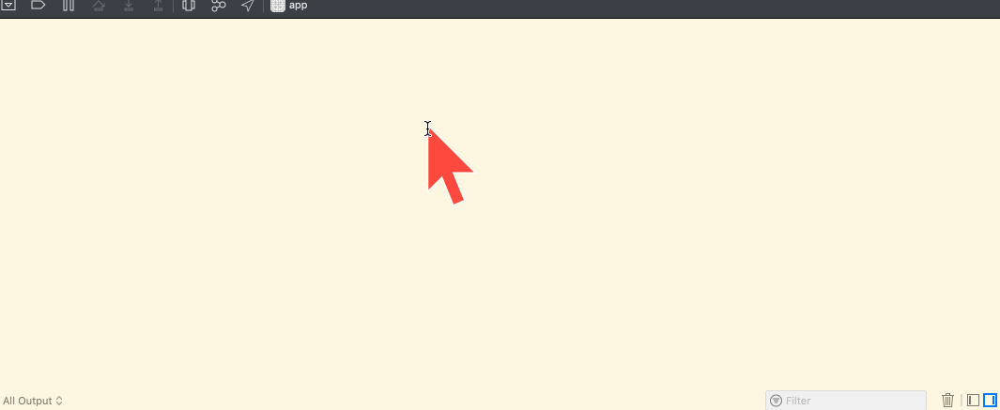
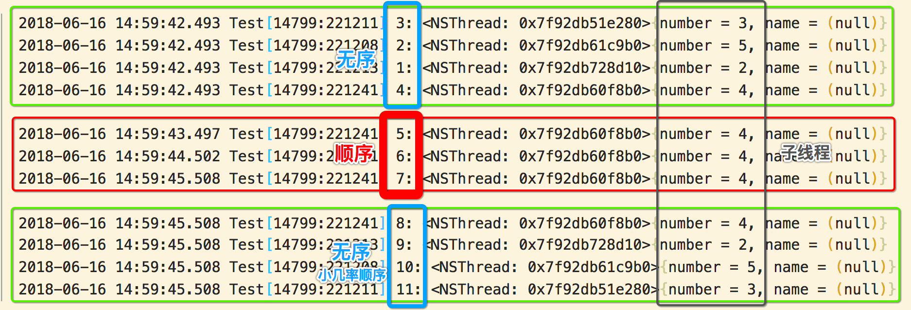

[TOC]

```objective-c
#import "ViewController.h"

@implementation ViewController {
  dispatch_queue_t queue;
  NSMutableDictionary *dic;
}

- (void)viewDidLoad {
  [super viewDidLoad];
  
  /**
   * 使用【并发】无序队列，提高【并发】【读】效率
   */
  queue = dispatch_queue_create(
    "com.test.queue", 
    DISPATCH_QUEUE_CONCURRENT
  );
}

- (void)touchesBegan:(NSSet<UITouch *> *)touches withEvent:(UIEvent *)event {
  // 1. 并发【无序】的任务 ==> 【读】
  {
    dispatch_async(queue, ^{NSLog(@"1: %@", [NSThread currentThread]);});
    dispatch_async(queue, ^{NSLog(@"2: %@", [NSThread currentThread]);});
    dispatch_async(queue, ^{NSLog(@"3: %@", [NSThread currentThread]);});
    dispatch_async(queue, ^{NSLog(@"4: %@", [NSThread currentThread]);});
  }
  
  // 2. 需要按照【顺序】执行任务 ==> 【写】
  {
    dispatch_barrier_async(queue, ^{
      sleep(1);
      NSLog(@"5: %@", [NSThread currentThread]);
    });
    
    dispatch_barrier_async(queue, ^{
      sleep(1);
      NSLog(@"6: %@", [NSThread currentThread]);
    });
    
    
    dispatch_barrier_async(queue, ^{
      sleep(1);
      NSLog(@"7: %@", [NSThread currentThread]);
    });
  }
  
  
  // 3. 并发【无序】的任务 ==> 【读】
  {
    dispatch_async(queue, ^{NSLog(@"8: %@", [NSThread currentThread]);});
    dispatch_async(queue, ^{NSLog(@"9: %@", [NSThread currentThread]);});
    dispatch_async(queue, ^{NSLog(@"10: %@", [NSThread currentThread]);});
    dispatch_async(queue, ^{NSLog(@"11: %@", [NSThread currentThread]);});
  }
}

@end
```



- 1) dispatch_async(并发队列, block) => 并发无序执行
- 2) dispatch_barrier_async(并发队列, block) => 在一个线程上顺序执行




